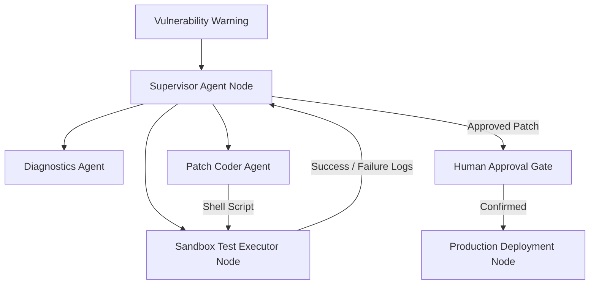

# Enterprise AI Agent Engineering Interview Preparation

This guide compiles advanced interview questions, architectural case studies, and scenarios covering the entire spectrum of agentic software engineering, multi-agent frameworks, graph orchestrators, tool integrations, and production agent deployment patterns.

---

## 1. LangChain & Abstraction Layers

### Q1: What is the benefit of LangChain Expression Language (LCEL) over legacy prompt chaining classes (like LLMChain)?
**Answer:**
- **Streaming & Async Native:** LCEL supports streaming, asynchronous calls, and fallback routing natively.
- **Parallel Task Execution:** Using `RunnableParallel` allows running multiple independent LLM calls concurrently, significantly reducing response latencies.
- **Unified Interface:** LCEL provides a consistent interface for testing, deploying, and tracing components, simplifying updates to prompt templates or models.

---

## 2. LangGraph & Stateful DAG Graph Orchestration

### Q2: Explain the significance of Checkpointing and Thread ID states in LangGraph for production systems.
**Answer:**
- **State Persistence:** Checkpointers (like PostgresSaver) automatically save a serialized copy of the graph state after every node executes.
- **Resilience to Failures:** If a server crashes or an API call fails mid-workflow, the system can reload the state from the last checkpoint using the `thread_id`, avoiding the need to restart the entire task.
- **Human-in-the-Loop Interruption:** Checkpoint databases allow you to pause execution before critical nodes (like a transaction approvals node) to wait for manual approvals, resuming the workflow once approved.

---

## 3. CrewAI vs. AutoGen Multi-Agent Coordination

### Q3: Contrast the coordination model of CrewAI (Role-based Tasks) with AutoGen (Conversational Chats). When is each model appropriate?
**Answer:**
- **CrewAI (Hierarchical/Sequential Tasks):**
  - **Model:** Modeled after human organizational hierarchies. Agents are assigned roles, backstories, and sequential tasks.
  - **Ideal Use Case:** Structured cognitive tasks (like business analysis, competitor reviews, or content pipelines) where outputs must progress through defined stages (e.g., research -> write -> audit).
- **AutoGen (Conversational Chats):**
  - **Model:** Modeled after conversational chat rooms. Agents (UserProxy, Assistant) converse dynamically to solve tasks.
  - **Ideal Use Case:** Autonomous task resolution (like code generation and testing loops) where execution outputs and console errors must be resolved dynamically through back-and-forth interactions.

---

## 4. Agent Memory & Caching

### Q4: Explain the differences between short-term context memory, episodic long-term memory, and semantic memory in enterprise agent architectures.
**Answer:**
- **Short-Term Context Memory:** Tracks variables and conversation history in the active session thread. It is typically stored in fast cache systems like Redis.
- **Episodic Long-Term Memory:** Stores historical summaries of previous runs and steps, helping agents learn from past tasks.
- **Semantic Memory:** Indexes user preferences, policies, and documents in vector databases (like ChromaDB or Pinecone) to support semantic search query retrieval.

---

## 5. Tool Calling, Validation, and Security

### Q5: How do you protect tool execution layers from "indirect prompt injection" when agents retrieve web pages or emails?
**Answer:**
- **Escape Markup Delimiters:** Strip out or escape XML delimiters from retrieved text before merging it into templates.
- **Enforce Least Privilege:** Restrict agent tool APIs to low-privilege actions, ensuring they cannot run destructive console or database commands.
- **Implement Security Check Gateways:** Validate all tool arguments dynamically using schemas, and require human approvals for critical actions (e.g. initiating transfers or modifying data).

---

## 6. System Design Case Studies

### Case Study: Autonomous IT Patching Agent Platform
**Scenario:** Design a platform where agents receive security warnings, locate files, write shell script patches, run tests in sandboxes, and deploy fixes.

**Architecture:**

1. **Intake & Analysis:** The Supervisor Agent routes tasks to the Diagnostics Agent to analyze the system and identify the patch requirements.
2. **Patch Development & Testing:** The Patch Coder Agent writes the shell script, and the Sandbox Test Executor Node runs it in a secure, isolated container to verify the fix and catch errors.
3. **Governance & Deployment:** The Supervisor Agent compiles the test logs, routes high-risk scripts to the Human Approval Gate for manual sign-off, and deploys approved patches to production.
