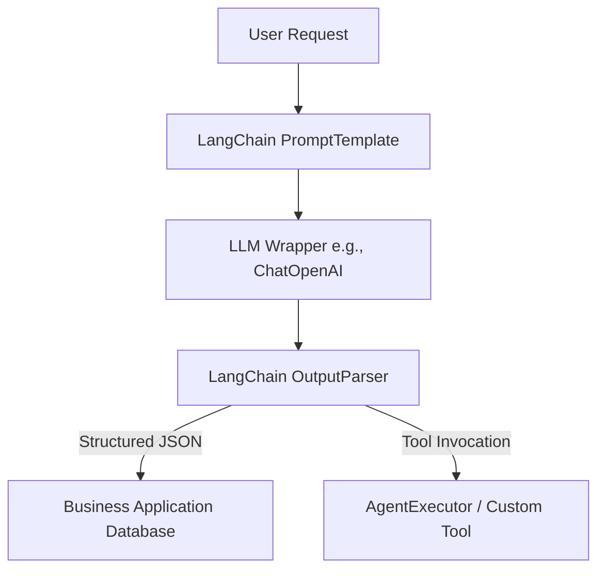

# Module 1: LangChain

## 1. Industry Explanation
LangChain is an open-source software development framework designed to simplify the creation of applications using Large Language Models (LLMs). Rather than interacting directly with raw API endpoints, LangChain provides standardized abstractions for linking prompts, models, output parsers, memory registers, and external tools into cohesive, executable processing pipelines (known as "chains").

In enterprise software engineering, LangChain functions as the orchestration middleware, decoupling application logic from underlying model providers and enabling developer teams to build robust, model-agnostic LLM applications.

## 2. Enterprise Architecture
An enterprise LangChain integration structures ingestion, parsing, tool routing, and generation flows:

## 3. Business Use Cases
- **Enterprise Search Systems**: Building RAG pipelines that ingest customer data, convert queries to semantic vectors, query databases, and summarize results.
- **Support Ticket Copilots**: Structuring raw customer tickets into standardized JSON schemas containing ticket category, urgency, and routing rules.
- **Dynamic Content Generators**: Constructing personalized, multi-variable sales outreach emails dynamically populated with client context.

## 4. Production Design
Production LangChain architectures leverage LangChain Expression Language (LCEL) to build execution pipelines:
- **LCEL Chains**: Enforcing type safety, supporting parallel execution of tasks, and providing streaming responses natively.
- **Observability Hooks (LangSmith)**: Connecting production pipelines to observability platforms to trace model latency, input/output structures, and tool call details.

## 5. Common Failure Modes
- **Verbose Output Parsing Crashes**: Output parsers failing and raising execution errors if the model includes conversational text (like code block markers) in its JSON output.
- **Context Window Saturation**: Blindly appending historical dialog to memory buffers without summarization, eventually exceeding model context limits.
- **Model Incompatibilities**: Designing prompts optimized for one model provider (e.g. OpenAI) that fail to generate structured tool calls when executed on another provider (e.g. Anthropic).

## 6. Optimization Strategies
- **Dynamic Context Pruning**: Summarizing or truncating conversation histories in the memory buffer before sending prompts to minimize token costs.
- **Parallel Step Execution**: Using LCEL's `RunnableParallel` block to run independent prompt steps concurrently, reducing overall API latencies.

## 7. Security Considerations
- **LLM Prompt Injection**: Untrusted inputs overriding template structures, tricking output parsers into executing unintended actions.
- **System Rule Leakage**: Failing to isolate user variables from system instructions, allowing users to extract the core system prompt.

## 8. Governance Considerations
- **Version Control Registries**: Storing prompt templates in central registries rather than hardcoding them in application repositories to support audits and quick updates.
- **Compliance Guardrails**: Running model outputs through safety filters (like Llama Guard) before returning responses to the user.

## 9. Best Practices
- **Use LCEL for All Chains**: Avoid deprecated legacy classes (like `LLMChain`) and build pipelines using the unified LCEL syntax to ensure streaming, async, and tracing support.
- **Enforce JSON Schema Validations**: Bind output schemas directly to model APIs using tools like Pydantic, forcing the model to adhere to the target structure.
- **Decouple Configurations**: Keep API keys, model parameters, and templates decoupled from application logic using environment variables and configuration files.

## 10. AI FDE Perspective
An FDE must design structured, maintainable integrations. FDEs should implement LCEL to build type-safe pipelines, connect observability tracing (like LangSmith) early in development to analyze bottlenecks, and leverage Pydantic output parsers to ensure responses are validated before hitting downstream business databases.
