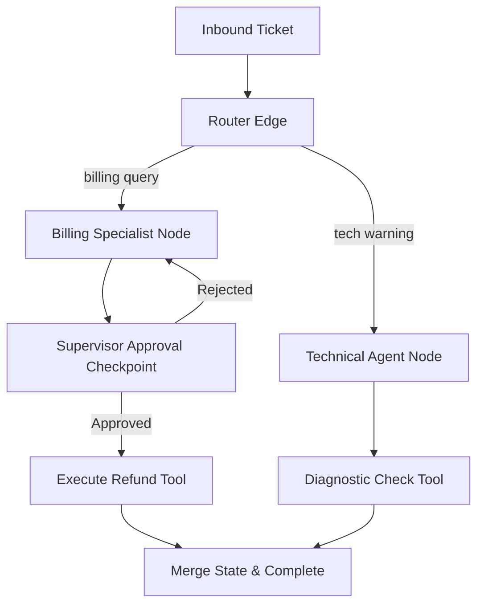

# Module 2: LangGraph

## 1. Industry Explanation
LangGraph is a library designed to build stateful, multi-agent applications using graph-based workflows. While traditional agent executors use linear loops, LangGraph models agent tasks as cyclic graphs containing **Nodes** (which represent actions, such as running python code or calling a model) and **Edges** (which define the transitions between nodes).

In enterprise systems, LangGraph is the standard library for complex automation. It allows developers to define state schemas, set up conditional routing (deciding which node to run next based on model outputs), enforce human approvals (Human-in-the-loop), and persist agent states in databases to ensure workflows are reliable.

## 2. Enterprise Architecture
Enterprise state chart orchestrations coordinate graph state, routing, and checkpointing:

## 3. Business Use Cases
- **Customer Support Refund Workflows**: Automating refund claims: the agent collects details, queries databases, checks policies, and routes requests to supervisors for approval.
- **Security Alert Resolution**: Resolving IT alerts: the system runs diagnostics, identifies vulnerabilities, drafts fixes, and waits for administrator confirmation before applying updates.
- **Enterprise Contract Drafting**: Generating, auditing, and refining contracts: the agent drafts clauses, checks compliance guidelines, and submits reports to legal teams.

## 4. Production Design
Production LangGraph architectures rely on robust state and persistence layers:
- **Persistent Checkpointers (SqliteSaver, PostgresSaver)**: Saving the complete state of the graph after every node execution. This allows long-running workflows to resume if the server restarts.
- **State Schemas**: Defining strict, typed state structures (using Pydantic or TypedDict) to pass variables between nodes and prevent state contamination.

## 5. Common Failure Modes
- **Infinite Execution Loops**: The agent repeatedly routing between nodes (e.g., node A calls tool -> tool returns error -> routes to node A) because it doesn't know how to resolve an error.
- **State Contamination**: Node execution scripts modifying shared state variables unexpectedly, causing downstream nodes to fail.
- **Context Window Saturation**: Appending every intermediate state change to the conversation history, eventually exceeding model token limits.

## 6. Optimization Strategies
- **Dynamic Context Summarization**: Compressing past agent steps into a summary note in the state object, preserving token limits in long runs.
- **Parallel Node Runs**: Running independent nodes (like analyzing multiple attachments in parallel) concurrently to keep execution times fast.

## 7. Security Considerations
- **Unsanitized Graph Input Hijacking**: Attackers injecting commands inside user inputs that hijack routing decisions (e.g. forcing the router to bypass supervisor checkpoints).
- **Unauthorized Tool Execution**: Nodes calling database or transaction APIs without verifying user permissions in the active state.

## 8. Governance Considerations
- **Human-in-the-Loop Checkpoints**: Implementing mandatory interrupts on high-risk nodes (e.g., sending payments, updating permissions) to require manual approvals.
- **Step-by-step Audit Logs**: Storing the history of every state change and routing decision to support debugging and compliance audits.

## 9. Best Practices
- **Define Explicit Base State Schemas**: Use clear schemas to manage variables and document how each node modifies the state.
- **Implement Strict Step Limits**: Set a maximum step count (e.g., 20 steps) in the runtime configuration to stop execution and prevent runaway API charges.
- **Separate Nodes from Core Tool Logic**: Keep your node functions focused on routing and state updates, and place complex business logic in separate service libraries.

## 10. AI FDE Perspective
An FDE must design secure, traceable workflows. FDEs should implement LangGraph to manage complex business logic, set up human-in-the-loop checkpoints for critical actions, and use persistent checkpointers to ensure long-running tasks are resilient to server failures.
