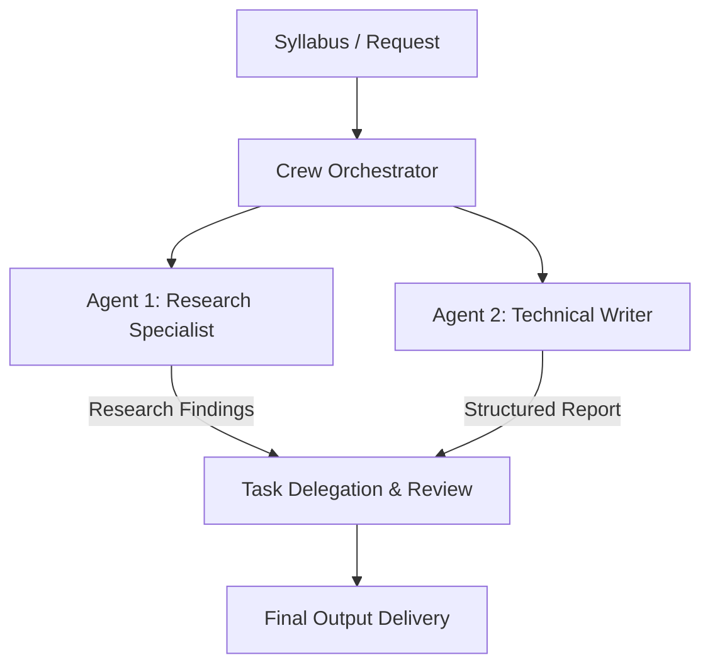

# Module 3: CrewAI

## 1. Industry Explanation
CrewAI is a framework designed to orchestrate role-playing, collaborative AI agents. Instead of focusing on low-level graph states, CrewAI models workflows around structured human organizational patterns: **Agents** are assigned specific roles, goals, and backstories; **Tasks** define explicit deliverables and required tools; and the **Crew** coordinates the execution order (either sequential or hierarchical).

In enterprise systems, CrewAI is used to automate cognitive team workflows, such as business analysis, content research, or market analysis, where multiple specialist roles must collaborate to build a final report.

## 2. Enterprise Architecture
Enterprise CrewAI structures ingest pipelines, specialist execution nodes, and reporting layers:

## 3. Business Use Cases
- **Automated Investment Research**: Coordinating a research agent (fetching market statistics) and a writing agent (drafting investment summaries) to compile stock analysis reports.
- **Competitor Analysis Engine**: Ingesting pricing pages, analyzing product features, and compiling comparison tables.
- **Corporate Content Pipeline**: Automating content creation: a copywriter agent drafts text, a SEO specialist optimizes keywords, and a compliance editor checks guidelines.

## 4. Production Design
Production CrewAI implementations require structured setups to keep agent outputs aligned:
- **Strict Output Formats**: Forcing agents to return structured formats (like JSON or Pydantic schemas) to ensure data can be processed by downstream APIs.
- **Decoupled Agent Configs**: Storing agent roles, backstories, and task descriptions in YAML configuration files rather than hardcoding them in Python scripts.

## 5. Common Failure Modes
- **Agent Goal Deviation**: Agents generating unstructured conversations or losing track of their tasks in long runs.
- **Infinite Delegation Loops**: Specialist agents repeatedly passing tasks back and forth because they cannot resolve a specific detail or error.
- **High Token Consumption**: Collaborative agents consuming high volumes of API tokens through verbose prompt histories.

## 6. Optimization Strategies
- **Enable Prompt Caching**: Structuring static backstories and task instructions to leverage model caching, reducing API costs.
- **Implement Local Model Execution**: Running smaller, local models (like Llama 8B) for simpler, repetitive sub-tasks to cut costs.

## 7. Security Considerations
- **Indirect Prompt Injection**: Research agents downloading and processing webpages containing malicious instructions that hijack the crew's goals.
- **Secrets Management**: Ensuring agents do not log API keys, database credentials, or private customer records in their shared thoughts.

## 8. Governance Considerations
- **Auditable Step Logs**: Storing the history of agent interactions (thoughts, task delegations, and tool runs) to support quality audits and troubleshooting.
- **Human Review Gates**: Requiring manual approvals before the crew delivers its output to external systems.

## 9. Best Practices
- **Write Precise Backstories**: Use clear, detailed instructions for roles and boundaries (e.g., *"Focus ONLY on data extraction. Do not write summaries."*).
- **Limit Delegation Steps**: Configure maximum iteration and delegation limits to prevent infinite loops and control costs.
- **Use Local Vector Storage**: Connect search tools to local vector databases (like ChromaDB) to speed up information retrieval during research tasks.

## 10. AI FDE Perspective
An FDE must design structured, cost-effective workflows. When implementing CrewAI, the FDE should decouple agent configurations into version-controlled YAML files, set up explicit output validation schemas, and configure iteration safety limits to ensure agent teams deliver reliable results within budget constraints.
