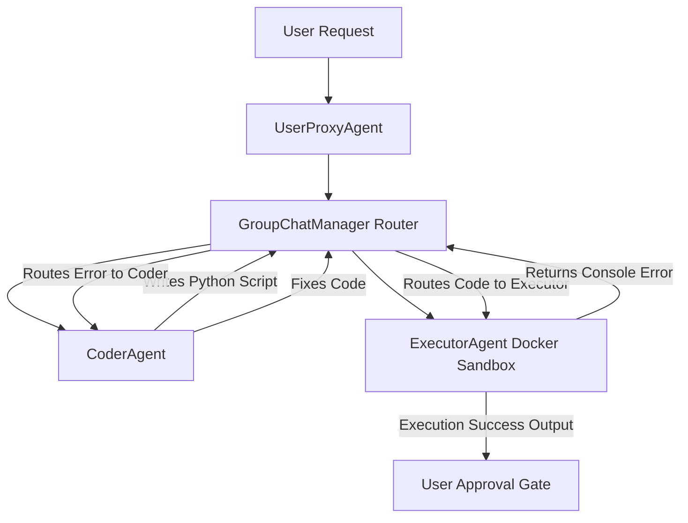

# Module 4: AutoGen

## 1. Industry Explanation
AutoGen is a developer framework designed to build multi-agent applications using conversational agent loops. While other frameworks use structured DAG graphs or task lists, AutoGen models workflows as multi-agent chat rooms where agents (UserProxyAgent, AssistantAgent) converse with one another to solve complex tasks.

In enterprise systems, AutoGen is used for autonomous software engineering, system simulation, and IT operations automation. The framework is highly flexible, supporting autonomous code generation, sandboxed execution, and dynamic human feedback routing.

## 2. Enterprise Architecture
Enterprise AutoGen integrations combine user proxies, sandboxed runtimes, and supervisor nodes:

## 3. Business Use Cases
- **Autonomous Software Engineering Platforms**: Automating code writing and testing: an agent writes Python code, a second agent runs it in a sandbox, catches errors, and prompts the first agent to apply fixes.
- **IT Systems Patching**: Automating patch management: the agent identifies software vulnerabilities, generates scripts, runs tests in a sandbox, and deploys updates.
- **Dynamic Business Simulation**: Simulating customer interactions: customer profile agents interact with support agents to evaluate pricing models and support guidelines.

## 4. Production Design
Production AutoGen architectures require strict isolation and monitoring:
- **Sandboxed Code Execution (Docker, LocalCommandLineCodeExecutor)**: Running model-generated code inside secure, isolated containers to protect the host server.
- **State Serialization Checkpoints**: Saving conversation history in databases (like PostgreSQL or Redis) to support long-running tasks.

## 5. Common Failure Modes
- **Runaway Execution Loops**: The agent repeatedly generating and running code that fails, resulting in high API costs and resource usage.
- **Dangerous System Commands**: The model attempting to run destructive commands (like `rm -rf /` or data deletions) during code execution tasks.
- **Chat Loop Deadlocks**: Agents getting stuck repeating the same conversation messages without progressing toward the task goal.

## 6. Optimization Strategies
- **Logit Bias Token Constraints**: Restricting token generation to prevent the model from generating unnecessary text during code extraction tasks.
- **Structured System Prompts**: Instructing agents to use specific termination tags (like `TERMINATE`) to end conversations once goals are met.

## 7. Security Considerations
- **Sandboxed Runtime Escapes**: Malicious code breaking out of standard containers and accessing host server resources.
- **API Secret Exposure**: Models reading and exposing system environment variables, database keys, or API tokens.

## 8. Governance Considerations
- **Human Approval Gates**: Requiring manual confirmations before the system executes critical console commands or deploys code.
- **Audit Trails**: Saving complete conversation logs (including code snippets and execution results) to support compliance reviews.

## 9. Best Practices
- **Always Run Code in Sandboxes**: Never run model-generated code directly on the host server; use isolated containers or virtual machines.
- **Set Iteration and Timeout Limits**: Enforce maximum execution counts and timeouts to prevent infinite loops and runaway costs.
- **Write Safe System Prompts**: Instruct agents to explain their plans clearly and write modular, testable code.

## 10. AI FDE Perspective
An FDE must design secure, reliable automation systems. When implementing AutoGen pipelines, the FDE should enforce strict container isolation, configure iteration safety limits, and set up human approval checkpoints for console actions, ensuring the platform is safe for enterprise operations.
