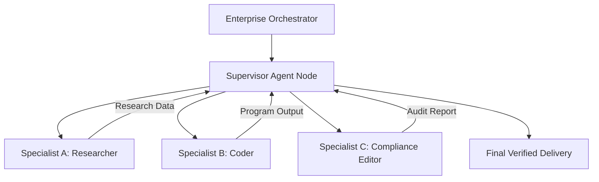

# Module 5: Multi-Agent Systems

## 1. Industry Explanation
A Multi-Agent System (MAS) is an architecture that coordinates multiple specialist agents to solve complex, multi-step tasks. Instead of relying on a single agent to handle all workflows, a MAS breaks tasks down and assigns them to specialist agents (like researchers, writers, programmers, or compliance auditors).

In enterprise systems, multi-agent architectures improve reliability and scalability. They partition system prompts, reduce model confusion by keeping tasks focused, and allow developers to use different, cost-effective models for different steps in the workflow.

## 2. Enterprise Architecture
Enterprise multi-agent systems use hierarchical or peer-to-peer designs to coordinate tasks:

## 3. Business Use Cases
- **Enterprise Software Platforms**: Coordinating a product manager agent (drafting specs), a coder agent (writing code), a QA agent (testing code), and a compliance agent (checking security).
- **Insurance Underwriting Platforms**: Coordinating an intake agent (extracting facts), a risk evaluator agent (checking policy compliance), and a report generator agent (drafting approval files).
- **Complex Financial Analytics**: Orchestrating a retrieval agent (fetching financial data), a calculations agent (running metrics), and an editor agent (compiling reports).

## 4. Production Design
Production-grade multi-agent architectures use structured orchestration layers:
- **Hierarchical Supervisor Models**: Deploying a central supervisor agent that receives the main request, delegates sub-tasks to specialist agents, compiles results, and returns the final answer.
- **Shared State Management**: Utilizing central state stores (like databases or memory files) to share variables across agents securely.

## 5. Common Failure Modes
- **Orchestration deadlocks**: Supervisor and specialist agents getting stuck in loops, repeatedly exchanging the same tasks or messages without making progress.
- **State Inconsistencies**: Specialists modifying shared state variables concurrently, resulting in race conditions or corrupted data.
- **Verbose Prompt Overheads**: Multi-agent chat rooms consuming high volumes of tokens through recursive planning discussions.

## 6. Optimization Strategies
- **Decoupled Specialist Prompts**: Keeping agent system prompts short and focused on specific tasks to prevent model confusion and save tokens.
- **Parallel Sub-Task Execution**: Running independent agent tasks (like retrieving data from different databases) concurrently to minimize latency.

## 7. Security Considerations
- **State Injection Vulnerabilities**: Malicious payloads injected by one specialist agent (e.g., from reading a compromised webpage) corrupting the shared state and hijacking other agents.
- **Privilege Escalation**: Specialist agents executing high-privilege tool calls on behalf of unauthorized users.

## 8. Governance Considerations
- **Human Approval Checkpoints**: Requiring manual confirmations before the supervisor executes critical actions (e.g., initiating bank transfers).
- **Comprehensive Run Auditing**: Logging all agent messages, thoughts, tool inputs, and outputs to support compliance audits and troubleshooting.

## 9. Best Practices
- **Define Clear Agent Responsibilities**: Keep agent roles focused and separate, ensuring each agent handles only one part of the workflow.
- **Use Typed State Objects**: Use structured state schemas (like Pydantic models) to pass data between agents, avoiding unstructured text logs.
- **Enforce Step and Loop Limits**: Configure safety limits on agent interactions to prevent infinite execution loops and control costs.

## 10. AI FDE Perspective
An FDE must design structured, manageable architectures. When working with complex client workflows, the FDE should avoid single-agent designs. Instead, the FDE should build a multi-agent system using a hierarchical supervisor model, keeping agent tasks focused, validating state transitions with typed schemas, and enforcing human approvals for high-risk operations.
