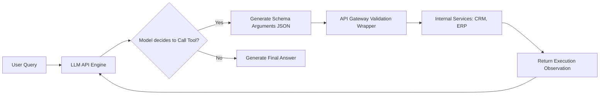

# Module 6: Tool Calling

## 1. Industry Explanation
Tool Calling (also known as Function Calling) is the standard method for connecting LLMs to external systems. When a model determines that a user query requires external data or action, it outputs a structured JSON object containing the name of a registered tool and its arguments. The application parses this JSON, runs the corresponding function, and returns the result to the model.

In agent engineering, tool calling is what allows models to write to databases, query APIs, perform calculations, and trigger real-world actions, transforming passive text generators into active integration engines.

## 2. Enterprise Architecture
Enterprise tool integration layers connect models to internal databases and APIs securely:

## 3. Business Use Cases
- **Real-Time CRM Operations**: Querying and updating sales pipelines: the agent parses details, calls `update_deal_stage(id, stage)`, and confirms changes.
- **Automated Inventory Tracking**: Monitoring supply chains: the agent checks stock levels, generates purchase orders, and updates internal databases.
- **IT Service Desk Automation**: Managing infrastructure alerts: the agent runs diagnostic checks, restarts services, and logs results in tracking systems.

## 4. Production Design
Production-grade systems separate tool execution from the core application:
- **Execution Sandboxing**: Running tool functions in secure, isolated containers (e.g., Docker or AWS Lambda) to protect internal networks.
- **API Gateways**: Routing all tool calls through secure gateways that handle authentication, input validation, and rate limiting.

## 5. Common Failure Modes
- **Argument Formatting Errors**: The model generating parameters that do not match the expected schema or fail JSON parsing checks.
- **Hallucinated Tool Names**: The model attempting to invoke functions that were not defined or registered in the pipeline.
- **Infinite Execution Loops**: The agent repeatedly calling a failing tool with the exact same parameters, resulting in high costs.

## 6. Optimization Strategies
- **Parallel Tool Runs**: Executing independent tool operations concurrently to minimize overall response times.
- **Pruning Conversation Logs**: Removing old tool execution logs from the context window once tasks are complete to save on token costs.

## 7. Security Considerations
- **Indirect Prompt Injection**: Malicious instructions embedded in retrieved data that hijack the model and trigger unauthorized tool calls.
- **Privilege Escalation**: Users using natural language to trick the model into running tool calls they do not have permissions to execute.

## 8. Governance Considerations
- **Human-in-the-Loop (HITL)**: Implementing mandatory human approvals for high-risk actions (e.g., sending emails, deleting records, making transfers).
- **Execution Audit Trails**: Logging all tool inputs, parameters, and responses to support troubleshooting and compliance.

## 9. Best Practices
- **Write Precise Tool Descriptions**: The model uses tool names and descriptions to select the right action. Describe clearly what each tool does and when to use it.
- **Enforce Low Temperatures**: Set the API temperature to `0` to make tool selection and parameter generation predictable.
- **Implement Robust Parsing Rules**: Wrap tool calling loops in try-catch blocks to catch and handle JSON formatting errors gracefully.

## 10. AI FDE Perspective
An FDE must design secure, reliable integration architectures. FDEs should implement validation wrappers to verify tool arguments, enforce user access controls at the API gateway, and deploy tools in secure sandboxes to protect enterprise networks.
