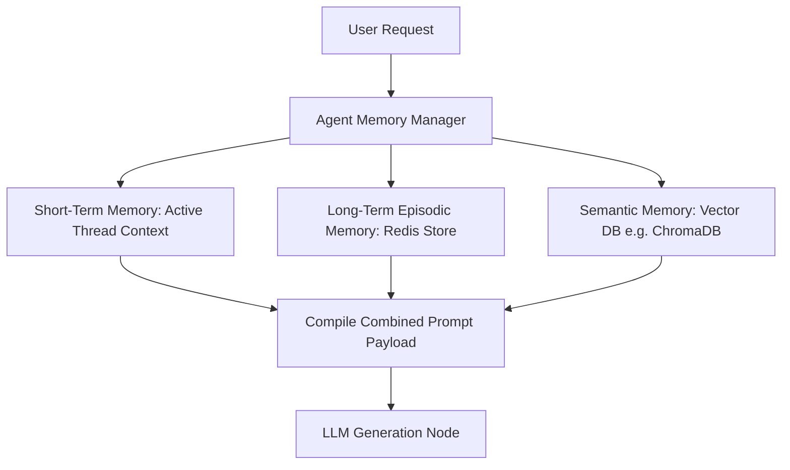

# Module 7: Memory Systems

## 1. Industry Explanation
Memory systems allow AI agents to maintain state, recall past interactions, learn from experiences, and retrieve relevant knowledge. Without memory, every LLM query is a standalone event, making it impossible for agents to manage long-term projects or build relationships with users.

In agent engineering, memory is divided into different subsystems: **Short-Term Memory** maintains the current conversation context; **Long-Term Memory** stores user preferences, rules, and facts over time; and **Vector/Semantic Memory** retrieves relevant documents and policies using similarity searches.

## 2. Enterprise Architecture
Enterprise agent memory systems organize short-term context and long-term database stores:

## 3. Business Use Cases
- **Personalized Customer Assistants**: Assistants that recall previous conversations, user preferences, and billing details to deliver tailored advice.
- **Enterprise IT Support Agents**: Agents that remember previous troubleshooting steps for specific servers, avoiding redundant checks and resolving issues faster.
- **Corporate Knowledge Assistants**: Assistants that query vector memory to retrieve relevant company policies, project guidelines, and HR manuals.

## 4. Production Design
Production-grade systems implement multi-tier storage architectures to manage memory:
- **Redis Cache Layer**: Storing active conversation histories and short-term variables to keep read/write latencies under 5ms.
- **Vector Database (ChromaDB, Pinecone)**: Indexing past conversation summaries and user preferences to support semantic search query retrieval.

## 5. Common Failure Modes
- **Memory Saturation**: Appending every message to the context window without summaries, eventually exceeding model token limits.
- **Memory Distortions**: The model generating inaccurate summaries of previous steps, leading to incorrect assumptions in future actions.
- **Context Cross-Contamination**: Multi-tenant systems leaking memory history across different user sessions, raising security risks.

## 6. Optimization Strategies
- **Dynamic Summarization**: Using a secondary, low-cost model to summarize conversation threads periodically, keeping active prompts short.
- **Time-to-Live (TTL) Configurations**: Setting expiration times on inactive session memories to save storage costs and protect privacy.

## 7. Security Considerations
- **PII Leakage in Memory**: Agents storing sensitive data (like passwords, credit card numbers, or personal IDs) in long-term vector indexes.
- **Memory Injection Attacks**: Attackers injecting malicious commands into conversations. If stored in long-term memory, these commands can hijack future sessions.

## 8. Governance Considerations
- **Compliance Alignment**: Ensuring memory systems comply with data regulations (like GDPR) by implementing automated "Right to be Forgotten" deletion routines.
- **Memory Auditing**: Logging when and how memories are created, updated, or retrieved to maintain transparency.

## 9. Best Practices
- **Implement Tiered Memory**: Use separate storage tiers: Redis for active thread context, and a vector database for long-term semantic preferences.
- **Sanitize Memory Inputs**: Clean user inputs to remove PII and control characters before saving them to long-term memory databases.
- **Build Structured Summaries**: Enforce structured schemas (like Pydantic models) for memory logs to make them easy to query and audit.

## 10. AI FDE Perspective
An FDE must design secure, compliant memory systems. FDEs should implement tiered storage architectures (Redis + Vector DB), set up automated summarization routines to optimize token usage, and build secure deletion APIs to comply with data privacy regulations (like GDPR).
