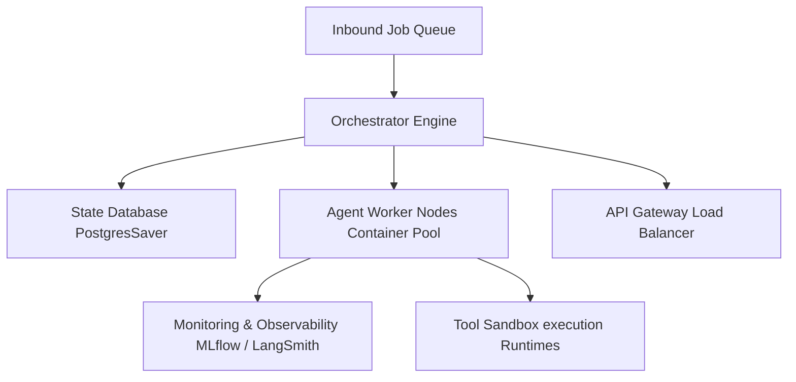

# Module 8: Agent Orchestration

## 1. Industry Explanation
Agent Orchestration is the process of managing the lifecycle, resource allocation, state persistence, execution queueing, and reliability of autonomous agent systems. While writing single prompts or basic agent loops is simple, running thousands of parallel agents at scale requires robust orchestration middleware.

An orchestrator coordinates tasks across teams of agents, manages shared states, schedules API calls, monitors execution budgets, and provides fail-safe recovery paths, transforming isolated scripts into reliable enterprise platforms.

## 2. Enterprise Architecture
Enterprise orchestrators coordinate execution queues, state databases, and worker nodes:

## 3. Business Use Cases
- **Enterprise Document Processing Hubs**: Orchestrating hundreds of parallel agents that parse financial files, check policy compliance, and generate reports.
- **IT Incident Response Systems**: Sourcing diagnostic alerts, spawning agent containers to run audits, applying hotfixes, and logging activities.
- **Supply Chain Automation**: Coordinating agents that monitor inventory levels, verify vendor pricing, generate orders, and route approvals.

## 4. Production Design
Production-grade orchestration systems use structured container environments:
- **Distributed Queues (Celery, Redis)**: Managing job distributions and handling spikes in workload smoothly.
- **Postgres Checkpointing**: Saving the state of all active agent runs in databases to support rollbacks and recovery.

## 5. Common Failure Modes
- **Orchestration Lockups**: Deadlocks in agent routing (e.g. Supervisor waiting for Worker -> Worker crashed -> no timeout configured), halting workflows.
- **Resource Depletion**: Spawning too many parallel agent processes, exhausting GPU memory, database connections, or API rate limits.
- **State Serialization Failures**: Issues saving complex custom Python objects, resulting in loss of state data.

## 6. Optimization Strategies
- **Dynamic Task Batching**: Grouping similar agent tasks together to maximize throughput and minimize latency.
- **Token Budget Limits**: Implementing token limits on agent runs to prevent runaway execution costs.

## 7. Security Considerations
- **Orchestration Context Pollution**: Attackers injecting malicious inputs to alter agent routing and bypass safety checkpoints.
- **Privilege Escalation**: Worker agents executing tool calls or database queries beyond the user's authorization level.

## 8. Governance Considerations
- **Mandatory Approval Gates**: Setting up supervisor checkpoints for high-risk actions (e.g., executing transactions or modifying databases).
- **Comprehensive Auditing**: Maintaining complete logs of all agent actions, thoughts, and tool inputs to support compliance reviews.

## 9. Best Practices
- **Implement Timeouts**: Always configure timeouts on agent nodes to prevent hangs and infinite loops.
- **Use Simple, Serializable States**: Keep state variables simple and easily serializable (using JSON or standard types) to ensure they save reliably.
- **Scale Workers Horizontally**: Run agent execution tasks on separate worker containers to scale the system efficiently.

## 10. AI FDE Perspective
An FDE must design reliable, scalable architectures. FDEs should implement distributed orchestration engines (like LangGraph with PostgresSaver), set up automated task routing, configure rate limits on tool interfaces, and establish human review gates for critical actions to build secure, robust enterprise platforms.
