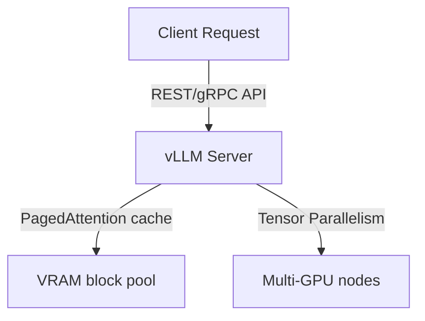
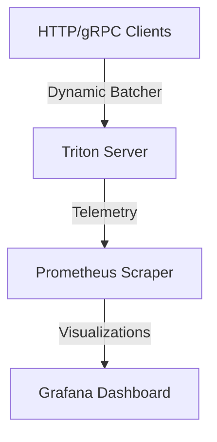
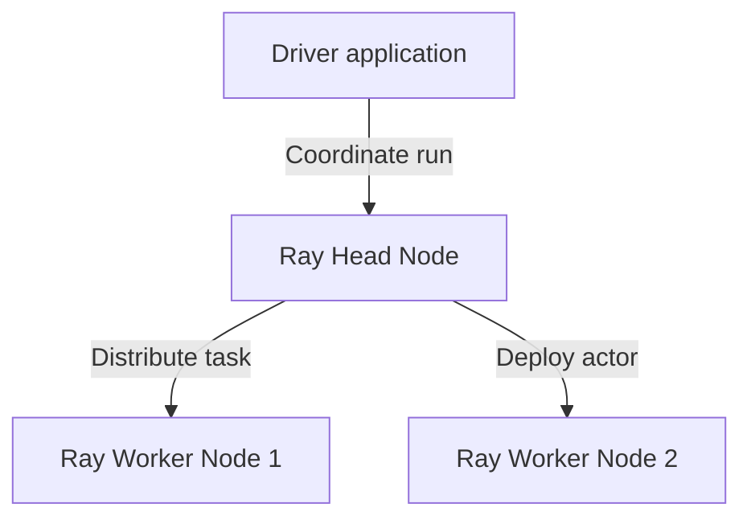
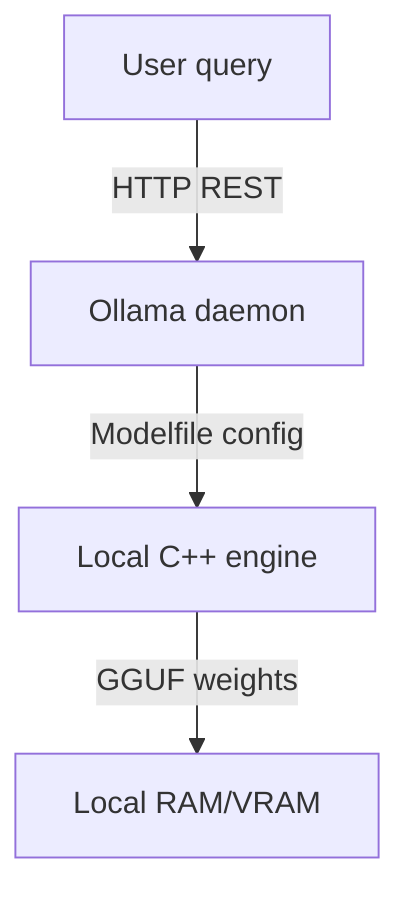
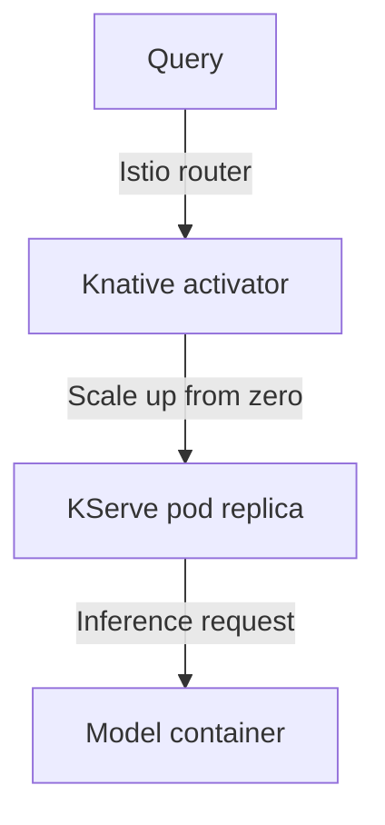
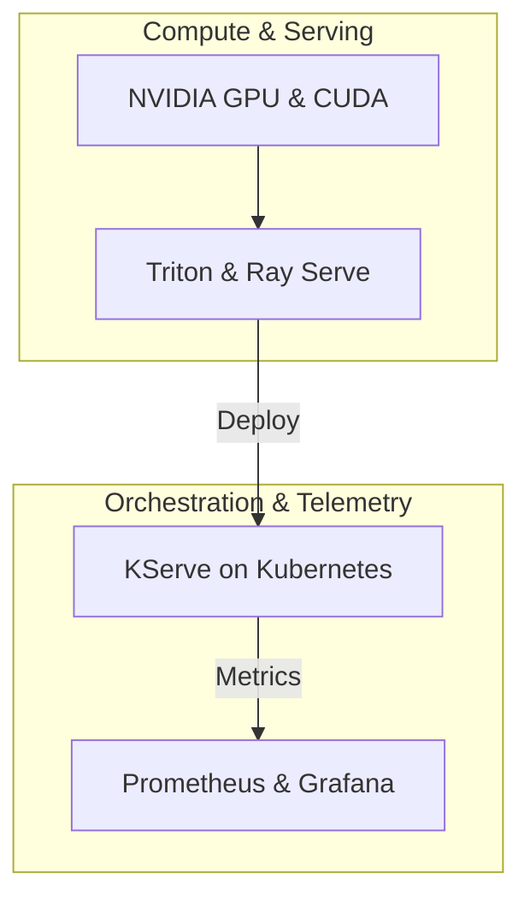

# Module 11: Enterprise AI Infrastructure Capstone Projects

This module outlines the architectures, requirements, and deployment steps for the seven enterprise capstone projects.

---

## Project 1: Enterprise LLM Serving Platform

### Overview
Build a high-performance LLM serving platform using vLLM to host Llama models with PagedAttention configurations.

### Technology Stack
*   **Hardware Layer**: NVIDIA GPU (CUDA runtime)
*   **Serving Engine**: vLLM
*   **Model**: Llama-3-8B-Instruct

### Architecture Diagram


### Key Deliverables
1.  **Server Startup Scripts**: Bash scripts configuring model download paths and starting the OpenAI-compatible vLLM API server.
2.  **KV Cache Tuning Config**: Setup tuning parameters (`--gpu-memory-utilization 0.90`) to optimize memory.
3.  **Benchmarking client**: Python script measuring response throughput and latency.

---

## Project 2: Enterprise Inference Platform

### Overview
Deploy Triton Inference Server on a local Kubernetes cluster, enabling dynamic batching and exposing metrics to Prometheus and Grafana.

### Technology Stack
*   **Serving Engine**: Triton Inference Server
*   **Model Format**: ONNX Runtime / TensorRT
*   **Monitoring**: Prometheus, Grafana

### Architecture Diagram


### Key Deliverables
1.  **Model Repository structure**: Directory structure containing models and configurations (`config.pbtxt`).
2.  **Dynamic Batching Config**: Tuning parameters (`max_queue_delay_microseconds: 5000`) to optimize throughput.
3.  **Prometheus Integration**: JSON dashboard configuration displaying metrics.

---

## Project 3: Distributed AI Training Platform

### Overview
Setup a distributed Ray cluster on Ubuntu, executing parallel tasks and running a Ray Serve model deployment.

### Technology Stack
*   **Distributed Platform**: Ray Core
*   **Model Serving**: Ray Serve
*   **Deployment tools**: Python / Pip

### Architecture Diagram


### Key Deliverables
1.  **Ray Cluster Config**: Scripts starting head and worker nodes with address binding.
2.  **Distributed Task Script**: Python script running parallel computations.
3.  **Ray Serve script**: Python script deploying model replicas with autoscaling.

---

## Project 4: Private Enterprise AI Platform

### Overview
Configure Ollama to serve local, quantized models (GGUF) in an air-gapped environment using custom Modelfile settings.

### Technology Stack
*   **Local serving**: Ollama
*   **Base model**: Llama-3 (Quantized)
*   **Configuration**: Modelfile syntax

### Architecture Diagram


### Key Deliverables
1.  **Modelfile configurations**: Custom instructions and parameters (temperature, system prompts) for model deployments.
2.  **Local model build scripts**: CLI commands importing GGUF checkpoints.
3.  **Offline deployment guide**: Instructions for setting up the platform in secure networks.

---

## Project 5: Enterprise Model Serving Platform

### Overview
Deploy serverless inference services using KServe, Knative, and Istio on a local Kubernetes cluster.

### Technology Stack
*   **Orchestration**: Kubernetes / Knative Serving
*   **Mesh routing**: Istio
*   **Serverless serving**: KServe InferenceServices

### Architecture Diagram


### Key Deliverables
1.  **KServe YAML manifests**: Declarations defining model frameworks and object storage paths.
2.  **Canary split manifest**: Configurations routing traffic between model versions.
3.  **Scale-to-Zero tests**: Logs validating auto-scale behaviors.

---

## Project 6: Multi-Tenant AI Platform

### Overview
Build a secure, multi-tenant AI platform configuring namespace resource quotas, MIG GPU slicing, and Keycloak authorization.

### Technology Stack
*   **Orchestration**: Kubernetes Namespaces
*   **Hardware Isolation**: MIG (Multi-Instance GPU)
*   **Identity Provider**: Keycloak

### Architecture Diagram
```mermaid
graph TD
    A[Tenant Developer] -->|Authenticate| B[Keycloak Gate]
    B -->|Deploy model| C[Namespace A (Quota limits)]
    C -->|Scheduled| D[MIG GPU Slice A (A100 partition)]
```

### Key Deliverables
1.  **Resource Quota YAMLs**: Manifests defining CPU/memory/GPU limits for namespaces.
2.  **MIG Slicing Profiles**: GPU configurations partitioning card nodes.
3.  **Keycloak realm configuration**: JSON file mapping roles and permissions.

---

## Project 7: Unified AI Infrastructure Platform

### Overview
Integrate all layers (GPU, CUDA, Triton, Ray, KServe, Monitoring) into a unified enterprise AI infrastructure platform.

### Technology Stack
*   **Hardware Layer**: NVIDIA GPU (CUDA runtime)
*   **Inference Layer**: Triton & Ray Serve
*   **Orchestration**: Kubernetes
*   **Monitoring**: Prometheus & Grafana

### Architecture Diagram


### Key Deliverables
1.  **Unified Infrastructure Setup**: Deployment manifests starting Triton, Ray, and monitoring tools on Kubernetes.
2.  **End-to-End Workflow**: Python script executing queries, checking batch statuses, and logging metrics.
3.  **Platform Verification Suite**: Script validating connection status across all integrated tools.
