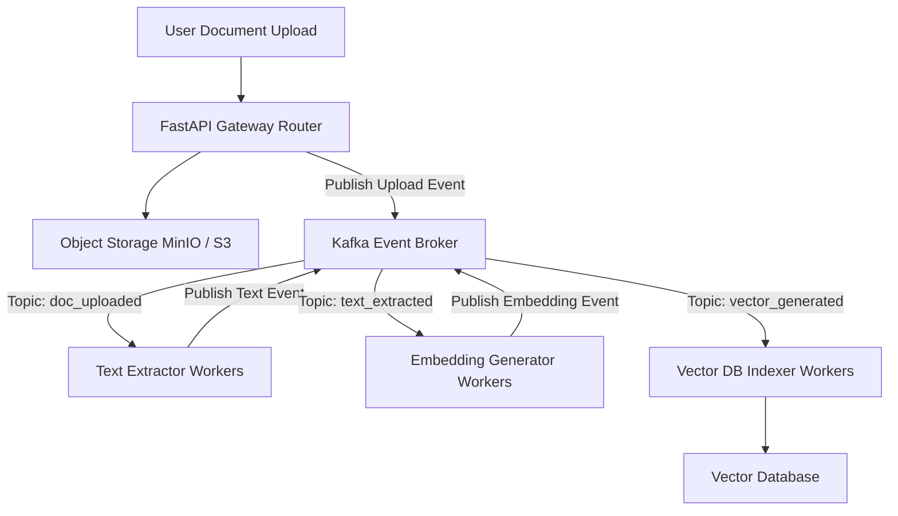

# Enterprise Backend Engineering Interview Preparation

This guide compiles advanced interview questions, architectural case studies, and scenarios covering the entire spectrum of backend engineering, microservices, gRPC communication, identity management (auth), edge gateways, event-driven streaming, and system design patterns.

---

## 1. High-Performance APIs (FastAPI & Flask)

### Q1: Explain how FastAPI handles asynchronous programming. What happens if a developer blocks the event loop with synchronous code?
**Answer:**
- **Asynchronous Execution:** FastAPI runs on an ASGI server (like Uvicorn) using a single-threaded event loop to handle concurrent connections efficiently.
- **The Event Loop Bottleneck:** If a route is defined with `async def` but contains blocking synchronous code (like slow database calls or file reads), the thread is blocked, preventing the event loop from handling other requests.
- **Best Practice:** Mark blocking operations with `def` rather than `async def` to allow FastAPI to run them in a separate thread pool.

---

## 2. Microservice Communication & gRPC

### Q2: Compare the network and performance trade-offs of gRPC (HTTP/2 + Protobuf) vs. REST (HTTP/1.1 + JSON) for inter-service communication.
**Answer:**
- **gRPC (HTTP/2 + Protobuf):**
  - **Trade-offs:** Uses binary Protocol Buffers to reduce payload sizes and HTTP/2 multiplexing to send multiple requests over a single TCP connection, keeping latencies low. However, it is more complex to set up and debug than REST.
  - **Best Fit:** Internal communication between backend services and real-time streaming interfaces.
- **REST (HTTP/1.1 + JSON):**
  - **Trade-offs:** Uses simple, human-readable text payloads (JSON), making it easy to test and integrate with third-party systems. However, it adds network overhead and requires separate TCP handshakes for requests.
  - **Best Fit:** Public APIs and client-facing interfaces.

---

## 3. Secure Identity Management (Authentication & Authorization)

### Q3: Contrast asymmetric (RS256) and symmetric (HS256) JWT signing algorithms. Why is RS256 preferred in microservice architectures?
**Answer:**
- **HS256 (Symmetric):** Uses a single shared secret key to sign and verify tokens, requiring all microservices to store the secret. If one service is compromised, the entire platform is vulnerable.
- **RS256 (Asymmetric):** Uses a private key at the identity server to sign tokens, and a public key to verify signatures. Microservices only store the public key, allowing them to verify tokens locally without risk of exposing signing secrets.

---

## 4. API Gateways & Rate Limiting

### Q4: Explain the Token Bucket algorithm for API rate limiting. How does it handle burst traffic?
**Answer:**
- **Mechanism:** A bucket is configured with a maximum capacity $C$ and refilled with tokens at a constant leak rate $r$ per second.
- **Request Validation:** Each incoming request consumes one token. If the bucket has tokens, access is granted; if it is empty, requests are rejected with a `429 Too Many Requests` error.
- **Burst Handling:** The bucket capacity allows the system to handle sudden bursts of traffic up to the capacity limit, while the leak rate limits continuous request rates.

---

## 5. System Design Case Studies

### Case Study: High-Throughput Event-Driven Document Ingestion
**Scenario:** Design a platform to process 1,000,000 document uploads daily, extracting text, generating vector embeddings, and indexing them in a database.

**Architecture:**

1. **Asynchronous Ingestion:** The gateway uploads files to storage, publishes upload events to Kafka, and returns immediate success responses to users, keeping APIs responsive.
2. **Decoupled Workers:** Decoupled worker services consume events from Kafka topics asynchronously, processing extraction, embedding, and indexing tasks step-by-step.
3. **Horizontal Scaling:** Run worker nodes on Kubernetes to scale consumer counts based on Kafka queue size, handling traffic spikes smoothly.
