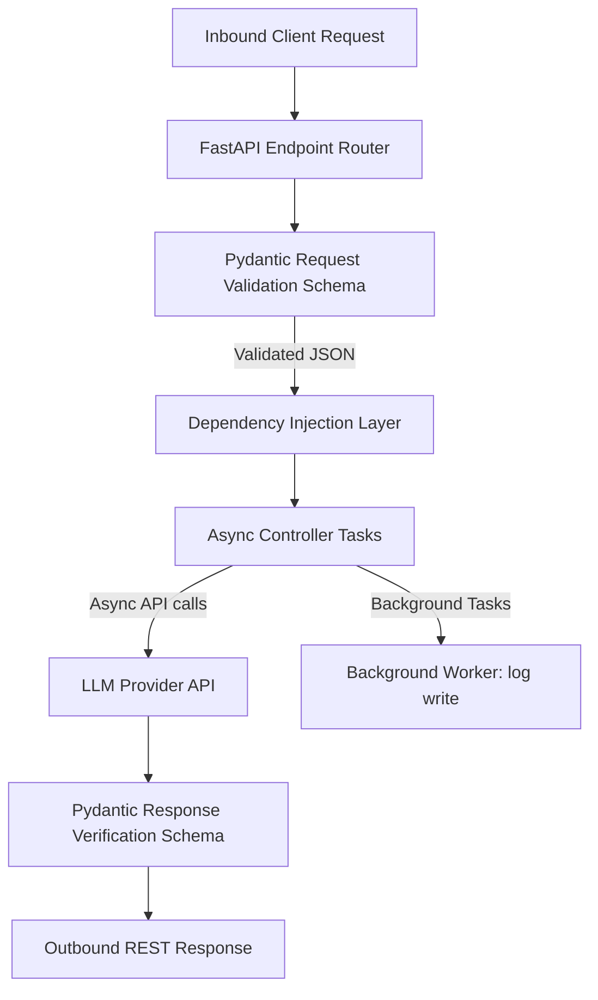

# Module 1: FastAPI

## 1. Industry Explanation
FastAPI is a modern, high-performance web framework designed for building REST APIs with Python. It relies on standard Python type hints to handle automated data serialization and validation via Pydantic, and runs on an asynchronous event loop (using ASGI servers like Uvicorn) to support thousands of parallel connections.

In enterprise AI engineering, FastAPI is the standard framework for hosting inference services, RAG APIs, and agentic platforms, providing low-latency response times and automated documentation.

## 2. Enterprise Architecture
Enterprise FastAPI endpoints manage schema validation, async connections, and worker tasks:

## 3. Business Use Cases
- **Enterprise AI Inference Gateways**: Hosting internal endpoints that format prompts, query model providers, and return structured text responses.
- **RAG Search Engines**: Exposing search endpoints that receive user queries, fetch documents, and return context-focused answers.
- **Agent Orchestration APIs**: Running background tasks to monitor and manage multi-step agent runs.

## 4. Production Design
Production-grade FastAPI applications use structured layers to keep requests fast and reliable:
- **Dependency Injection (`Depends`)**: Decoupling database connections, security checks, and service configurations from routing logic to make code easy to test.
- **Pydantic Data Validation Models**: Defining strict request and response schemas to validate inputs and outputs automatically.

## 5. Common Failure Modes
- **Blocking Async Loops**: Running slow, synchronous operations (like reading local files or calling legacy database drivers) inside async routes, blocking the event loop.
- **Memory Leaks in Background Tasks**: Spawning long-running tasks within the FastAPI server context without resource limits, eventually consuming all server memory.
- **Unvalidated API Input Errors**: Failing to define strict input schemas, leading to runtime failures inside business logic.

## 6. Optimization Strategies
- **Run Synchronous Code in Threads**: Mark slow synchronous functions with `def` rather than `async def` to allow FastAPI to run them in a separate thread pool.
- **Implement Connection Pools**: Use connection pooling for database drivers to minimize connection overhead.

## 7. Security Considerations
- **Exposing Internal Schema Data**: Leaving swagger docs (`/docs`) open to the public, allowing attackers to analyze api endpoints.
- **Injection Vulnerabilities**: Failing to sanitize request parameters, leaving SQL databases or system shells vulnerable to injection attacks.

## 8. Governance Considerations
- **Strict API Versioning**: Using versioned routing paths (e.g. `/api/v1/...`) to manage changes and updates without breaking integrations.
- **Request Auditing**: Implementing middleware logs to track incoming request parameters, IP addresses, and user IDs.

## 9. Best Practices
- **Define Strict Validation Schemas**: Use Pydantic models for all API inputs and outputs.
- **Avoid Blocking the Event Loop**: Move CPU-heavy or slow operations to background workers (like Celery) or run them in thread pools.
- **Secure Documentation Endpoints**: Disable Swagger UI documentation in production environments to protect API details.

## 10. AI FDE Perspective
An FDE must design secure, high-performance APIs. The FDE should define strict validation schemas to verify model arguments, run slow tasks in background workers to keep APIs responsive, and use dependency injection to decouple database connections from routing logic.
