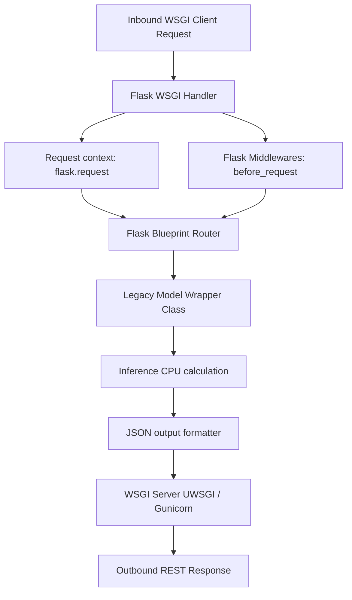

# Module 2: Flask

## 1. Industry Explanation
Flask is a lightweight, WSGI-compliant micro-framework designed for building web applications and REST APIs in Python. Unlike feature-rich frameworks (like Django), Flask provides a minimal core that developers can extend with custom extensions to manage databases, authentication, and validation.

In enterprise software platforms, Flask is commonly found in legacy codebases, internal routing services, and standalone machine learning pipelines serving traditional models (like Scikit-Learn or XGBoost).

## 2. Enterprise Architecture
Enterprise Flask integrations organize routes, blueprint structures, and request context:


## 3. Business Use Cases
- **Legacy ML Model Pipelines**: Serving traditional machine learning models (like fraud classification or churn prediction models) via REST APIs.
- **Internal Configuration Dashboards**: Running simple admin tools and dashboards inside corporate networks.
- **Micro-API Routing Tiers**: Serving lightweight data translation tools that parse and format files between internal services.

## 4. Production Design
Production Flask applications structure code into modules to keep deployment stable:
```
/app
  ├── /blueprints (Routes split by business logic)
  ├── /services (Business models)
  ├── __init__.py (App Factory setup)
```
- **Application Factory Pattern**: Initializing database drivers and extensions dynamically, preventing global state issues and supporting modular testing.
- **Blueprints**: Partitioning application routes into logical sections (e.g. isolating admin interfaces from customer endpoints).

## 5. Common Failure Modes
- **Synchronous Bottlenecks**: Blocking requests with slow operations, preventing the WSGI server from handling parallel queries.
- **Global Object Mutations**: Attempting to write to global variables inside request handlers, causing data leaks between concurrent threads.
- **Missing Error Handlers**: Failing to capture exceptions gracefully, exposing server stack traces to users.

## 6. Optimization Strategies
- **Deploy with Gunicorn/uWSGI**: Run Flask applications using production WSGI servers with multiple worker processes to handle traffic.
- **Offload Slow Workload**: Move resource-heavy tasks to async workers (like Celery) to prevent connection timeouts.

## 7. Security Considerations
- **Exposing Trace Logs in Production**: Leaving debug mode enabled (`debug=True`) in production, exposing database keys and files to the public.
- **Missing Session Secret Keys**: Configuring weak secret keys, leaving signed session cookies vulnerable to tampering.

## 8. Governance Considerations
- **Strict Configuration Decoupling**: Storing environment variables and API keys outside of code repositories to prevent leaks.
- **Standardized Error Schemas**: Returning consistent error shapes to clients to simplify debugging.

## 9. Best Practices
- **Never Run the Built-In Dev Server in Production**: Use Gunicorn or uWSGI to serve Flask applications.
- **Use the Application Factory Pattern**: Initialize your app dynamically to keep configuration modular.
- **Partition Routes with Blueprints**: Organize your code into blueprints to make routing configurations easy to scale.

## 10. AI FDE Perspective
An FDE must design secure, reliable deployment systems. When migrating or operating legacy Flask applications, the FDE should use application factories to keep configurations modular, deploy services using Gunicorn worker pools, and move slow tasks to background worker queues.
