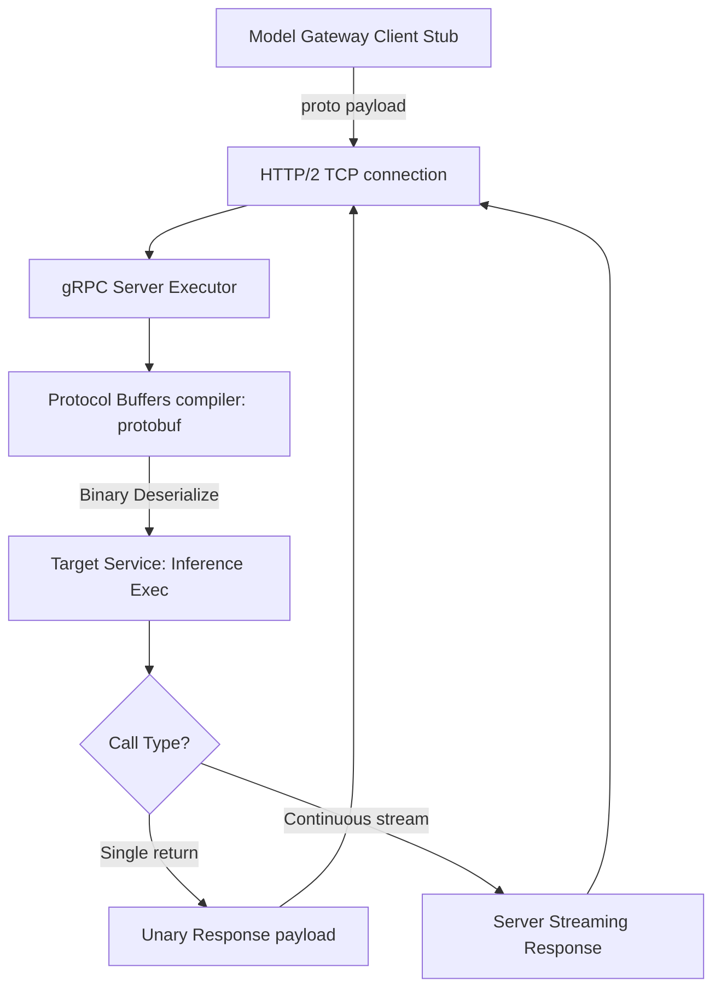

# Module 3: gRPC

## 1. Industry Explanation
gRPC (Google Remote Procedure Call) is a high-performance, open-source RPC framework that uses HTTP/2 for transport and Protocol Buffers (Protobuf) as its interface description language. Unlike standard REST APIs that send plain text JSON, gRPC compiles service contracts into binary payloads, significantly reducing network overhead and latency.

In enterprise AI platforms, gRPC is the standard framework for communication between microservices, linking model gateways, database indexes, and inference servers with low latency.

## 2. Enterprise Architecture
Enterprise gRPC platforms structure protoc compilation, client stubs, and stream channels:

## 3. Business Use Cases
- **Low-Latency Microservice Communication**: Connecting API gateways to internal vector databases and embedding services to keep query responses under 10ms.
- **Model Inference Streaming**: Streaming token generations from LLM servers to user clients in real time.
- **High-Throughput Logging Services**: Streaming system metrics and execution traces to analytics databases without slowing down application servers.

## 4. Production Design
Production gRPC implementations focus on performance and load balancing:
- **Protocol Buffer Schema Control**: Maintaining gRPC service definitions (using `.proto` files) in shared repositories to guarantee API contracts across development teams.
- **HTTP/2 Connection Keep-Alive**: Configuring keep-alive checks on TCP connections to reuse channels and minimize handshake latencies.

## 5. Common Failure Modes
- **Payload Size Limits**: Large file uploads exceeding gRPC's default payload limit (usually 4MB) and raising resource errors.
- **Incompatible Proxy Routing**: Standard proxy load balancers (like AWS ALB) terminating HTTP/2 connections incorrectly, disrupting gRPC traffic.
- **Unmanaged Stream Timeouts**: Streaming calls hanging indefinitely because of missing client-side timeouts or keep-alive parameters.

## 6. Optimization Strategies
- **Leverage Binary Quantization**: Compress data arrays before sending them over the wire to keep binary payloads small.
- **Configure Keep-Alive Pings**: Enable keep-alive checks to monitor connection health and close inactive channels automatically.

## 7. Security Considerations
- **Missing TLS Encryption**: Sending unencrypted binary data over public networks, leaving payloads vulnerable to interception.
- **Unauthenticated RPC Channels**: Exposing gRPC ports internally without configuring API key or token checks.

## 8. Governance Considerations
- **Protobuf Schema Backward Compatibility**: Enforcing strict guidelines on schema changes (e.g. avoiding changing field IDs) to prevent breaking existing stubs.
- **Service Dependency Mapping**: Auditing gRPC connections to track data flows across services.

## 9. Best Practices
- **Define Strict Proto Contracts**: Maintain Protobuf schema definitions in version-controlled repositories.
- **Enforce TLS on All Channels**: Secure gRPC connections with TLS to protect data privacy.
- **Configure Client Timeouts (Deadlines)**: Set timeouts on all RPC calls to prevent connections from hanging indefinitely.

## 10. AI FDE Perspective
An FDE must design fast, scalable systems. For inter-service communication within AI platforms, the FDE should use gRPC over REST to minimize serialization overhead, define clear Protocol Buffer contracts, configure TLS encryption, and set up streaming connections to serve token predictions in real time.
