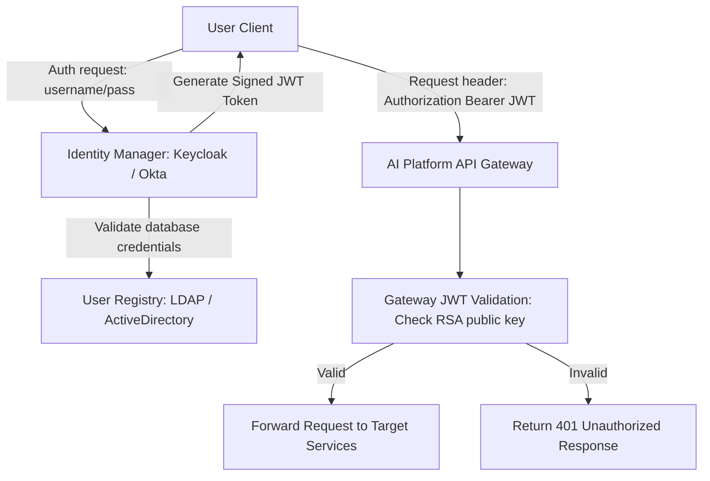

# Module 4: Authentication

## 1. Industry Explanation
Authentication is the process of verifying the identity of a user, system, or application. In enterprise platforms, authentication transitions from simple username/password checks to decentralized standards (like JSON Web Tokens (JWT), OAuth 2.0, and OpenID Connect (OIDC)) that support Single Sign-On (SSO) and secure API access.

In AI engineering, secure authentication ensures that only authorized users can query model interfaces, view RAG document indices, or access agent execution APIs.

## 2. Enterprise Architecture
Enterprise authentication systems verify user identity, issue tokens, and audit requests:

## 3. Business Use Cases
- **Enterprise Single Sign-On (SSO)**: Allowing employees to log in to corporate AI assistants using their existing company credentials.
- **Model Provider API Key Access**: Providing secure, audited API keys to developer teams to track model usage.
- **Multi-Tenant SaaS Platforms**: Isolating user identities and billing logs to ensure tenants only access their own data.

## 4. Production Design
Production-grade authentication systems use token-based validation to keep platforms secure:
- **Asymmetric Token Signing (RS256)**: Signing JWTs with a private key at the identity server, allowing API gateways to verify tokens using a public key without storing secrets.
- **Stateless JWT Verification**: Verifying token signatures, expiration dates, and scopes locally at the gateway, avoiding the need to query database servers on every request.

## 5. Common Failure Modes
- **Weak Token Signatures**: Signing JWTs with symmetric keys (HS256) stored in text files, leaving them vulnerable to tampering if files are compromised.
- **Missing Expiration Checks**: Issuing long-lived JWT tokens without expiration dates, leaving them active indefinitely if stolen.
- **Token Parsing Overheads**: Storing database lookups inside authentication middleware, slowing down request processing times.

## 6. Optimization Strategies
- **Cache JWKS (JSON Web Key Sets)**: Cache identity provider public keys at the gateway to verify token signatures locally, avoiding network requests.
- **Short-Lived Tokens**: Use short-lived access tokens (e.g., 15 minutes) combined with secure refresh tokens to minimize risk.

## 7. Security Considerations
- **Algorithm Hijacking**: Failing to block the `none` algorithm in JWT verification libraries, allowing attackers to bypass signature checks.
- **Insecure Token Storage**: Storing access tokens in local storage, leaving them vulnerable to Cross-Site Scripting (XSS) attacks.

## 8. Governance Considerations
- **Data Compliance Policies**: Ensuring user identity databases meet regional data privacy laws (like GDPR right to be forgotten).
- **Authentication Logs**: Logging all login attempts, token issuances, and key rotations to support security audits.

## 9. Best Practices
- **Use Asymmetric RS256 Signing**: Sign tokens with private keys and verify them using public keys.
- **Implement Short Token Expirations**: Set short expiration times on access tokens and use secure refresh tokens to renew them.
- **Validate Token Scopes**: Check token scopes and claims at the API gateway before routing requests.

## 10. AI FDE Perspective
An FDE must design secure, compliant authentication systems. When deploying AI platforms, the FDE should use asymmetric RS256 token verification, cache identity provider keys at the gateway to keep API responses fast, and enforce strict API key auditing to track model usage.
