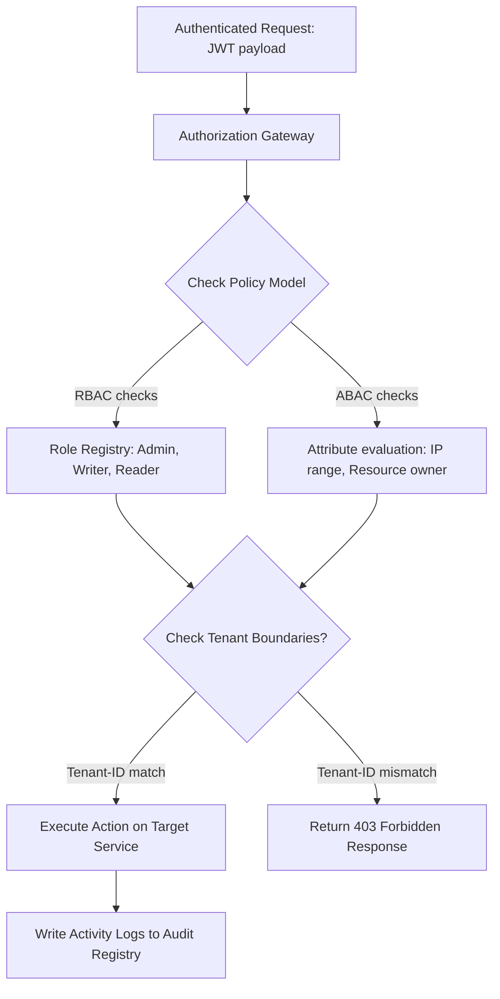

# Module 5: Authorization

## 1. Industry Explanation
Authorization is the process of verifying what resources an authenticated user or service is allowed to access. While authentication checks *who* you are, authorization checks *what* you can do. Enterprise platforms transition from basic Role-Based Access Control (RBAC) to Attribute-Based Access Control (ABAC) to enforce fine-grained access policies.

In AI platforms, authorization controls access to models, document partitions in RAG vector databases, and admin configurations.

## 2. Enterprise Architecture
Enterprise authorization layers manage permissions, tenant access, and audits:

## 3. Business Use Cases
- **Role-Based RAG Access**: Ensuring only HR department employees can retrieve documents from the HR namespace.
- **Model Execution Limits**: Setting daily spending limits on model runs for developer teams.
- **Multi-Tenant SaaS Security**: Isolating customer data so tenant administrators only access resources within their own tenant ID.

## 4. Production Design
Production-grade systems separate policy definitions from application logic:
- **Centralized Policy Engines (OPA - Open Policy Agent)**: Deploying dedicated policy services to evaluate access permissions, keeping authorization rules consistent across microservices.
- **Hierarchical Access Controls**: Checking tenant boundaries at the API gateway, and running fine-grained resource audits within target microservices.

## 5. Common Failure Modes
- **Hardcoded Authorization Rules**: Writing permission logic directly in application code, making updates slow and difficult to audit.
- **Broken Object-Level Authorization (BOLA)**: Validating user roles but failing to check resource ownership (e.g. allowing users to read records from other tenants by modifying ID parameters).
- **Slow Authorization Checks**: Querying database servers repeatedly to check user permissions, slowing down request processing times.

## 6. Optimization Strategies
- **Embed Roles in JWT Claims**: Store user roles and tenant IDs inside JWT tokens, allowing microservices to verify permissions locally without querying databases.
- **Cache Authorization Policies**: Cache policy decisions locally at microservice endpoints to keep response times fast.

## 7. Security Considerations
- **Privilege Escalation**: Users exploiting input formatting errors or API vulnerabilities to grant themselves administrative permissions.
- **Incomplete Tenancy Separations**: Querying databases without checking tenant IDs, leading to data leaks in shared indexes.

## 8. Governance Considerations
- **Comprehensive Audit Logs**: Storing detailed logs of all authorization decisions (including who requested what action and if it was approved) to support compliance reviews.
- **Policy Reviews**: Regularly reviewing role scopes and access policies to ensure permissions remain aligned with business needs.

## 9. Best Practices
- **Never Hardcode Authorization Rules**: Use centralized engines (like OPA) or config libraries to manage permissions outside of code.
- **Embed Tenant IDs in JWTs**: Store tenant boundaries inside tokens to simplify access checks.
- **Validate Object Ownership**: Always verify that the requesting user owns or has access to the target resource ID before executing actions.

## 10. AI FDE Perspective
An FDE must design secure, auditable access systems. When deploying AI platforms, the FDE should use centralized policy engines to manage authorization, embed tenant boundaries in JWT tokens, and verify that users have permission to access specific document namespaces before running vector database queries.
