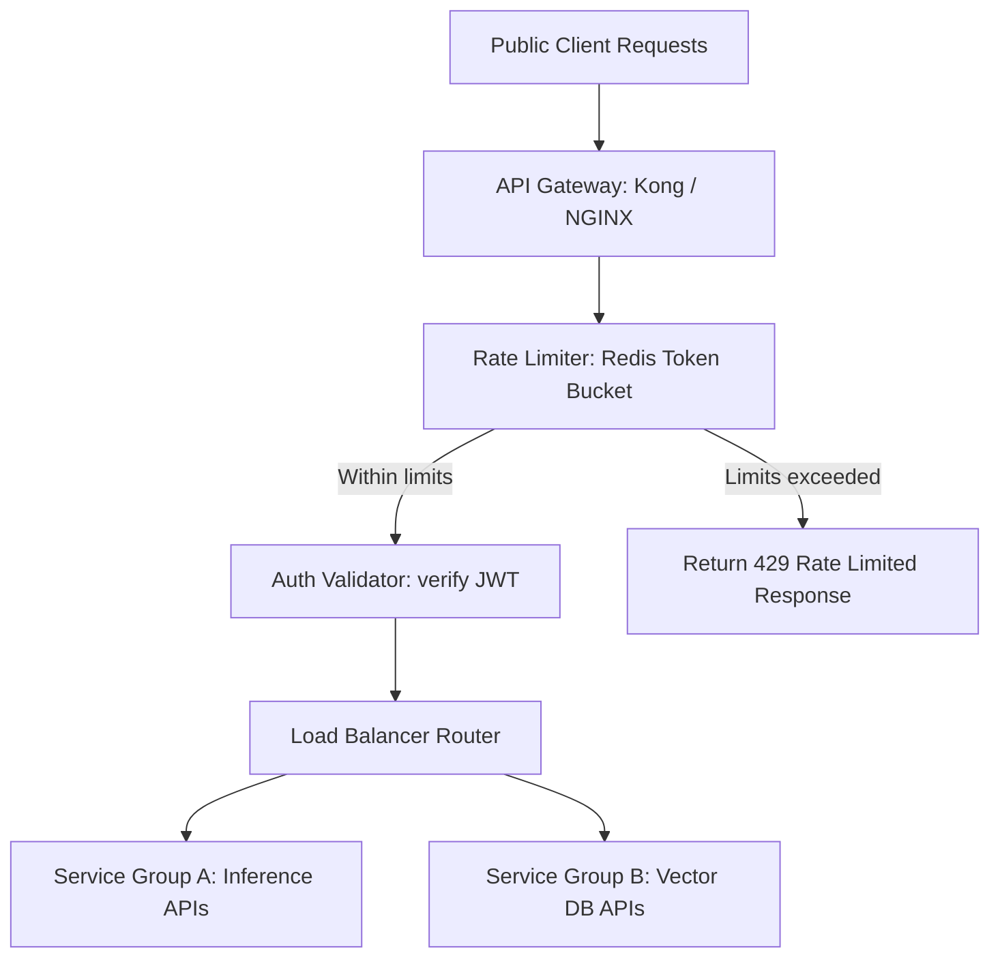

# Module 6: API Gateway

## 1. Industry Explanation
An API Gateway is a server that acts as a single entry point for all client requests, routing traffic to internal microservices. Rather than requiring clients to connect to services directly, the gateway handles reverse proxy routing, load balancing, SSL termination, authentication checks, and rate limiting at the edge of the network.

In AI platform engineering, the gateway is critical. It acts as the traffic controller, routing API calls, checking tokens, limiting request rates to model endpoints, and collecting telemetry data.

## 2. Enterprise Architecture
Enterprise API gateways coordinate incoming queries, apply security rules, and balance workloads:

## 3. Business Use Cases
- **Public API Rate Limiting**: Limiting client request rates to model endpoints to prevent abuse and manage API costs.
- **Inference Load Balancing**: Distributing query traffic across multiple model replica servers to maintain fast response times.
- **Unified Microservice Access**: Exposing a single API domain (e.g. `api.company.com`) to coordinate traffic to internal services.

## 4. Production Design
Production-grade systems deploy gateways at the edge of network zones:
- **Rate Limiting Middleware (Redis Token Bucket)**: Tracking client requests in fast Redis caches to limit api access rates.
- **Reverse Proxy Routing**: Defining routing tables (e.g. routing `/v1/inference` to model servers and `/v1/search` to RAG services) to decouple internal services from public endpoints.

## 5. Common Failure Modes
- **Single Point of Failure (SPOF)**: Deploying only a single gateway instance, causing system outages if the gateway server fails.
- **Gateway CPU Saturation**: Running complex tasks (like processing large payloads or generating tokens) directly on the gateway, slowing down traffic.
- **Stale Routing Configurations**: Out-of-sync routing configurations causing queries to be sent to dead or offline service instances.

## 6. Optimization Strategies
- **Scale Gateways Horizontally**: Run multiple gateway instances behind network load balancers (like AWS ELB) to prevent single-point failures.
- **Offload Heavy Calculations**: Keep the gateway layer focused on routing, security checks, and rate limiting, and run business logic on internal servers.

## 7. Security Considerations
- **Exposing Internal Service Ports**: Failing to block direct public access to internal microservice ports, allowing attackers to bypass the gateway.
- **Insecure SSL Configurations**: Using weak SSL ciphers or old TLS versions to terminate connections.

## 8. Governance Considerations
- **Strict API Version Control**: Managing endpoint paths (e.g. routing `/v1/` and `/v2/` requests to different service versions) to support system updates.
- **Telemetry Ingestion**: Collecting usage data (like request counts and latencies) to track database workloads and monitor SLAs.

## 9. Best Practices
- **Run Gateways in HA Pools**: Deploy multiple gateway servers behind load balancers to ensure high availability.
- **Implement Rate Limiting Early**: Set rate limits at the gateway layer to protect internal services from overload.
- **Decouple Gateway Runtimes**: Keep gateways focused on routing and security, and offload processing tasks to internal microservices.

## 10. AI FDE Perspective
An FDE must design secure, resilient access architectures. The FDE should deploy edge gateways (like Kong or NGINX) to manage access routes, configure Redis-backed rate limiters to control API costs, and collect usage telemetry data to monitor system performance.
