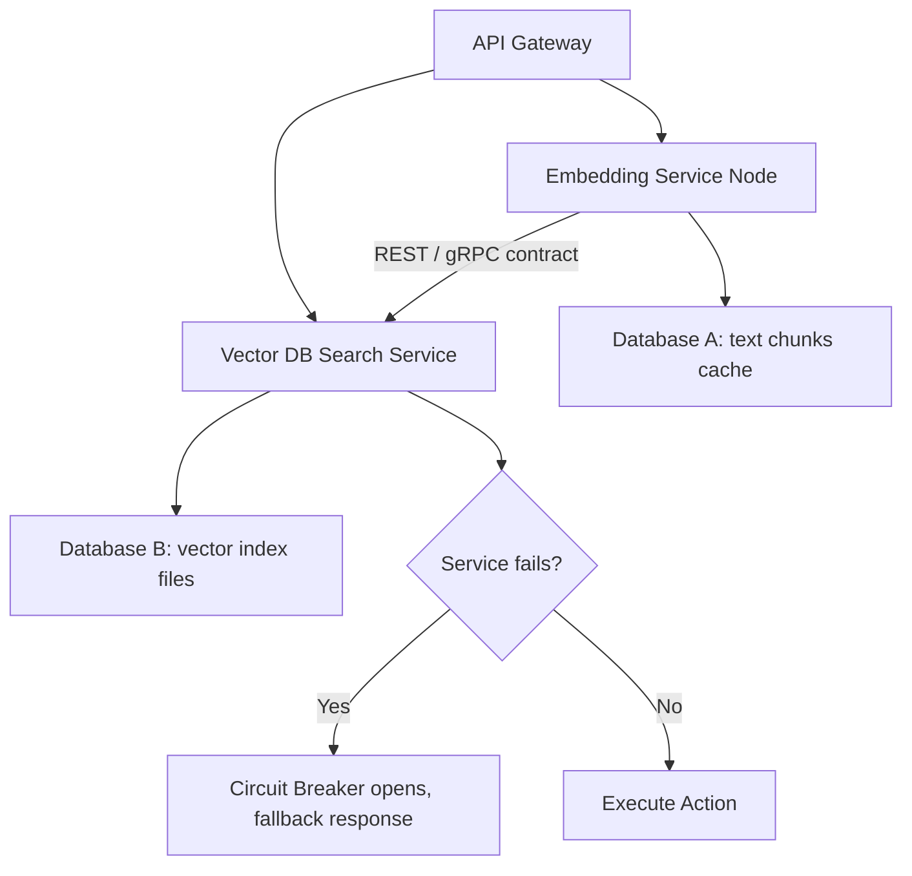

# Module 7: Microservices

## 1. Industry Explanation
Microservices is an architectural style that structures an application as a collection of small, loosely coupled, independently deployable services. Instead of building a single monolith application, microservices partition business logic into specialist services (like user auth, embedding generation, vector indexing, and billing), linking them via network contracts (REST, gRPC).

In AI platforms, microservices improve scalability. They allow developers to scale CPU-heavy data pipelines independently from memory-heavy model serving runtimes, using different technologies and deployment patterns for each step.

## 2. Enterprise Architecture
Enterprise microservice architectures isolate database domains and deploy resilience patterns:

## 3. Business Use Cases
- **Modular AI Platforms**: Decoupling the user interface from the backend embedding and inference pipelines, allowing developer teams to update services independently.
- **Custom Search Platforms**: Scaling the indexing pipeline to handle large document imports without affecting search query speeds.
- **Dynamic Billing Tiers**: Separating payment processing from model execution services to track billing details securely.

## 4. Production Design
Production microservice architectures rely on service boundaries and database isolation:
- **Database-per-Service Pattern**: Restricting database access so each microservice queries only its own database, preventing database coupling.
- **Circuit Breaker Pattern (Hystrix / Resilience4j)**: Implementing circuit breakers on network connections to fail fast and prevent failures in one service from crashing other systems.

## 5. Common Failure Modes
- **Shared Database Coupling**: Allowing multiple microservices to read and write to the same database tables, causing schema updates to break services.
- **Cascading Failures**: A timeout in a downstream database causing failures to cascade upstream, halting the entire platform because of missing timeouts.
- **Distributed Monoliths**: Building microservices that are tightly coupled by synchronous REST calls, losing the benefits of independent deployments.

## 6. Optimization Strategies
- **Deploy Service Registries (Consul / Kubernetes DNS)**: Automating service discovery to update service routes automatically as containers scale.
- **Use Asynchronous Event Loops**: Coordinate inter-service notifications asynchronously using message brokers to reduce coupling.

## 7. Security Considerations
- **Internal Access Security**: Failing to authenticate inter-service requests, allowing attackers to access downstream databases directly.
- **Secret Leaks**: Hardcoding service credentials, database keys, or API tokens in code repositories.

## 8. Governance Considerations
- **Strict API Contract Versioning**: Versioning gRPC Protobuf files and OpenAPI specs to manage service updates without breaking integrations.
- **Distributed Tracing Integration**: Tracking queries across services (using systems like OpenTelemetry) to monitor performance.

## 9. Best Practices
- **Enforce Database Isolation**: Ensure each microservice manages and accesses its own database.
- **Implement Circuit Breakers**: Wrap network calls in circuit breakers to handle downstream timeouts and prevent cascading failures.
- **Use gRPC for Inter-Service Traffic**: Route internal microservice communication over gRPC to minimize network overhead and latency.

## 10. AI FDE Perspective
An FDE must design resilient, modular systems. When building AI platforms, the FDE should structure pipelines into decoupled microservices, isolate document processing databases from model indexes, run internal connections over gRPC, and implement circuit breakers to handle downstream timeouts.
