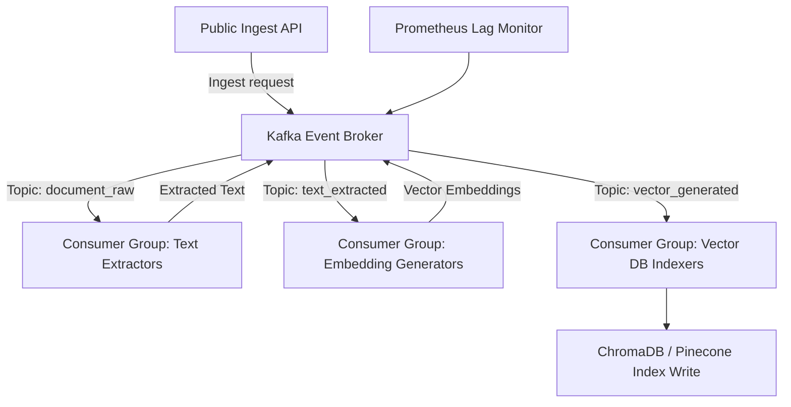

# Module 8: Event-Driven Architecture

## 1. Industry Explanation
Event-Driven Architecture (EDA) is a software design pattern where decoupled services interact asynchronously by producing and consuming events. Instead of sending synchronous REST calls (where service A blocks to wait for service B), services publish events (e.g. "document_uploaded") to a central message broker (like Apache Kafka or RabbitMQ), and interested services consume and process those events.

In AI engineering, EDA is critical for managing asynchronous processes, such as document ingestion, background index generation, model fine-tuning, and multi-step agent runs.

## 2. Enterprise Architecture
Enterprise event-driven platforms coordinate message queues, worker groups, and indexes:

## 3. Business Use Cases
- **Asynchronous Document Ingestion**: Ingesting corporate folders: files are uploaded, text is extracted, embeddings are generated, and databases are indexed in a step-by-step background process.
- **Model Fine-Tuning Pipelines**: Spawning training runs, monitoring updates, and writing checkpoints to storage.
- **Real-Time Notification Systems**: Sending system alerts and task updates to users as long-running calculations complete.

## 4. Production Design
Production event-driven platforms require structured consumer groups and metrics monitoring:
- **Decoupled Consumer Groups**: Running multiple instances of consumer services under a single consumer group to distribute task processing.
- **Dead Letter Queues (DLQ)**: Routing failing event messages to a separate DLQ for manual audit, preventing corrupt messages from blocking processing pipelines.

## 5. Common Failure Modes
- **Consumer Lag Accumulation**: The volume of incoming events exceeding consumer processing speeds, causing a backlog of unprocessed tasks.
- **OutOfOrder Processing**: Processing events out of order, leading to inconsistent application states.
- **Broker Memory Outages**: Unmanaged data retention rules on brokers, exhausting disk space during heavy data runs.

## 6. Optimization Strategies
- **Scale Consumer Partitions**: Match Kafka partition counts with the number of consumer workers to scale event processing horizontally.
- **Implement Batch Processing**: Fetch and process events in batches rather than one-by-one to reduce database write overhead.

## 7. Security Considerations
- **Broker Access Security**: Authenticating and encrypting all traffic to the message broker using TLS and SASL.
- **Payload Data Sanitization**: Cleaning event payloads to prevent malicious inputs from reaching downstream consumers.

## 8. Governance Considerations
- **Event Schema Registries**: Using tools like Confluent Schema Registry to version-control event schemas and prevent updates from breaking consumers.
- **Monitor Consumer Lag**: Continuously tracking consumer lag metrics to identify and resolve processing bottlenecks.

## 9. Best Practices
- **Implement Dead Letter Queues**: Route failing events to a DLQ to isolate errors and keep pipelines running.
- **Use Schema Registries**: Enforce consistent event schemas to ensure compatibility across services.
- **Tune Retention Settings**: Configure data retention rules on your broker to prevent disk space issues.

## 10. AI FDE Perspective
An FDE must design scalable, asynchronous systems. When building document ingestion pipelines, the FDE should use event-driven architectures, route files through decoupled consumer steps (for extraction, embedding, and indexing), and monitor consumer lag to keep processing queues running smoothly.
