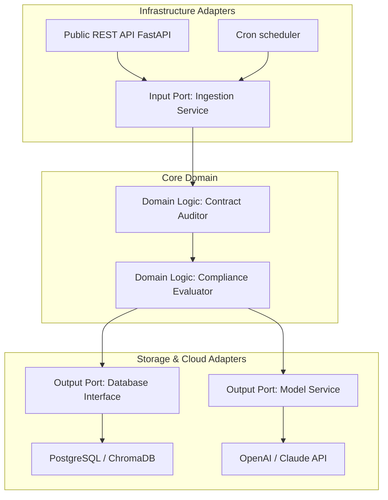

# Module 9: Backend Architecture Patterns

## 1. Industry Explanation
Backend Architecture Patterns define the structural design principles that dictate how code dependencies, database boundaries, and domain boundaries are organized within enterprise software. Choosing the right pattern is critical: it determines whether a codebase remains maintainable, testable, and scalable over time, or degrades into a tightly coupled system that is difficult to update.

In AI engineering, patterns (like Hexagonal Architecture or Domain-Driven Design (DDD)) decouple core business logic from model providers and database engines, allowing platforms to swap models or databases with minimal impact.

## 2. Enterprise Architecture
Enterprise Hexagonal (Ports and Adapters) architectures isolate core business domains:

## 3. Business Use Cases
- **Enterprise Copilot Platforms**: Building modular platforms that can swap model providers (e.g. from OpenAI to local Llama) without rewrite.
- **Dynamic Insurance Portals**: Decoupling claims processing rules from external systems (like email services or payment gateways) to simplify updates.
- **High-Volume Search Hubs**: Isolating search logic from database engines to allow developers to swap vector databases easily.

## 4. Production Design
Production architectures isolate core business rules from external technologies:
- **Clean / Hexagonal Architecture**: Placing business logic at the core, and routing all external connections (like databases, APIs, and model services) through interface adapters (Ports & Adapters).
- **Domain-Driven Design (DDD)**: Grouping code into bounded contexts based on business processes to keep responsibilities separate.

## 5. Common Failure Modes
- **Tightly Coupled Codebases**: Hardcoding specific database drivers or model SDKs directly inside core business functions, making updates slow and error-prone.
- **Anemic Domain Models**: Treating core domain files as simple data stores (like basic SQL schemas) while placing business logic inside database layers or controllers.
- **Over-Engineering**: Designing complex, multi-tiered architectures for simple CRUD systems, adding unnecessary overhead and slowing down development.

## 6. Optimization Strategies
- **Define Explicit Interfaces (Ports)**: Write abstract base classes to define service contracts, keeping domain logic isolated from external packages.
- **Group Code by Bounded Context**: Organize repository files by feature (e.g. `billing/`, `search/`) rather than by code layer (`controllers/`, `models/`) to keep code modular.

## 7. Security Considerations
- **Boundary Validation**: Enforce input validation at the edge of domain boundaries to ensure domain logic processes only clean data.
- **Secrets Management**: Keep API keys and database credentials in secure, external config files to prevent leaks.

## 8. Governance Considerations
- **Schema Migration Control**: Version-control database schemas to manage updates and migrations across environments.
- **API Contract Reviews**: Regularly auditing service boundaries and interfaces to keep microservices aligned with business needs.

## 9. Best Practices
- **Isolate Core Domain Logic**: Keep business rules decoupled from external frameworks, databases, and third-party APIs.
- **Use Abstract Interfaces (Ports)**: Route all database and API connections through interface boundaries.
- **Organize Repository Files by Domain**: Group code files by business feature to maintain modularity.

## 10. AI FDE Perspective
An FDE must design flexible, maintainable systems. FDEs should implement Hexagonal Architecture to separate domain logic from model providers and database engines, write abstract interfaces for all third-party connections, and validate inputs at boundary gates to keep systems robust.
