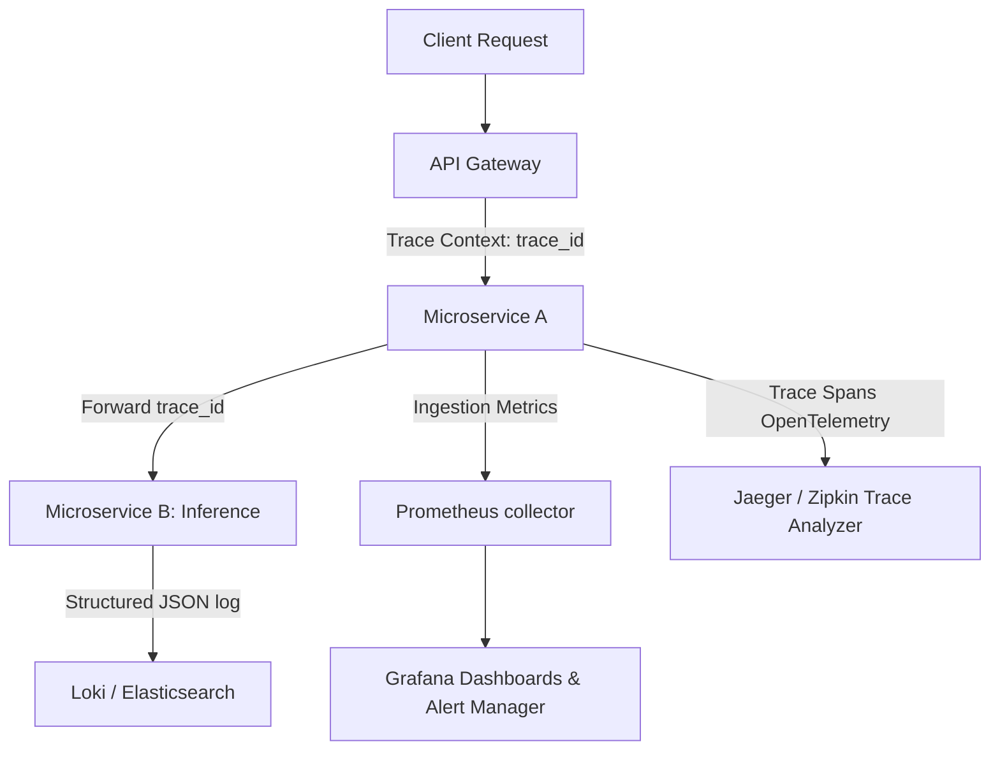

# Module 10: Backend Observability

## 1. Industry Explanation
Backend Observability is the practice of monitoring, measuring, and tracing the internal state of software platforms by analyzing logs, metrics, and traces. While basic monitoring checks if a server is online, observability allows developers to debug complex, distributed systems by tracing requests across microservices.

In AI engineering, observability is critical. It enables developer teams to track model latencies, input/output structures, database query speeds, and token consumption rates in real time.

## 2. Enterprise Architecture
Enterprise observability platforms collect structured logs, system metrics, and traces:

## 3. Business Use Cases
- **Real-Time Model Latency Tracking**: Monitoring API latency to identify performance bottlenecks and slow model responses.
- **Dynamic Cost Tracking**: Measuring token consumption across departments to track monthly API spend.
- **Distributed Query Debugging**: Tracing RAG queries across search services, embedding APIs, and vector databases to identify errors.

## 4. Production Design
Production-grade systems use structured telemetry to monitor platform health:
- **Distributed Tracing (OpenTelemetry)**: Propagating unique trace IDs through HTTP/gRPC request headers to track workflows across microservices.
- **Structured JSON Logging**: Formatting all logs as structured JSON to support automated parsing and analysis in central log aggregators.

## 5. Common Failure Modes
- **High Telemetry Storage Costs**: Ingesting excessive debug logs or high-frequency metrics, resulting in high storage costs.
- **Missing Trace Contexts**: Failing to pass trace IDs across microservice boundaries, breaking request traces.
- **Unstructured Text Logs**: Logging unstructured text files, making automated search and analysis difficult.

## 6. Optimization Strategies
- **Implement Trace Sampling**: Sample a percentage of successful requests (e.g., 5%) while logging all failed runs to keep storage costs low.
- **Use Local Logging Buffers**: Write log entries to local memory buffers and send them in batches to central log services to minimize network overhead.

## 7. Security Considerations
- **PII Exposure in Logs**: Logging sensitive customer data (like passwords, credit card numbers, or personal IDs) in application logs.
- **Log Injection Vulnerabilities**: Failing to sanitize request parameters, leaving log parsers vulnerable to injection attacks.

## 8. Governance Considerations
- **Log Retention Policies**: Setting up automated data retention rules to archive or delete old logs to meet privacy requirements (like GDPR).
- **Service Level Agreements (SLAs)**: Establishing alerting rules for critical metrics (like 99th percentile latencies and error rates) to maintain service quality.

## 9. Best Practices
- **Implement OpenTelemetry Tracing**: Use OpenTelemetry to track requests and workflows across all services.
- **Write Structured JSON Logs**: Format all logs as JSON to support automated parsing and analysis.
- **Sample Trace Collections**: Sample successful traces to keep data storage costs manageable.

## 10. AI FDE Perspective
An FDE must design observable, reliable architectures. The FDE should implement OpenTelemetry to trace requests across microservices, format logs as structured JSON, sanitize data to remove PII, and configure alert managers to track model performance and latencies.
