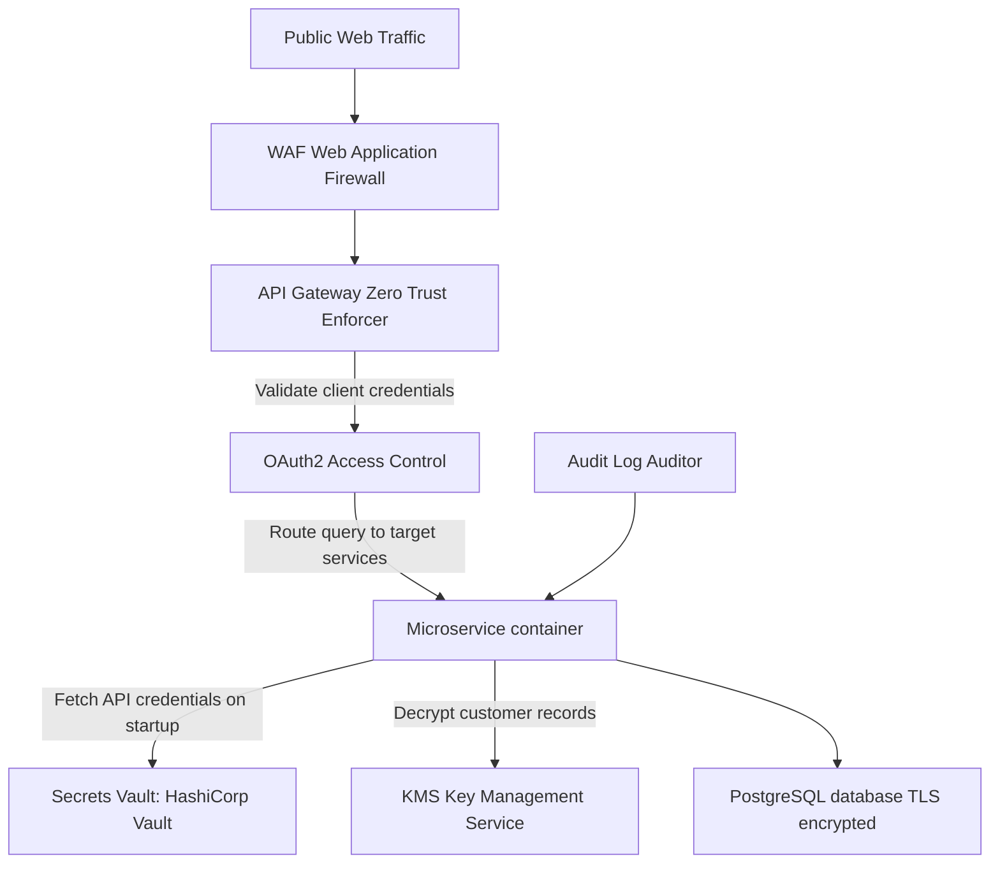

# Module 11: Backend Security

## 1. Industry Explanation
Backend Security is the practice of protecting application servers, database engines, configuration records, and network ports from unauthorized access, exploits, and data leaks. Modern security focuses on the OWASP API Top 10 vulnerabilities, secure encryption, Zero Trust networking, and secure secrets management.

In enterprise AI platforms, security is critical. It protects sensitive training datasets, model keys, and document indices from public exposure and injection attacks.

## 2. Enterprise Architecture
Enterprise security platforms deploy layered access gateways and isolated key vaults:


## 3. Business Use Cases
- **Secure Medical Document RAG**: Storing patient health records in encrypted databases, ensuring only authorized healthcare staff access patient data.
- **Enterprise Financial Assistants**: Ingesting financial transaction logs, requiring end-to-end data encryption and role-based access checks.
- **Developer API Access Portals**: Issuing model access keys to developers while auditing usage to prevent key sharing.

## 4. Production Design
Production security designs isolate secrets and enforce encryption across services:
```
/environment
  ├── App fetches secrets from HashiCorp Vault / AWS Secrets Manager
  ├── Code never hardcodes API keys or passwords
```
- **Zero Trust Network Architectures**: Encrypting all network traffic between services using mutual TLS (mTLS), requiring authorization checks for every call.
- **Secure Key Management (Vault/KMS)**: Storing API keys, certificates, and database credentials in dedicated vaults, rotating secrets automatically.

## 5. Common Failure Modes
- **Hardcoded Secret Keys**: Storing database passwords or model API keys in code repositories, leaving them vulnerable to leaks.
- **Missing Input Sanitization**: Failing to sanitize request parameters, leaving SQL databases and backend engines vulnerable to injection attacks.
- **Weak Data Encryption**: Storing sensitive data in unencrypted databases or sending payloads over unencrypted HTTP connections.

## 6. Optimization Strategies
- **Enforce mTLS Internally**: Route all internal microservice connections over mutual TLS to protect data privacy.
- **Rotate Secrets Regularly**: Automate secret rotations in key vaults to minimize the impact of compromised credentials.

## 7. Security Considerations
- **SQL / Prompt Injection**: Attackers injecting database commands or prompt instructions to extract private records.
- **Broken Object-Level Authorization (BOLA)**: Failing to validate object ownership at microservice boundaries, leaving data vulnerable to access by unauthorized users.

## 8. Governance Considerations
- **Regulatory Compliance Guidelines**: Ensuring databases meet regional privacy standards (like GDPR or HIPAA).
- **Auditable Security Logs**: Storing detailed logs of all authorization decisions, login attempts, and key rotations.

## 9. Best Practices
- **Never Hardcode Secrets**: Use secure key managers (like HashiCorp Vault) to inject credentials at runtime.
- **Sanitize All API Inputs**: Validate and sanitize all request parameters at boundary gates.
- **Encrypt Data at Rest and in Transit**: Secure data volumes with encryption keys, and route network connections over TLS.

## 10. AI FDE Perspective
An FDE must design secure, compliant architectures. FDEs should store all model keys in secure managers, sanitize inputs at API gateways to prevent injection attacks, and route all microservice connections over TLS to secure enterprise data.
