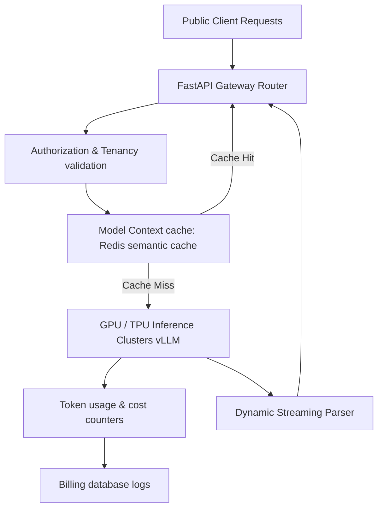

# Module 12: Backend Engineering for AI Platforms

## 1. Industry Explanation
Backend Engineering for AI Platforms involves designing, deploying, and operating backend architectures tailored to host large language models (LLMs), RAG pipelines, agentic workflows, and embedding services at scale. Unlike standard CRUD backends, AI platforms must handle compute-heavy GPU workloads, manage token caching, optimize context windows, and track API costs.

The architecture coordinates model inference, database indices, request queues, and access security to deliver reliable services.

## 2. Enterprise Architecture
Enterprise AI platforms coordinate inference servers, data caching, and resource queues:

## 3. Business Use Cases
- **Enterprise-Wide AI Gateways**: Hosting internal endpoints that format prompts, query models, and return text predictions to employee groups.
- **Billion-Scale RAG Ingestions**: Ingesting files, extracting text, generating embeddings, and updating vector databases in background queues.
- **SaaS AI Assistant Platforms**: Providing secure assistant APIs to external tenants, tracking token usage and billing metrics.

## 4. Production Design
Production-grade platforms isolate compute workloads from web gateways to optimize scale:
- **Inference Engines (vLLM / Triton)**: Hosting models using dedicated inference engines to maximize GPU throughput and minimize latency.
- **Semantic Prompt Caching**: Caching model prompts and responses in high-speed Redis caches to save token costs on repetitive queries.

## 5. Common Failure Modes
- **GPU Out-of-Memory (OOM) Crashes**: Loading models or processing long prompts that exceed GPU memory limits, crashing the server.
- **API Cost Overruns**: Failing to set usage limits or track token consumption, leading to high monthly API bills.
- **Slow Query Responses**: Synchronous bottlenecks in database lookups or document extractions slowing down search queries.

## 6. Optimization Strategies
- **Deploy Semantic Prompt Caching**: Cache common queries and responses in Redis to reduce API costs and improve response times.
- **Set Up Auto-Scaling Pools**: Configure auto-scaling rules for model serving nodes to handle traffic spikes smoothly.

## 7. Security Considerations
- **Data Isolation**: Isolating customer data using separate namespaces or database partitions to prevent data leaks.
- **Model Poisoning Defense**: Cleaning training data and inputs to protect model files from manipulation.

## 8. Governance Considerations
- **API Key Scopes**: Restricting model access permissions using scoped keys to manage user access.
- **Usage Auditing**: Logging token consumption, query types, and errors to track platform usage.

## 9. Best Practices
- **Isolate GPU Serving Runtimes**: Host model serving and data ingestion tasks on separate resources to keep query speeds stable.
- **Implement Semantic Caching**: Use Redis to cache common queries and reduce token costs.
- **Enforce Token Limits**: Configure rate limits and quotas on API keys to prevent abuse and manage costs.

## 10. AI FDE Perspective
An FDE must design secure, cost-effective architectures. The FDE should decouple model serving workloads from web gateways, implement semantic caches to reduce token costs, configure usage quotas to manage budgets, and monitor latency metrics to maintain platform quality.
