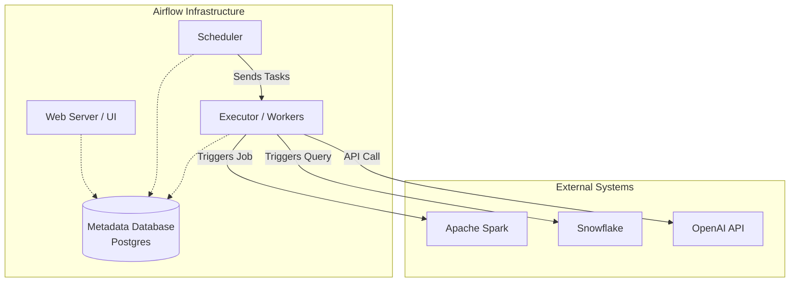

# Module 3.1: Airflow Fundamentals

Welcome to **Apache Airflow**. As an AI Forward Deployed Engineer (FDE), you will constantly orchestrate complex, multi-step processes: extracting data, training models, generating embeddings, and updating Vector Databases. Doing this with simple `cron` jobs is a recipe for disaster. Apache Airflow is the industry standard for workflow orchestration.

---

## 1. Detailed Theory

### What is Apache Airflow?
Airflow is an open-source platform created by Airbnb to programmatically author, schedule, and monitor workflows. It is written in Python, meaning your data pipelines are defined as Python code, allowing for version control, testing, and dynamic generation.

### Workflow Orchestration
Orchestration is the automated configuration, coordination, and management of computer systems and software. Airflow does not process data itself; it tells *other* systems (like Spark, Snowflake, or an API) to process data, and it tracks their success or failure.

### Core Architecture Components
- **Scheduler**: The heartbeat of Airflow. A daemon that constantly monitors all tasks and DAGs, triggering task instances whose dependencies have been met.
- **Executor**: The mechanism that runs task instances (e.g., `LocalExecutor` for single-machine setups, `KubernetesExecutor` for enterprise scale).
- **Metadata Database**: A SQL database (usually Postgres or MySQL) that stores state: which tasks ran, how long they took, and configuration variables.
- **Web UI**: A Flask-based web server that provides a visual interface to inspect, trigger, and debug your pipelines.

### Core Logical Concepts
- **DAG (Directed Acyclic Graph)**: A collection of all the tasks you want to run, organized in a way that reflects their relationships and dependencies. "Directed" means there is a flow of execution. "Acyclic" means it cannot loop back on itself (no infinite loops).
- **Tasks**: A single, defined unit of work within a DAG. (e.g., "Extract from Salesforce").
- **Operators**: The template for a task. If a Task is an object, an Operator is the Class. (e.g., `PythonOperator`, `BashOperator`).

---

## 2. Architecture Diagram: Airflow Infrastructure



---

## 3. Production Use Cases

1. **Daily Knowledge Base Ingestion**: An Airflow DAG runs every night at 2 AM. Task A pulls Confluence pages. Task B chunks the text. Task C calls the OpenAI embedding API. Task D upserts vectors to Pinecone. If Task C fails due to a rate limit, Airflow automatically retries it 3 times without restarting Task A and B.
2. **Machine Learning Model Retraining**: Once a week, Airflow orchestrates a pipeline that spins up an AWS EMR cluster, runs a massive Spark job to generate features, trains a model, evaluates it against a threshold, and deploys it if successful.

---

## 4. Real Company Examples

- **Airbnb**: The creator of Airflow. They use it to schedule tens of thousands of tasks a day across thousands of DAGs, managing everything from BI reporting to machine learning.
- **Lyft**: Heavily relies on Airflow to compute dynamic pricing models, matching algorithms, and financial reconciliation.

---

## 5. Coding Examples

### A Basic DAG Definition in Python

```python
from datetime import datetime, timedelta
from airflow import DAG
from airflow.operators.bash import BashOperator

# 1. Define default arguments for all tasks in this DAG
default_args = {
    'owner': 'ai_fde_team',
    'depends_on_past': False,
    'email_on_failure': True,
    'email': ['alerts@company.com'],
    'retries': 1,
    'retry_delay': timedelta(minutes=5),
}

# 2. Instantiate the DAG
with DAG(
    dag_id='example_daily_etl',
    default_args=default_args,
    description='A simple tutorial DAG',
    schedule_interval='@daily',
    start_date=datetime(2023, 1, 1),
    catchup=False
) as dag:

    # 3. Define Tasks using Operators
    extract_task = BashOperator(
        task_id='extract_data',
        bash_command='echo "Extracting data from API..."'
    )

    load_task = BashOperator(
        task_id='load_data',
        bash_command='echo "Loading data into Warehouse..."'
    )

    # 4. Define Dependencies
    extract_task >> load_task
```

---

## 6. Hands-on Labs

**Lab: DAG Anatomy**
**Objective**: Identify the required components of an Airflow DAG script.
**Instructions**:
Write out the 4 main sections of any Airflow python file (Imports, Default Args, DAG Instantiation, Task/Dependency Definition). Explain why we separate "DAG Instantiation" from "Task Definition".

---

## 7. Assignments

**Assignment: The "Acyclic" Rule**
In the acronym DAG, "A" stands for Acyclic. Write a short paragraph explaining why a workflow orchestration tool would strictly prevent you from creating a cycle (e.g., Task A -> Task B -> Task C -> Task A). What problem does this prevent in a distributed data engineering environment?

---

## 8. Interview Questions

1. **What is the difference between a Task and an Operator in Airflow?**
   *Answer Hint: An Operator is the blueprint or class (e.g., `PythonOperator`). A Task is an instance of that Operator with specific arguments assigned to it within a DAG.*
2. **Explain the role of the Scheduler.**
   *Answer Hint: The Scheduler parses the Python DAG files, determines which tasks are ready to run based on dependencies and time schedules, and queues them in the Metadata database for the Executor to pick up.*
3. **Why use Airflow instead of a simple CRON job?**
   *Answer Hint: CRON cannot handle dependencies (Task B must run after Task A), retries, alerting on failure, historical backfilling, or visualize the execution state across a massive team.*

---

## 9. Best Practices (FDE Standards)

- **Airflow is NOT a Data Processing Engine**: Never load a 5GB Pandas DataFrame into memory inside an Airflow `PythonOperator`. The Airflow worker will crash (OOM). Airflow should *trigger* a Spark job or Snowflake query to do the heavy lifting.
- **Stateless Tasks**: Every task in Airflow should be stateless and idempotent. A task should not rely on a local file saved by a previous task on the worker node, because the next task might execute on a completely different physical server.

---

## 10. Common Mistakes

- **Top-Level Code**: Putting expensive API calls or database queries at the "top level" of your Python DAG file (outside of the task definition). The Airflow Scheduler parses these files every 30 seconds. If you have an API call at the top level, you will DDOS the API.
- **Ignoring Catchup**: Leaving `catchup=True` on a daily DAG with a start date from 5 years ago. When you turn on the DAG, Airflow will immediately try to run 1,800 parallel pipeline executions to "catch up" to the present day, crashing your entire infrastructure.
