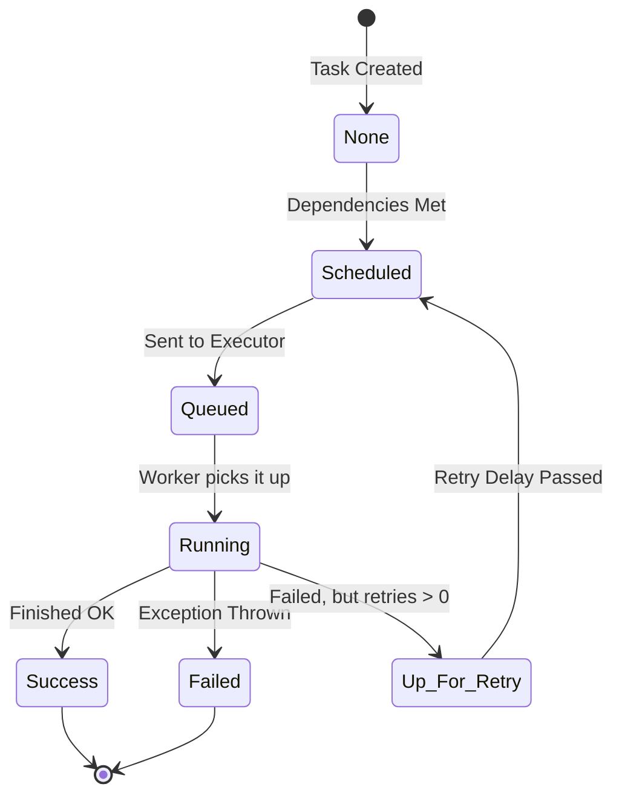

# Module 3.2: Airflow Core Concepts

Welcome to **Airflow Core Concepts**. Writing a basic DAG is easy; mastering how Airflow schedules, retries, and manages state across distributed systems is what separates a junior developer from a Senior FDE.

---

## 1. Detailed Theory

### Scheduling and Cron Expressions
Airflow uses a `schedule_interval` to know when to trigger a DAG Run. You can use presets like `@daily` or `@hourly`, but for enterprise precision, you must use **Cron Expressions** (e.g., `30 2 * * *` means run at 2:30 AM every day).

### Execution Dates vs. Start Dates
- **`start_date`**: The date when your DAG starts being actively scheduled.
- **`logical_date` (formerly `execution_date`)**: The *start* of the time period the DAG is running for. If a daily DAG runs at 2:00 AM on Oct 2nd, the `logical_date` is Oct 1st, because it is processing the data generated during Oct 1st.

### Task Dependencies
Airflow uses bitshift operators in Python to define dependencies:
- `task_a >> task_b`: Task A must succeed before Task B runs (Downstream).
- `task_b << task_a`: Same as above (Upstream).
- `[task_a, task_b] >> task_c`: Task A and B run in parallel; Task C waits for both to succeed.

### State Management
- **Retries & Timeouts**: At the task level, you configure how many times Airflow should retry on failure (`retries=3`) and how long to wait before killing a stuck task (`execution_timeout=timedelta(hours=1)`).
- **SLA (Service Level Agreement)**: A time limit applied to a DAG. If the DAG doesn't finish by this time, it doesn't kill the task, but it sends an angry alert to the data team.

### Variables and Connections
Do not hardcode API keys or database passwords in your Python files.
- **Connections**: Securely store database credentials (Host, Login, Password, Port). Airflow Operators automatically use these Connection IDs.
- **Variables**: Global key-value stores for dynamic configuration (e.g., `model_threshold=0.85`).

---

## 2. Architecture Diagram: Task Lifecycle



---

## 3. Production Use Cases

1. **RAG Pipeline Failure Recovery**: Your pipeline hits the OpenAI API to generate embeddings. The API goes down for 5 minutes. Because you configured `retries=5` and `retry_delay=timedelta(minutes=2)`, Airflow automatically waits and retries, saving you from a 3 AM pager alert.
2. **Environment Isolation**: You use an Airflow `Connection` called `enterprise_db_conn`. In your Development Airflow environment, it points to a staging DB. In Production, it points to the real DB. The DAG Python code remains identical across both environments.

---

## 4. Real Company Examples

- **Spotify**: Heavily utilizes SLAs. If their daily royalty calculation DAGs don't complete by a certain hour, an SLA miss is triggered, immediately escalating a PagerDuty alert to the on-call data engineering team.

---

## 5. Coding Examples

### Complex Dependencies and Configuration

```python
from datetime import datetime, timedelta
from airflow import DAG
from airflow.operators.empty import EmptyOperator
from airflow.models import Variable

with DAG(
    dag_id='complex_dependencies',
    schedule_interval='0 6 * * 1-5', # Run at 6:00 AM, Monday through Friday
    start_date=datetime(2023, 1, 1),
    catchup=False,
    # Example SLA: Must finish within 2 hours of starting
    sla=timedelta(hours=2)
) as dag:

    # Using an Airflow Variable to dynamically set a threshold
    threshold = Variable.get("ml_threshold", default_var=0.8)

    extract_sales = EmptyOperator(task_id='extract_sales')
    extract_logs = EmptyOperator(task_id='extract_logs')
    
    transform_data = EmptyOperator(
        task_id='transform_data',
        # Kill the task if it hangs for more than 30 minutes
        execution_timeout=timedelta(minutes=30) 
    )
    
    train_model = EmptyOperator(task_id='train_model')
    deploy_model = EmptyOperator(task_id='deploy_model')

    # Dependency routing
    [extract_sales, extract_logs] >> transform_data >> train_model >> deploy_model
```

---

## 6. Hands-on Labs

**Lab: Cron Translation**
**Objective**: Master standard cron expressions.
**Instructions**:
Translate the following English schedules into standard 5-part Cron expressions:
1. Every hour on the hour.
2. At 11:30 PM, every day.
3. Every Monday at 4:00 AM.
4. Every 15 minutes.

---

## 7. Assignments

**Assignment: Connection Management**
Explain why hardcoding a database password in an Airflow Python file is a critical security vulnerability, and detail how the Airflow `Connections` interface mitigates this risk while interacting with Github/Version Control.

---

## 8. Interview Questions

1. **What does the `catchup=False` parameter do in a DAG?**
   *Answer Hint: If a DAG with a daily schedule has a `start_date` 10 days ago, setting catchup to True will cause Airflow to immediately run 10 historical executions to "catch up." Setting it to False tells Airflow to only run the most recent scheduled execution.*
2. **What is the difference between a retry and a backfill?**
   *Answer Hint: A retry happens automatically when a task fails during a normal run. A backfill is a manual process initiated by a user to run a DAG for historical dates that were missed or need to be reprocessed.*

---

## 9. Best Practices (FDE Standards)

- **Use Connection IDs**: Never use raw credentials. Always use `conn_id` parameters in your Operators.
- **Limit Variable Usage**: Do not call `Variable.get()` outside of a task (at the top level of the file). This opens a database connection every 30 seconds when the Scheduler parses the file, crashing your Metadata database.

---

## 10. Common Mistakes

- **Misunderstanding Logical Date**: Writing a SQL query that uses Python's `datetime.now()` to pull "yesterday's" data. If you backfill that DAG for a date in 2022, `datetime.now()` still returns today, pulling the wrong data. Always use Airflow's built-in `{{ ds }}` (logical date) Jinja template.
