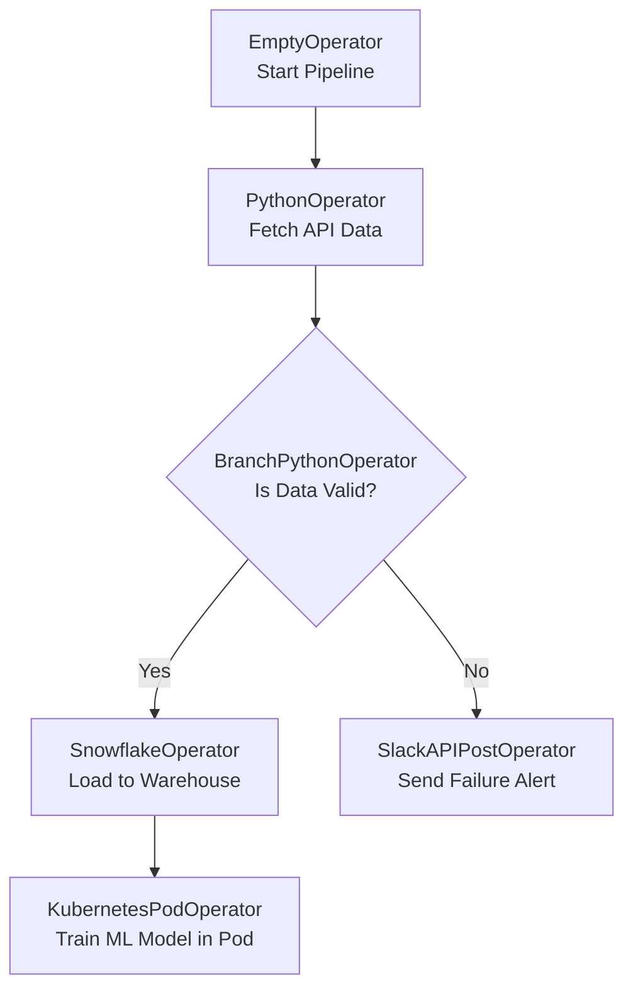

# Module 3.3: Airflow Operators

Welcome to **Airflow Operators**. While DAGs define the *workflow*, Operators define the *work*. Airflow has an incredibly rich ecosystem of "Providers"—packages that contain hundreds of pre-built Operators to interact with almost every technology in existence.

---

## 1. Detailed Theory

### Basic Operators
- **`PythonOperator`**: Executes a standard Python callable (function). The bread and butter for custom API calls, simple data manipulation, or triggering LLM models.
- **`BashOperator`**: Executes a bash command. Useful for running shell scripts, moving local files, or triggering legacy systems.
- **`EmptyOperator`**: Does nothing. Used purely for organizing logic (e.g., as a dummy join point where 5 parallel tasks converge before starting the next phase).
- **`BranchPythonOperator`**: Allows the DAG to take different paths based on a condition (e.g., If `model_accuracy > 0.90`, route to `Deploy_Task`, else route to `Alert_Data_Science_Team`).

### Database & Cloud Operators
Rather than writing custom Python code to connect to Snowflake or AWS using `boto3`, you should use Airflow's native providers.
- **`PostgresOperator` / `SnowflakeOperator`**: Pass it a SQL string or file path, and it handles the connection, execution, and closure securely.
- **`S3CreateObjectOperator` / `GCSToBigQueryOperator`**: Purpose-built classes that handle massive file transfers between cloud services optimized for reliability.

### Kubernetes Operators
- **`KubernetesPodOperator`**: The ultimate tool for enterprise orchestration. Instead of running Python code on the Airflow worker, this operator spins up an isolated Docker container on a Kubernetes cluster, executes the job, returns the result, and destroys the pod. This guarantees complete dependency isolation.

---

## 2. Architecture Diagram: Branching & Operator Types



---

## 3. Production Use Cases

1. **RAG Document Pipeline**: You use an `S3ToLocalOperator` to download a PDF, a `PythonOperator` running PyMuPDF to extract and chunk the text, and a custom `PineconeUpsertOperator` to load the embeddings.
2. **Polyglot Data Pipelines**: The data science team writes their model training code in R, but the data engineering team uses Python. By using the `KubernetesPodOperator`, Airflow can orchestrate the R container without needing R installed on the Airflow servers.

---

## 4. Real Company Examples

- **Astronomer.io**: The leading commercial provider of managed Airflow. They heavily maintain the "Airflow Registry," which hosts thousands of community-built operators, ranging from standard AWS tools to specific integrations like Datadog or Salesforce.

---

## 5. Coding Examples

### Using the Python, Postgres, and Branch Operators

```python
from airflow import DAG
from airflow.operators.python import PythonOperator, BranchPythonOperator
from airflow.providers.postgres.operators.postgres import PostgresOperator
from datetime import datetime

def check_data_quality(**kwargs):
    # Retrieve a value pushed by a previous task via XCom
    row_count = kwargs['ti'].xcom_pull(task_ids='extract_data')
    if row_count and row_count > 1000:
        return 'load_to_postgres' # Returns the task_id to execute next
    return 'send_alert'

with DAG('operator_showcase', start_date=datetime(2023,1,1), schedule_interval='@daily') as dag:

    # 1. Standard Python Operator
    extract = PythonOperator(
        task_id='extract_data',
        python_callable=lambda: 1500 # Simulating returning 1500 rows
    )

    # 2. Branching Logic
    branch = BranchPythonOperator(
        task_id='quality_check',
        python_callable=check_data_quality
    )

    # 3. Database Operator (Uses a connection ID, no passwords here!)
    load = PostgresOperator(
        task_id='load_to_postgres',
        postgres_conn_id='enterprise_pg_conn',
        sql="""
            INSERT INTO daily_metrics (date, count) 
            VALUES ('{{ ds }}', 1500);
        """
    )

    # 4. Dummy Alert Task
    alert = PythonOperator(
        task_id='send_alert',
        python_callable=lambda: print("Data quality failed!")
    )

    # Dependency definition
    extract >> branch
    branch >> load
    branch >> alert
```

---

## 6. Hands-on Labs

**Lab: Building a Custom Pipeline**
**Objective**: Understand which operators to choose.
**Instructions**:
You need to download a CSV from an FTP server, run a SQL script against Snowflake to prepare a staging table, and then load the CSV into Snowflake. 
List the exact three Airflow Operators you would import and use to accomplish this without writing any custom Python data-processing logic.

---

## 7. Assignments

**Assignment: The Power of KubernetesPodOperator**
Write a short explanation of the "dependency hell" problem (where Pipeline A needs `pandas==1.0` and Pipeline B needs `pandas==2.0`). How does the `KubernetesPodOperator` completely solve this issue for Airflow environments?

---

## 8. Interview Questions

1. **What is XCom in Airflow?**
   *Answer Hint: "Cross-Communication". It is a mechanism that allows tasks to talk to each other. Task A can push a small piece of data (like an ID or a row count) to XCom, and Task B can pull it. It is stored in the Metadata DB, so it should NOT be used for large datasets like DataFrames.*
2. **Why should you use a `PostgresOperator` instead of writing Python code with `psycopg2` inside a `PythonOperator`?**
   *Answer Hint: Using the native provider operator abstracts away the boilerplate of connection management, securely handles credentials via Airflow Connections, ensures proper opening/closing of connections, and makes the DAG code much cleaner and easier to read.*

---

## 9. Best Practices (FDE Standards)

- **Use the Registry**: Before you write a 100-line `PythonOperator` to interact with a system, check the Airflow Registry. Someone has likely already built and maintained an operator for it.
- **XCom Limits**: Never pass large amounts of data (like a Pandas DataFrame) through XCom. It is serialized and stored in the Postgres Metadata DB. You will bloat and crash the database. Pass a *pointer* to the data (e.g., an S3 file path) instead.

---

## 10. Common Mistakes

- **Forgetting kwargs**: When using a `PythonOperator`, if your python function needs Airflow context (like the `logical_date` or XCom), you must define `**kwargs` in your function signature, otherwise, Airflow will throw an unexpected argument error.
