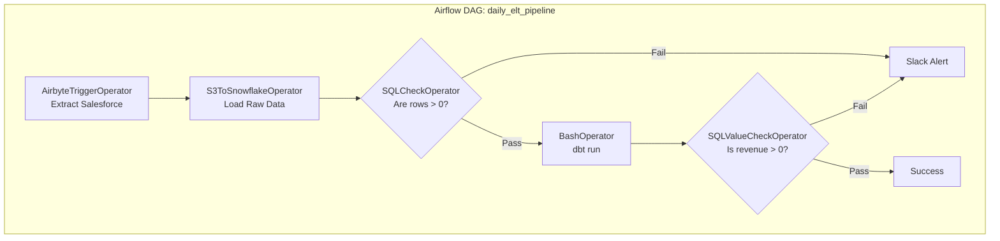

# Module 3.4: Data Pipelines

Welcome to **Airflow Data Pipelines**. You've learned how to write DAGs and use Operators. Now we apply those tools to real-world Data Engineering paradigms: ETL and ELT architectures, CDC integration, and Data Quality validation.

---

## 1. Detailed Theory

### ETL vs. ELT in Airflow
- **ETL (Extract, Transform, Load)**: Airflow triggers a task to extract data to an S3 staging area, then triggers a Spark job (Transform) to process it, and finally triggers a Redshift load command.
- **ELT (Extract, Load, Transform)**: Airflow triggers Fivetran/Airbyte to sync data into Snowflake (Extract & Load), and then triggers a `dbt run` command to transform the data inside Snowflake using SQL.

### Incremental vs. Full Loads
- **Full Load**: Airflow passes a standard command to truncate and reload a table. Safe, but inefficient.
- **Incremental Load**: Airflow passes the `{{ logical_date }}` (also known as `{{ ds }}` for date string) to the SQL query or API call, ensuring the pipeline only processes data for that specific day. 

### Data Quality Checks
If your pipeline extracts 1,000 rows and inserts 0 rows, but doesn't throw a Python exception, Airflow will mark the task as a `SUCCESS`. You must introduce explicit Data Quality checks to fail the pipeline if data is corrupted.

---

## 2. Architecture Diagram: ELT Pipeline with Data Quality



---

## 3. Production Use Cases

1. **Customer Data ETL Pipeline**: A company uses Salesforce. Airflow orchestrates a daily incremental load, extracting only Accounts modified since yesterday `{{ ds }}`, dumping them to S3, and merging them into the Enterprise Data Warehouse.
2. **AI Training Data Validation**: Before kicking off an expensive LLM training job, Airflow runs a massive SQL check to ensure that the `<text>` column has less than 1% NULL values. If it fails, the pipeline halts before wasting $5,000 on GPU compute.

---

## 4. Real Company Examples

- **DataRobot**: Uses Airflow to manage the massive pipelines required to ingest customer datasets, run rigorous statistical validations on the data, and prepare it for automated machine learning model generation.

---

## 5. Coding Examples

### Airflow ELT with dbt and Data Quality Checks

```python
from datetime import datetime
from airflow import DAG
from airflow.providers.airbyte.operators.airbyte import AirbyteTriggerSyncOperator
from airflow.providers.common.sql.operators.sql import SQLColumnCheckOperator
from airflow.operators.bash import BashOperator

with DAG('sales_elt_pipeline', start_date=datetime(2023, 1, 1), schedule_interval='@daily') as dag:

    # 1. Extract and Load (EL) using Airbyte
    sync_salesforce = AirbyteTriggerSyncOperator(
        task_id='sync_salesforce_to_snowflake',
        airbyte_conn_id='airbyte_default',
        connection_id='your-uuid-from-airbyte'
    )

    # 2. Data Quality Check on the Raw Data
    check_raw_data = SQLColumnCheckOperator(
        task_id='check_raw_data',
        conn_id='snowflake_default',
        table='raw.salesforce_accounts',
        column_mapping={
            "account_id": {"null_check": {"equal_to": 0}},
            "created_at": {"max": {"less_than": "{{ ds }}"}} # Ensures no future dates
        }
    )

    # 3. Transform (T) using dbt
    run_dbt = BashOperator(
        task_id='run_dbt_models',
        bash_command='dbt run --models sales_marts'
    )

    sync_salesforce >> check_raw_data >> run_dbt
```

---

## 6. Hands-on Labs

**Lab: Incremental Date Templating**
**Objective**: Understand Airflow Jinja templating.
**Instructions**:
Write a generic SQL query string inside an Airflow DAG script that uses Jinja templating (`{{ ds }}`) to pull data from an `orders` table where the `order_date` matches the execution date of the DAG.

---

## 7. Assignments

**Assignment: The Silent Failure**
Your Airflow pipeline pulls data from an API and loads it into a database using a `PythonOperator`. Due to a bug in the API, it returns an empty JSON list `[]`. The python code successfully loops over the empty list and inserts 0 rows. Airflow marks the task as Green (Success). 
Propose a solution to catch this "Silent Failure" using an explicit Data Quality task.

---

## 8. Interview Questions

1. **How does Airflow facilitate Incremental Data Loading?**
   *Answer Hint: Airflow provides context variables (like `{{ ds }}` or `{{ data_interval_start }}`) at runtime via Jinja templating. You inject these dates into your SQL queries or API calls so the task only extracts data for that specific time window.*
2. **What is the purpose of the `SQLColumnCheckOperator`?**
   *Answer Hint: It is used for Data Quality validation. It runs SQL queries against a database to ensure columns meet specific constraints (e.g., no nulls, unique values, values within a certain range) and fails the pipeline if the checks fail.*

---

## 9. Best Practices (FDE Standards)

- **Write, Validate, Publish (WAP)**: Don't write transformed data directly to the production table. Write it to a temporary staging table, run Airflow Data Quality checks on the staging table, and if it passes, swap/merge it into production.
- **Fail Loudly**: If data looks wrong, crash the pipeline. A broken dashboard is much better than a dashboard silently displaying incorrect numbers to the CEO.

---

## 10. Common Mistakes

- **Testing against `datetime.now()`**: If you have a data quality check that says `WHERE date = CURRENT_DATE()`, it will work today. But if you try to backfill the pipeline for last year, it will check today's data, not last year's data. Always use Airflow's logical date variables.
