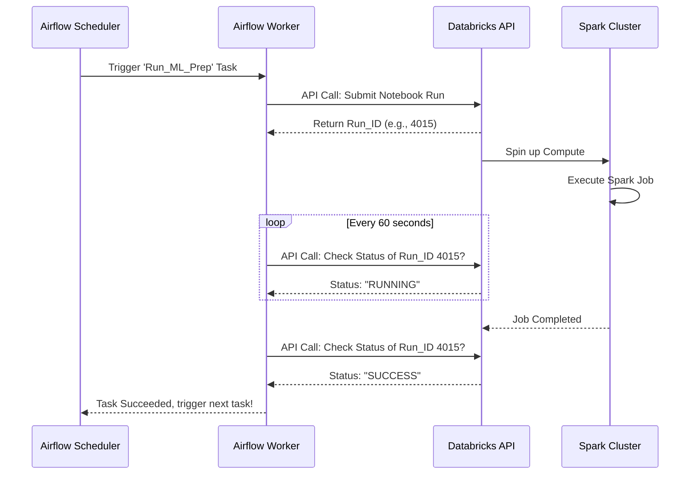

# Module 3.6: Airflow + Spark

Welcome to **Airflow + Spark**. As an FDE dealing with Big Data (terabytes of raw text for LLMs or massive telemetry logs), single-node Python processing will fail. You need a distributed computing engine like Apache Spark. Airflow does not process data; it orchestrates Spark to process data.

---

## 1. Detailed Theory

### Why pair Airflow and Spark?
- **Airflow**: Excellent at scheduling, dependency management, alerting, and retries. Terrible at processing heavy data (OOM errors).
- **Spark**: Excellent at processing petabytes of data across a cluster. Terrible at complex workflow scheduling or running dependent API tasks.
- Together, they form the backbone of modern Big Data pipelines.

### Execution Environments
How does Airflow trigger a Spark job?
- **Airflow with EMR (AWS)**: Airflow uses the `EmrCreateJobFlowOperator` to spin up a Hadoop/Spark cluster, submits a PySpark script via `EmrAddStepsOperator`, and then uses an EMR sensor to wait for it to finish, tearing down the cluster afterward to save money.
- **Airflow with Databricks**: The modern standard. Airflow uses the `DatabricksSubmitRunOperator` to trigger a pre-written notebook or JAR file on a Databricks cluster.
- **Airflow with Spark-Submit (Local/YARN)**: Using the `SparkSubmitOperator` to run a job on a long-running on-premise cluster.

---

## 2. Architecture Diagram: Airflow + Databricks



---

## 3. Production Use Cases

1. **Retail Demand Forecasting**: A massive supermarket chain has 5 years of daily transaction data for 10,000 stores. Airflow triggers a Databricks PySpark job to aggregate this massive dataset into weekly trends, saving the result to a Gold Layer Delta Table, which is then used by a forecasting model.
2. **LLM Pre-training Pipeline**: You have 100TB of Common Crawl internet data in S3. Airflow spins up a 50-node AWS EMR cluster, submits a Spark job to filter out profanity and perfectly tokenize the data, and shuts the cluster down.

---

## 4. Real Company Examples

- **Databricks**: Strongly encourages using Airflow (or their internal Databricks Workflows) to orchestrate complex chains of Spark notebooks, rather than trying to write monolithic, unmanageable Spark scripts.
- **Any Fortune 500**: Almost all major enterprises use Airflow to orchestrate their heavy ETL workloads running on Hadoop/Spark or EMR.

---

## 5. Coding Examples

### Airflow triggering a Databricks Job

```python
from airflow import DAG
from airflow.providers.databricks.operators.databricks import DatabricksSubmitRunOperator
from datetime import datetime

# Define the cluster configuration for Databricks
new_cluster_config = {
    'spark_version': '10.4.x-scala2.12',
    'node_type_id': 'i3.xlarge',
    'num_workers': 4,
}

with DAG('databricks_spark_pipeline', start_date=datetime(2023, 1, 1), schedule_interval='@daily') as dag:

    # Operator to submit a notebook to run on a new ephemeral cluster
    run_spark_notebook = DatabricksSubmitRunOperator(
        task_id='run_data_prep_notebook',
        databricks_conn_id='databricks_default',
        new_cluster=new_cluster_config,
        notebook_task={
            'notebook_path': '/Users/ai_team/prepare_training_data',
        },
        # Pass Airflow variables directly into the Spark Notebook
        notebook_params={
            'target_date': '{{ ds }}' 
        }
    )

    run_spark_notebook
```

---

## 6. Hands-on Labs

**Lab: The Sensor Pattern**
**Objective**: Understand asynchronous execution.
**Instructions**:
When you submit an EMR job using an API call, it returns a `JobId` immediately, but the job takes 4 hours. Write an explanation of how an Airflow "Sensor" (e.g., `EmrJobFlowSensor`) is used to pause the DAG and ping the AWS API every 5 minutes to wait for the job to actually finish before continuing to the next task.

---

## 7. Assignments

**Assignment: Cost Optimization Strategy**
A client has a long-running, always-on Spark cluster (costing $10,000/month) just to run a 2-hour data processing job every night. 
Write a proposal explaining how using Airflow with AWS EMR (`EmrCreateJobFlowOperator` -> `EmrAddStepsOperator` -> `EmrTerminateJobFlowOperator`) can dramatically reduce their cloud bill.

---

## 8. Interview Questions

1. **Why shouldn't you process a 50GB CSV file using Pandas inside an Airflow `PythonOperator`?**
   *Answer Hint: Airflow worker nodes are not designed for heavy compute and usually have limited RAM. Processing a 50GB file in memory will cause an Out of Memory (OOM) error, crashing the worker. You should delegate this work to Spark/Databricks.*
2. **What is an Airflow Sensor?**
   *Answer Hint: A special type of operator designed to wait for a specific condition to be met (like a file arriving in S3, or a Spark job finishing on EMR) before allowing the DAG to proceed. It periodically pokes the external system.*

---

## 9. Best Practices (FDE Standards)

- **Ephemeral Clusters**: Do not leave Spark clusters running 24/7 if they are only used for batch processing. Use Airflow to programmatically create the cluster, run the job, and destroy the cluster.
- **Pass Context**: Always pass Airflow's `{{ ds }}` (execution date) as an argument to your PySpark script. Do not rely on the PySpark script calling `datetime.now()`, or you will lose the ability to perform historical backfills.

---

## 10. Common Mistakes

- **Zombie Tasks**: Submitting a job via `SparkSubmitOperator` without setting an execution timeout. If the Spark cluster freezes, the Airflow task will sit in a "Running" state for 3 weeks, consuming worker slots. Always set an `execution_timeout`.
