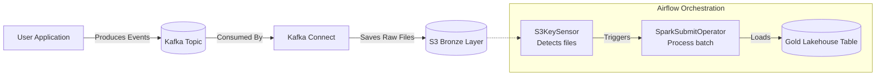

# Module 3.7: Airflow + Kafka

Welcome to **Airflow + Kafka**. Combining batch orchestration (Airflow) with real-time event streaming (Kafka) is critical for modern data engineering. As an AI FDE, you will often need to ingest streaming customer behavior, process it in real time, and use Airflow to manage the lifecycle, models, and metadata of those streams.

---

## 1. Detailed Theory

### Why Combine Airflow and Kafka?
- **Airflow**: Is fundamentally a batch orchestrator. It is not designed to run infinite, 24/7 streaming loops.
- **Kafka**: Is a distributed event streaming platform designed to handle real-time streams of data.
- **The Synergy**: Airflow orchestrates the deployment, control, and monitoring of Kafka producers and consumers. Airflow does not process the stream directly; it initiates, schedules, and restarts stream-processing tasks (like PySpark Streaming or Kafka Connect) or manages batch consumer endpoints.

### Core Streaming Orchestration Patterns
1. **Triggering Kafka Connect**: Airflow schedules tasks that dynamically create or configure Kafka Connect tasks to load data from Kafka topics into a Lakehouse (Delta/Iceberg).
2. **Scheduled Batch Consumers**: An Airflow DAG runs hourly, spins up a consumer task that reads the last hour of events from a Kafka topic, writes them to S3, and shuts down.
3. **Event-Driven Airflow Pipelines**: Using webhooks or sensors to trigger Airflow DAGs dynamically based on specific Kafka event thresholds.

---

## 2. Architecture Diagram: Event-Driven Kafka Ingestion



---

## 3. Production Use Cases

1. **Real-Time Fraud Detection**: Transactions stream into Kafka. A streaming model evaluates them. Concurrently, an Airflow DAG runs every night to consume these events, check model performance drift, retrain if necessary, and deploy the new model to the streaming app.
2. **Customer Event Processing Platform**: Clicking, searching, and viewing events stream into Kafka. Airflow manages Kafka Connect sinks that stream this raw interaction data directly to a clean database table for user profile enrichment.

---

## 4. Real Company Examples

- **Uber**: Relies on Kafka for all real-time trip and location telemetry, while using Airflow to coordinate the batch processing of this streamed data for historic analytics and machine learning model training.
- **Confluent**: The company behind enterprise Kafka, which widely recommends using Airflow to orchestrate downstream data lake transformations once events are landed by Kafka Connect.

---

## 5. Coding Examples

### Airflow DAG Managing a Kafka Connect Pipeline

```python
from datetime import datetime
from airflow import DAG
from airflow.providers.http.operators.http import SimpleHttpOperator
import json

with DAG('kafka_connector_management', start_date=datetime(2023, 1, 1), schedule_interval='@daily', catchup=False) as dag:

    # Trigger a Kafka Connect REST API request to start a sink connector
    start_kafka_sink = SimpleHttpOperator(
        task_id='start_s3_sink_connector',
        http_conn_id='kafka_connect_api',
        endpoint='/connectors',
        method='POST',
        headers={"Content-Type": "application/json"},
        data=json.dumps({
            "name": "s3-sink-customer-events",
            "config": {
                "connector.class": "io.confluent.connect.s3.S3SinkConnector",
                "tasks.max": "2",
                "topics": "customer.events",
                "s3.bucket.name": "enterprise-bronze-lake",
                "s3.region": "us-east-1",
                "format.class": "io.confluent.connect.s3.format.parquet.ParquetFormat",
                "flush.size": "1000"
            }
        })
    )

    start_kafka_sink
```

---

## 6. Hands-on Labs

**Lab: Simulating a Batch Consumer**
**Objective**: Build a simple Python script to consume a batch of messages.
**Instructions**:
Write a Python script using `confluent-kafka` that consumes exactly 100 messages from a topic called `test-topic`, writes them to a local JSON file, and then terminates. This script would be wrapped by an Airflow `PythonOperator` to pull batches incrementally.

---

## 7. Assignments

**Assignment: Batch vs. Streaming Orchestration**
Describe why it is a bad practice to run an infinite `while True:` consumer loop directly inside an Airflow worker node. What happens to the task instance status, worker resources, and logs if you do this?

---

## 8. Interview Questions

1. **How do you orchestrate streaming data with a batch orchestrator like Airflow?**
   *Answer Hint: You do not run the stream inside Airflow. Instead, you use Airflow to start and monitor external streaming engines (like Kafka Connect or Spark Streaming) or run scheduled micro-batch consumers that process chunks of streamed data at set intervals.*
2. **What is the role of Kafka Connect in a data lakehouse architecture?**
   *Answer Hint: It is a framework for connecting Kafka with external systems (like databases, key-value stores, search indexes, and file systems) to easily stream raw data into S3/GCS or databases without custom code.*

---

## 9. Best Practices (FDE Standards)

- **Do Not Run Continuous Stream Tasks**: Always delegate 24/7 stream execution to dedicated engines (Kubernetes, Spark Streaming, Kafka Connect). Use Airflow only for configuration, triggering, and scheduling secondary tasks.
- **Monitoring Lag**: Rather than monitoring task status, monitor consumer group lag on Kafka to detect if your downstream processing is falling behind.

---

## 10. Common Mistakes

- **Memory Leaks in Consumer Tasks**: Running consumer tasks that hold resources in memory indefinitely inside Airflow workers, eventually causing the host machine to crash.
