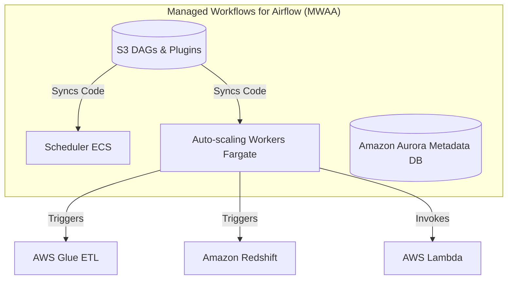

# Module 3.8: Cloud-Native Airflow

Welcome to **Cloud-Native Airflow**. In enterprise deployments, you will rarely manage bare-metal Airflow servers. You will rely on managed cloud services like AWS MWAA (Managed Workflows for Apache Airflow), GCP Cloud Composer, or Azure Data Factory integrations.

---

## 1. Detailed Theory

### Managed Airflow Offerings
- **AWS MWAA**: Fully managed Airflow that scales workers dynamically using Amazon ECS on Fargate, handles database scaling automatically, and integrates natively with IAM.
- **GCP Cloud Composer**: Built on top of Google Kubernetes Engine (GKE). Extremely scalable, but exposes more Kubernetes configuration details compared to MWAA.
- **Azure Integration**: Often utilizes Azure Data Factory to trigger Airflow DAGs hosted in AKS or managed Airflow instances.

### Cloud Orchestration Patterns
Cloud-native data engineering utilizes Airflow to tie together specialized serverless components:
- **AWS**: Airflow triggers AWS Lambda functions for lightweight event processing, runs AWS Glue crawler jobs to update data catalogs, and triggers queries in Redshift.
- **GCP**: Airflow triggers BigQuery query tasks, spins up serverless Google Dataflow (Apache Beam) pipelines, and interacts with Cloud Storage.
- **Azure**: Airflow coordinates Azure Data Factory pipelines or Synapse analytics workloads.

---

## 2. Architecture Diagram: AWS MWAA Infrastructure



---

## 3. Production Use Cases

1. **Serverless Data Lake Ingestion (AWS)**: A new file lands in S3, triggering an AWS Lambda function, which pings Airflow via API. The Airflow DAG triggers an AWS Glue job to transform the files, runs a schema validation, and loads the data into Redshift.
2. **Real-time Analytics Engine (GCP)**: Airflow orchestrates a GCP Cloud Composer pipeline that runs daily BigQuery jobs to refresh dashboard summaries, followed by triggering a Dataflow job to archive stale raw tables to Coldline GCS storage.

---

## 4. Real Company Examples

- **Amazon Web Services (AWS)**: Strongly encourages using MWAA for data orchestration on AWS, providing deep integration with AWS Secrets Manager to completely eliminate hardcoded secrets in DAG files.
- **Google Cloud (GCP)**: Deeply integrates Cloud Composer with Vertex AI, making it the default batch orchestrator for Google Cloud machine learning pipelines.

---

## 5. Coding Examples

### AWS-Native Orchestration DAG

```python
from datetime import datetime
from airflow import DAG
from airflow.providers.amazon.aws.operators.glue import GlueJobOperator
from airflow.providers.amazon.aws.operators.redshift_data import RedshiftDataOperator

with DAG('aws_native_pipeline', start_date=datetime(2023, 1, 1), schedule_interval='@daily', catchup=False) as dag:

    # 1. Run an AWS Glue Spark ETL job
    run_glue_job = GlueJobOperator(
        task_id='run_glue_clean_data',
        job_name='clean_customer_data',
        aws_conn_id='aws_default',
        region_name='us-east-1'
    )

    # 2. Execute a SQL Command in Amazon Redshift Serverless
    load_redshift = RedshiftDataOperator(
        task_id='load_to_redshift',
        aws_conn_id='aws_default',
        database='dev',
        cluster_identifier=None, # Used for serverless workgroup
        workgroup_name='analytics-workgroup',
        sql="""
            COPY INTO gold.customers 
            FROM 's3://my-bucket/clean/' 
            IAM_ROLE 'arn:aws:iam::123456789012:role/RedshiftS3Access';
        """
    )

    run_glue_job >> load_redshift
```

---

## 6. Hands-on Labs

**Lab: Setting up Cloud Connections**
**Objective**: Configure Airflow to talk to Cloud Providers.
**Instructions**:
Write the step-by-step instructions to configure an AWS Connection in the Airflow UI using an IAM Role (Instance Profile/IRSA) instead of hardcoding an `AWS_ACCESS_KEY_ID` and `AWS_SECRET_ACCESS_KEY`.

---

## 7. Assignments

**Assignment: Managed vs. Self-Hosted Airflow**
A client is deciding between hosting Airflow themselves on a single EC2 instance using Docker Compose vs. buying AWS MWAA. Write a concise trade-off matrix analyzing maintenance overhead, scalability, cost, and reliability.

---

## 8. Interview Questions

1. **What is AWS MWAA and how does it handle worker scaling?**
   *Answer Hint: MWAA is Managed Workflows for Apache Airflow. It automatically spins up and down Airflow worker nodes on AWS Fargate based on the number of tasks currently in the queue, ensuring you only pay for what you use.*
2. **Why use an IAM role instead of access keys for AWS operators in Airflow?**
   *Answer Hint: Access keys can leak, expire, or get checked into Github. IAM roles utilize temporary security tokens (STS) and namespace-level permissions, adhering to the security principle of least privilege.*

---

## 9. Best Practices (FDE Standards)

- **Use Cloud Providers' Secrets Managers**: Configure Airflow to use AWS Secrets Manager or GCP Secret Manager as its backend. This allows Airflow to fetch credentials dynamically at runtime, avoiding credentials storage in the local database.
- **Set Timeout Limits**: Cloud services can fail, hang, or queue forever. Always set `execution_timeout` parameters on cloud-native operators.

---

## 10. Common Mistakes

- **Assuming Infinite Scaling**: Assuming managed services have no limits. AWS MWAA has maximum concurrency limits. Exceeding worker quotas can stall your entire DAG scheduling system.
