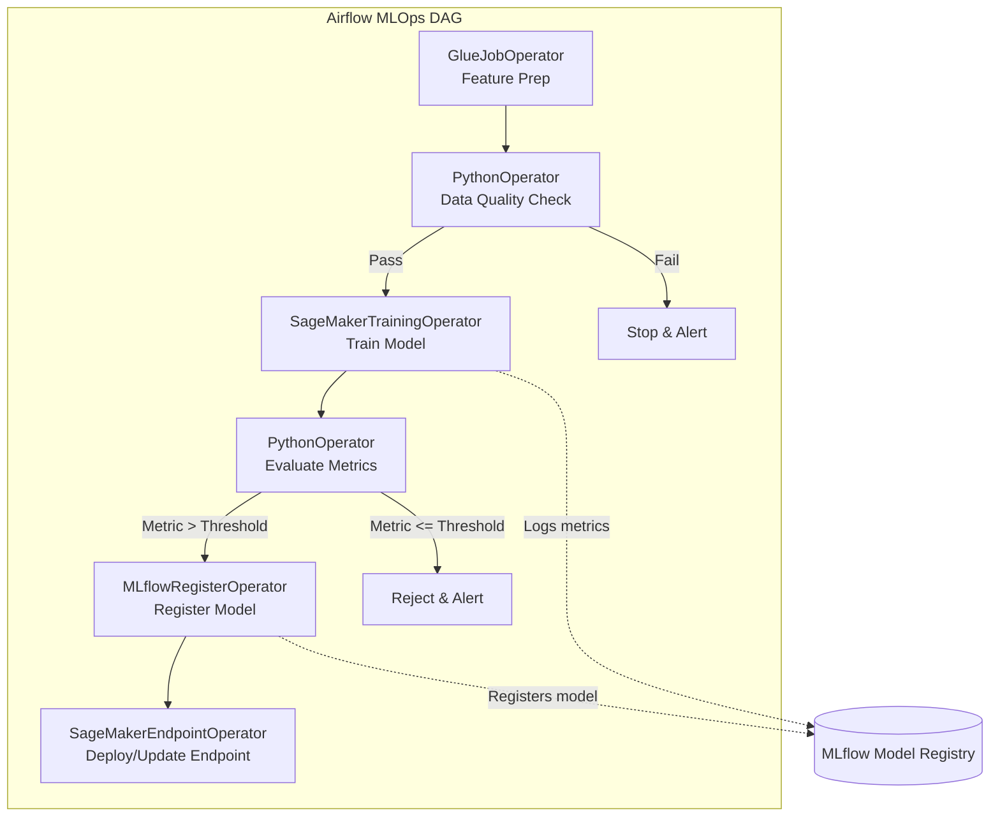

# Module 3.9: Airflow for AI/ML

Welcome to **Airflow for AI/ML**. Standard data pipelines end with database loads. Machine learning pipelines go further: triggering feature engineering, kicking off model training, tracking metrics in MLflow, evaluating models, and deploying predictions. Airflow serves as the primary orchestrator that brings order to MLOps.

---

## 1. Detailed Theory

### The ML Pipeline Lifecycle in Airflow
An ML pipeline consists of multiple distinct steps, which map perfectly to Airflow tasks:
1. **Feature Engineering**: Transforming raw data into model features.
2. **Data Validation**: Ensuring no data drift or distribution shift before training.
3. **Training**: Launching training runs on scalable compute (e.g., SageMaker or Kubernetes).
4. **Evaluation**: Comparing model metrics (accuracy, F1 score) against production baselines.
5. **Registration & Deployment**: Registering the model in MLflow and deploying the inference endpoint.

### Airflow + MLflow Integration
MLflow is used to track hyperparameters, metrics, and models. Airflow orchestrates the execution while logging all training parameters back to MLflow.
- Airflow passes the MLflow `Run ID` between tasks via XCom to keep track of the run context.

### SageMaker & Kubeflow Orchestration
- **SageMaker Operators**: AWS SageMaker operators allow Airflow to start a SageMaker training job, wait for completion, and create a model endpoint.
- **Kubeflow Operators**: Used to trigger Kubeflow pipelines on Kubernetes for containerized ML workloads.

---

## 2. Architecture Diagram: MLOps Pipeline Architecture



---

## 3. Production Use Cases

1. **Automated Churn Prediction Retraining**: A weekly Airflow DAG extracts user behavior features. It trains a classification model on SageMaker, evaluates the F1 score against the current active model, and if it exceeds the baseline by 1%, updates the production API endpoint automatically.
2. **Data Drift Detection**: A daily DAG checks current inference payloads. If data drift is detected (calculated via Python libraries like Evidently or Great Expectations), the DAG sends an alert and triggers the retraining workflow.

---

## 4. Real Company Examples

- **Stitch Fix**: Uses thousands of daily Airflow tasks to coordinate recommendations, styling algorithms, and inventory demand forecasting, combining PySpark preprocessing with containerized model execution.
- **Lyft**: Employs Airflow to manage the lifecycle of models running in production, validating that new pricing algorithms are correct before deployment.

---

## 5. Coding Examples

### End-to-End MLOps DAG (Conceptual)

```python
from datetime import datetime
from airflow import DAG
from airflow.operators.python import PythonOperator
from airflow.providers.amazon.aws.operators.sagemaker import SageMakerTrainingOperator
import mlflow

def evaluate_model(**kwargs):
    # Extract training metrics logged to MLflow in the previous step
    ti = kwargs['ti']
    run_id = ti.xcom_pull(task_ids='train_model')
    
    client = mlflow.tracking.MlflowClient()
    run_data = client.get_run(run_id)
    accuracy = run_data.data.metrics.get("accuracy", 0.0)
    
    # Check threshold
    if accuracy > 0.85:
        print("Model passed validation. Ready to deploy.")
        return "deploy_model"
    else:
        raise ValueError("Model performance too low!")

with DAG('mlops_retraining_pipeline', start_date=datetime(2023, 1, 1), schedule_interval='@weekly', catchup=False) as dag:

    # 1. Trigger Model Training on SageMaker
    train = PythonOperator(
        task_id='train_model',
        python_callable=lambda: "mlflow-run-id-12345" # Dummy run ID return
    )

    # 2. Evaluate model performance
    eval_model = PythonOperator(
        task_id='evaluate_model_performance',
        python_callable=evaluate_model,
        provide_context=True
    )

    # 3. Deploy model (Dummy placeholder task)
    deploy = PythonOperator(
        task_id='deploy_model',
        python_callable=lambda: print("Deploying model to SageMaker Endpoint...")
    )

    train >> eval_model >> deploy
```

---

## 6. Hands-on Labs

**Lab: Tracking Experiments in Airflow**
**Objective**: Integrate MLflow tracking with an Airflow task.
**Instructions**:
Write a Python function for a `PythonOperator` that starts an MLflow run, logs a hyperparameter `learning_rate=0.01`, logs a metric `loss=0.25`, and saves the run ID to XCom so downstream tasks can access it.

---

## 7. Assignments

**Assignment: Preventing Bad Model Deployment**
Explain how you would structure an Airflow DAG to ensure that a newly trained model is never deployed to production if its validation accuracy drops below 80%. Describe which operators and conditional logic paths you would use.

---

## 8. Interview Questions

1. **How does Airflow fit into an MLOps architecture compared to MLflow?**
   *Answer Hint: Airflow is the workflow orchestrator—it controls *when* tasks run, manages dependencies, retries, and coordinates the infrastructure. MLflow is an experiment tracker and registry—it records the hyperparameters, weights, metrics, and models generated by the code.*
2. **What is data drift, and how can Airflow help mitigate it?**
   *Answer Hint: Data drift is when the statistical properties of input data change over time, degrading model accuracy. Airflow can schedule daily check tasks that run drift-detection libraries on incoming production data and trigger alert/retraining pipelines if drift is detected.*

---

## 9. Best Practices (FDE Standards)

- **Decouple Training and Serving**: Do not run the inference API server inside Airflow. Airflow's job is to deploy the model to an external serving platform (like SageMaker, Seldon, or FastAPI containers) and then exit.
- **Log Everything to MLflow**: Ensure every training task orchestrating a run records its parameters, metrics, datasets, and environmental details in a central registry for auditing.

---

## 10. Common Mistakes

- **Running Heavy Inference inside DAGs**: Trying to run batch inference on 1 million rows directly in a `PythonOperator` using local system resources, leading to CPU starvation and scheduler crashes.
