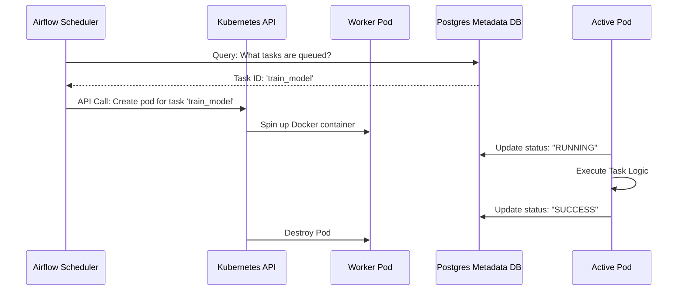

# Module 3.11: Production Airflow

Welcome to **Production Airflow**. Building DAGs locally using the `SequentialExecutor` is great for testing. But in production, you must scale Airflow to handle thousands of concurrent tasks, secure it against vulnerabilities, monitor worker performance, and manage deployments using CI/CD.

---

## 1. Detailed Theory

### Scalability (Executors)
Airflow determines how to run tasks using Executors.
- **CeleryExecutor**: The traditional scaling mechanism. Airflow pushes tasks to a Celery queue (e.g., backed by Redis or RabbitMQ), and a fixed pool of persistent worker nodes pick them up. Very fast task startup time.
- **KubernetesExecutor**: The modern enterprise standard. For every task instance, Airflow calls the Kubernetes API to spin up a temporary pod, runs the task, and terminates the pod. Offers absolute resource isolation and dynamic scaling to zero.

### Reliability & Fault Tolerance
- **Dead Letter Queues (DLQ)**: Routing corrupted or unparseable input data to a separate database or folder for manual inspection, rather than halting the entire pipeline.
- **Backfilling**: Running historical DAG runs after fixing a bug or updating business logic in a DAG.
- **Checkpointing**: Designing tasks to save state or progress, so if a task fails midway through processing 1 million files, it can resume from where it failed rather than starting over.

### Security
- **RBAC (Role-Based Access Control)**: Restricting Web UI access. (e.g., data scientists can only view and trigger DAGs, while administrators can modify configuration and variables).
- **Secret Backends**: Dynamically fetching passwords and keys from HashiCorp Vault, AWS Secrets Manager, or Google Secret Manager rather than storing them in the Airflow Metadata Database.

### Monitoring
- **Prometheus & Grafana**: Exporting Airflow metrics (e.g., scheduler heartbeats, queued task counts, worker CPU/RAM) to monitor system health in real-time.

---

## 2. Architecture Diagram: Production KubernetesExecutor Flow



---

## 3. Production Use Cases

1. **Enterprise Scaling (Kubernetes)**: During high traffic (e.g., Black Friday), Airflow scales from 2 to 100 worker pods to process streaming logs concurrently, and then automatically scales back to 0 when traffic drops, saving thousands of dollars.
2. **Dynamic Secrets Management**: To query a customer database, the Airflow PostgresOperator requests access. Airflow dynamically connects to HashiCorp Vault to pull a temporary DB credential, runs the query, and discards the credential.

---

## 4. Real Company Examples

- **Astronomer.io**: The primary managed Airflow enterprise platform, built entirely on top of Kubernetes, utilizing Helm charts to deploy and manage production-level Airflow clusters.
- **PagerDuty**: Integrates natively with Airflow. If a critical production DAG (like financial reporting) fails, Airflow calls the PagerDuty API to page the on-call engineer immediately.

---

## 5. Coding Examples

### Configuring custom Secret Backends (airflow.cfg)

This configuration directs Airflow to look in AWS Secrets Manager for variables and connections before checking its own database.

```ini
[secrets]
backend = airflow.providers.amazon.aws.secrets.secrets_manager.SecretsManagerBackend
backend_kwargs = {"connections_prefix": "airflow/connections", "variables_prefix": "airflow/variables"}
```

---

## 6. Hands-on Labs

**Lab: Simulating Checkpointing**
**Objective**: Build a checkpointing function.
**Instructions**:
Write a Python loop that processes a list of 100 files. Before processing a file, check if its name exists in a local SQLite database table `processed_files`. If yes, skip it. If no, process it and write the filename to `processed_files`. This ensures your code is restartable.

---

## 7. Assignments

**Assignment: CI/CD Pipeline Design**
Sketch out the steps of a GitHub Actions workflow that runs every time a developer submits a pull request to edit a DAG:
1. Run syntax checks (flake8/black).
2. Run Airflow DAG bag validation (checking for syntax and import errors).
3. Deploy the files to the production S3 bucket/Airflow directory.

---

## 8. Interview Questions

1. **What are the differences between the CeleryExecutor and the KubernetesExecutor?**
   *Answer Hint: CeleryExecutor uses a persistent pool of worker nodes that are always running (fast task startup, but incurs constant server costs). KubernetesExecutor spins up a dedicated, isolated pod for each task at execution time (slower startup time, but provides perfect resource isolation and scales down to zero cost when idle).*
2. **What is a "Dead Letter Queue" and when should you use it?**
   *Answer Hint: A mechanism to isolate problematic, malformed, or unprocessable messages/files. Instead of crashing the entire pipeline or skipping the data silently, you direct it to a special table or folder for manual inspection.*

---

## 9. Best Practices (FDE Standards)

- **Always Validate DAGs**: Integrate `dagbag` verification into your CI/CD tests. A simple syntax error in a single DAG file can crash the parser and hide all other DAGs from the Web UI.
- **Enable Least Privilege**: Ensure the IAM Role or Service Account running Airflow workers has ONLY the permissions required to execute tasks, never give full administrative access.

---

## 10. Common Mistakes

- **Storing Secrets in Git**: Checking in a DAG file containing the database password to a public or private GitHub repository. Always use Airflow Connections linked to a Secret Backend.
- **Infinite Wait Sensors**: Setting an Airflow sensor to run without a `timeout` parameter, letting it check for a missing file forever, consuming a worker slot indefinitely.
