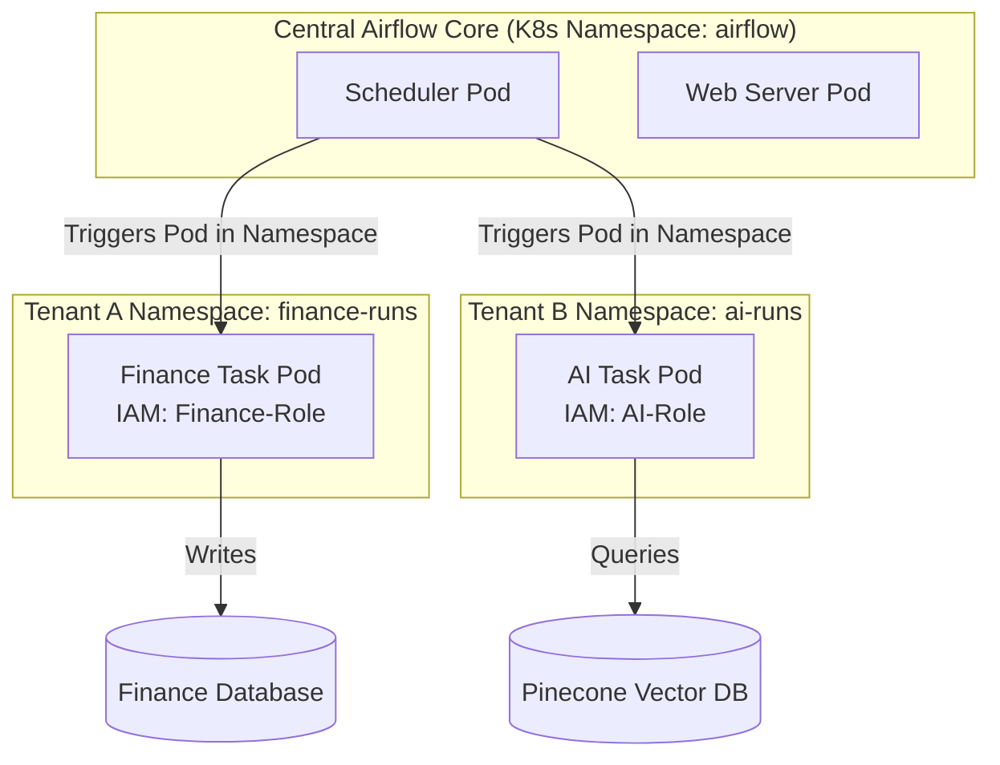

# Module 3.12: Enterprise Airflow Architecture

Welcome to the final module of the Airflow curriculum: **Enterprise Airflow Architecture**. In large organizations, Airflow doesn't serve just one team. It acts as the central coordinator for the entire enterprise data platform. You must design Airflow to support multi-tenancy, coordinate cross-team data contracts, and orchestrate complex AI, Lakehouse, and Business Intelligence workloads at scale.

---

## 1. Detailed Theory

### Multi-Tenant Airflow
In a multi-tenant enterprise architecture, different business departments (Marketing, Finance, AI, Engineering) share the same Airflow infrastructure but require strict isolation:
- **Tenant Isolation**: Ensuring Marketing cannot view or edit Finance's DAGs.
- **Namespace-Based Execution**: When running tasks via the `KubernetesExecutor`, tasks for different tenants are executed in isolated Kubernetes namespaces, each with its own IAM roles and service accounts.
- **Resource Quotas**: Limiting the maximum CPU/RAM each department's namespace can consume to prevent one team's model training run from starving the entire system.

### Data Platform Orchestration
Airflow acts as the master scheduler connecting the three core pillars of a modern enterprise platform:
1. **The Lakehouse (Bronze/Silver/Gold)**: Coordinating raw data ingestion, Silver layer cleansing, and Gold layer aggregations.
2. **Data Contracts & Quality**: Triggering validation suites (such as Great Expectations or Soda) at ingestion boundaries to enforce data quality contracts between teams.
3. **AI/ML Platform Integration**: Running feature generation pipelines, registering model assets, and orchestrating deployment endpoints.

---

## 2. Architecture Diagram: Enterprise Orchestration Architecture



---

## 3. Production Use Cases

1. **Enterprise Data Mesh Architecture**: The core infrastructure team hosts a shared Airflow deployment. The Risk team writes a DAG that executes in the `risk` Kubernetes namespace, accessing sensitive transaction data. The Sales team writes a DAG that executes in the `sales` namespace. Both run on the same scheduler but remain completely isolated from a security and network perspective.
2. **Unified Data Lakehouse + AI Pipeline**: Airflow orchestrates a pipeline that loads raw files into S3, runs an AWS Glue job to update a Delta Lake, runs a Soda data quality check, and if it passes, triggers a Vertex AI model training run, followed by loading newly generated embeddings into a Milvus Vector Database.

---

## 4. Real Company Examples

- **Palantir**: Uses modular, isolated architectures to separate data processing pipelines of different clients, ensuring strict isolation while maintaining centralized scheduling.
- **Airbnb**: Maintains centralized, multi-tenant Airflow deployments serving thousands of internal users, relying heavily on custom UI plugins to isolate DAG visibility between different departments.

---

## 5. Coding Examples

### Namespace Routing in KubernetesPodOperator

This operator runs the task inside a specific Kubernetes namespace with its own security service account.

```python
from datetime import datetime
from airflow import DAG
from airflow.providers.cncf.kubernetes.operators.pod import KubernetesPodOperator

with DAG('enterprise_tenant_isolation', start_date=datetime(2023, 1, 1), schedule_interval='@daily', catchup=False) as dag:

    run_isolated_ai_job = KubernetesPodOperator(
        task_id='run_ai_training',
        name='ai-training-task',
        # Route to a specific namespace with dedicated resource limits
        namespace='ai-runs', 
        # Run under a security context with specific IAM permissions
        service_account_name='ai-platform-sa', 
        image='enterprise-registry.com/ai/training-image:v1.2',
        cmds=["python", "train.py"],
        get_logs=True
    )

    run_isolated_ai_job
```

---

## 6. Hands-on Labs

**Lab: Resource Limit Design**
**Objective**: Configure pod resources for Kubernetes execution.
**Instructions**:
Write out the resource configurations (CPU request/limit, Memory request/limit) for a task that is expected to consume significant compute. Explain how setting these limits prevents a single container from crashing the physical Kubernetes node.

---

## 7. Assignments

**Assignment: Enterprise Architecture Proposal**
A bank is migrating to a centralized data platform. They have three separate divisions that must run Airflow workflows. They want to avoid hosting three independent Airflow instances due to management costs. 
Write a short technical proposal explaining how they can host a single, multi-tenant Airflow instance on Kubernetes while guaranteeing data security and resource isolation between divisions.

---

## 8. Interview Questions

1. **How do you enforce tenant isolation in a shared Airflow environment using Kubernetes?**
   *Answer Hint: By deploying the KubernetesExecutor and specifying the `namespace` and `service_account_name` in the KubernetesPodOperator configuration. This ensures tasks run in network-isolated namespaces with unique IAM credentials rather than sharing the Airflow host worker permissions.*
2. **Why is dynamic resource quota management important in enterprise data platforms?**
   *Answer Hint: Without quotas, a single large, unoptimized Spark or ML training task could spin up hundreds of worker pods, consuming the cluster's entire compute capacity and causing critical daily production tasks to stall.*

---

## 9. Best Practices (FDE Standards)

- **Decouple Core Scheduling from Execution**: Keep the Airflow core scheduler and web server simple and lean. Run all data processing inside isolated namespaces using the `KubernetesPodOperator`.
- **Enforce Service Level Objectives (SLOs)**: Implement alerting systems using Slack or PagerDuty on critical data paths so infrastructure failures are escalated immediately.

---

## 10. Common Mistakes

- **Global Service Accounts**: Running all Airflow tasks under a single administrative Kubernetes service account, allowing developer DAGs from any department to read/write from any database.
- **Monolithic Deployments**: Putting all company DAGs in a single massive repository, making it impossible to separate deployment lifecycles between departments.
