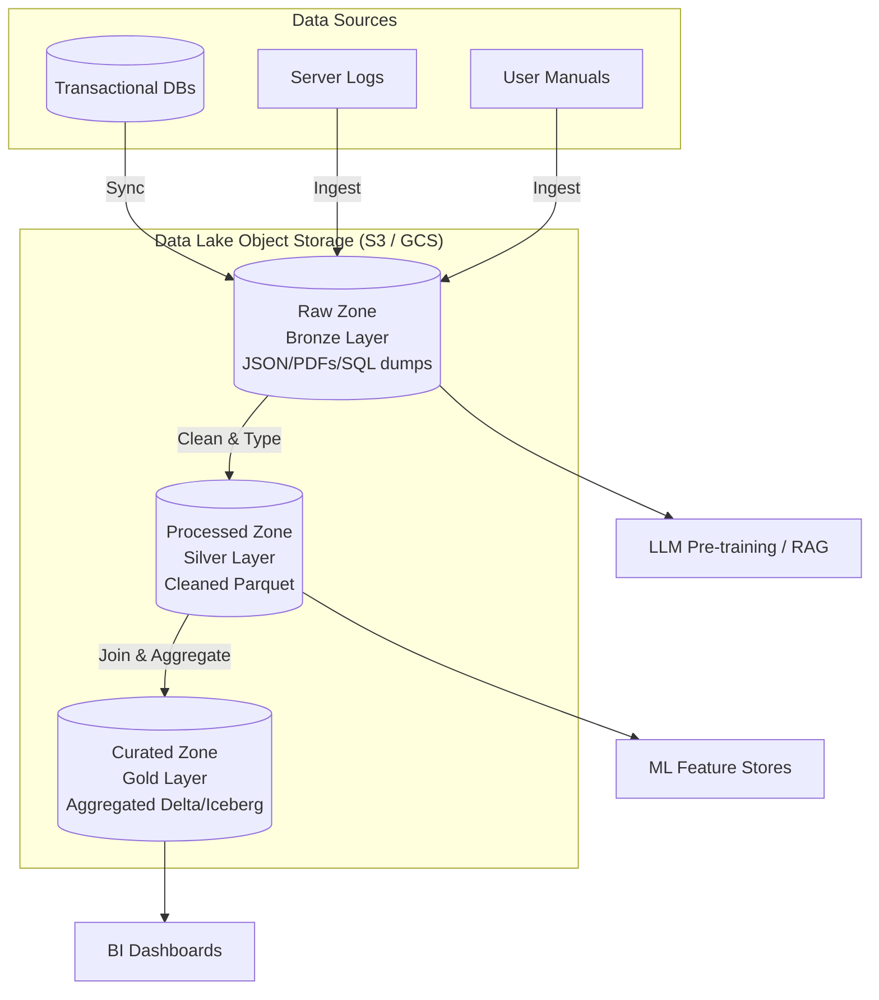

# Module 6.1: Data Lake Fundamentals

Welcome to **Data Lake Fundamentals**. As an AI Forward Deployed Engineer (FDE), raw data is your lifeblood. Traditional data warehouses are highly structured and restrict the ingestion of unstructured data. To train machine learning models, parse text for RAG pipelines, or execute large-scale data science, you must leverage **Data Lakes**. A Data Lake allows you to store all your structured, semi-structured, and unstructured data at any scale in its native format.

---

## 1. Detailed Theory

### What is a Data Lake?
A Data Lake is a centralized repository that allows you to store all your structured, semi-structured, and unstructured data at any scale. Unlike a relational database or data warehouse, which requires data to be structured and defined before ingestion (**Schema-on-Write**), a Data Lake allows you to load data as-is and define its schema only when you query it (**Schema-on-Read**).

### Data Warehouses vs. Data Lakes
- **Data Warehouse**: Stores structured data only. Uses expensive, high-speed storage coupled with compute. Relies on relational tables, schemas, and SQL access. Great for historical business intelligence.
- **Data Lake**: Stores any data type. Uses cheap, decoupled object storage (S3/GCS) separated from compute clusters. Ideal for AI, machine learning, and raw data exploration.

### Types of Data
1. **Structured Data**: Relational database tables with strict rows and columns (e.g., SQL tables).
2. **Semi-Structured Data**: Data containing tags or markers but lacking a formal schema (e.g., JSON, XML, YAML).
3. **Unstructured Data**: Raw binary data without any predefined structure (e.g., PDFs, text manuals, audio recordings, images, video). This is the primary format processed by Generative AI and LLMs.

### Storage Layers
To keep a Data Lake from becoming an unorganized "Data Swamp," storage is split into logical directories:
- **Raw Layer (Bronze)**: Untouched, original source data. Historic snapshots are preserved.
- **Processed Layer (Silver)**: Standardized, cleaned, and schema-validated data.
- **Curated Layer (Gold)**: Highly aggregated, business-ready datasets (often modeled as Star Schemas).

---

## 2. Architecture Diagram: Data Lake Storage Paradigm



---

## 3. Production Use Cases

1. **Enterprise LLM Knowledge Store**: Storing raw corporate manuals, transcripts, and slack logs in the Raw Zone of a Data Lake. Chunking and embedding pipelines read these files to build semantic search engines.
2. **Batch ML Ingest**: Collecting transactional database snapshots and server click logs into a single storage layer to generate training datasets for customer churn models.

---

## 4. Real Company Examples

- **Netflix**: Manages petabytes of raw viewing and telemetry data using Amazon S3 as their primary Data Lake storage layer, feeding downstream analytical engines.
- **Uber**: Ingests geospatial and transaction updates directly into an open table format lakehouse to manage logistical supply chains.

---

## 5. Coding Examples

### Logical Schema-on-Read using PySpark

This PySpark script shows how a Data Lake handles Schema-on-Read: raw, unstructured text is ingested and dynamically parsed with a schema at query time.

```python
from pyspark.sql import SparkSession
import pyspark.sql.functions as F

spark = SparkSession.builder.appName("SchemaOnReadShowcase").getOrCreate()

# 1. Read unstructured raw text logs from the Data Lake
raw_logs_df = spark.read.text("s3://my-enterprise-datalake/raw/logs/*.txt")

# At this stage, Spark has no structured schema except a single 'value' column.
# 2. Schema-on-Read: Dynamically extract and type columns using regex
structured_df = raw_logs_df.select(
    F.regexp_extract(F.col("value"), r"^\[(.*?)\]", 1).alias("timestamp"),
    F.regexp_extract(F.col("value"), r"LEVEL:(\w+)", 1).alias("log_level"),
    F.regexp_extract(F.col("value"), r"MESSAGE:(.*)$", 1).alias("message")
)

# 3. Query the dynamically structured data
error_logs = structured_df.filter("log_level = 'ERROR'")
error_logs.show(5, truncate=False)
```

---

## 6. Hands-on Labs

**Lab: Data Swamp Prevention**
**Objective**: Establish folder structures.
**Instructions**:
Write down a logical directory layout for an S3 Data Lake hosting e-commerce data. Include paths for:
- Raw transaction dumps (divided by year/month/day).
- Cleaned customer profile Parquet files.
- Curated dashboard metrics.

---

## 7. Assignments

**Assignment: Lake vs. Warehouse Storage Sizing**
Write a technical note analyzing the storage cost difference between storing 100TB of raw logs in a traditional Relational Data Warehouse (e.g., Oracle) vs. storing the same files in a Cloud Data Lake (e.g., AWS S3). How does the decoupling of compute and storage affect budget planning?

---

## 8. Interview Questions

1. **What is the difference between Schema-on-Read and Schema-on-Write?**
   *Answer Hint: Schema-on-Write (Data Warehouse) requires data to fit a predefined table schema before it can be loaded. Schema-on-Read (Data Lake) allows raw data of any format to be loaded immediately; the structure is defined when a query or script parses the files.*
2. **Why do we partition a Data Lake Raw Zone by Date?**
   *Answer Hint: Partitioning by date allows downstream processing pipelines to read only the directories containing yesterday's files rather than scanning the entire historical dataset, reducing S3 API requests and network transfer costs.*

---

## 9. Best Practices (FDE Standards)

- **Decouple Compute and Storage**: Never configure your processing clusters (Spark/Kubernetes) to store permanent data. Always write outputs back to object storage (S3/GCS) so the compute nodes can be shut down when idle.
- **Maintain a Catalog**: Always maintain a central catalog (like AWS Glue or DataHub) to record what datasets exist in the lake, who owns them, and what schemas they contain to prevent a "Data Swamp."

---

## 10. Common Mistakes

- **Creating a Data Swamp**: Writing raw files to a single S3 bucket without folder structures, metadata validation, or lifecycle policies, making the data unusable.
- **Ignoring Lifecycle Policies**: Keeping raw, volatile temporary files in high-tier object storage forever, resulting in skyrocketing cloud storage bills. Configure lifecycle transitions to cold storage (Glacier).
