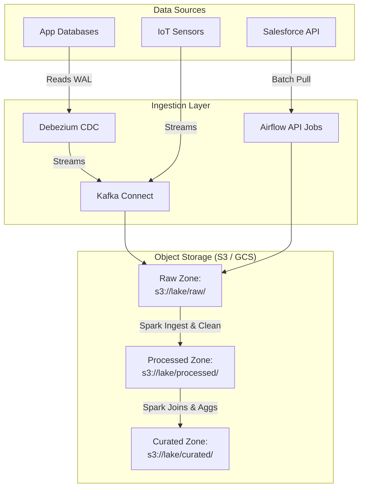

# Module 6.2: Data Lake Architecture

Welcome to **Data Lake Architecture**. Building a scalable, reliable Data Lake requires designing data flows that ingest events from diverse sources, partition them in storage zones, and prepare them for consumption by AI and analytical systems.

---

## 1. Detailed Theory

### Data Sources
An enterprise Data Lake must ingest data from multiple systems:
- **Databases**: Relational and NoSQL database dumps.
- **APIs**: Third-party SaaS logs (e.g., Salesforce, Zendesk).
- **Logs**: Application server stdout and syslogs.
- **IoT Devices**: High-frequency streaming sensors.
- **Streaming Events**: Real-time clickstreams.

### Ingestion Patterns
Ingestion is categorized by frequency:
1. **Batch Ingestion**: Large dumps of data transferred at scheduled intervals (e.g., daily database backups).
2. **Streaming Ingestion**: Continuous event collection (e.g., Kafka ingestion of real-time server logs).
3. **Change Data Capture (CDC)**: Continuous streaming of database logs (PostgreSQL WAL) to capture inserts, updates, and deletes in real-time.

### Storage Zones
To organize data in cloud object storage, the Data Lake is partitioned into logical zones:
- **Raw Zone (Landing Zone)**: The entry point. Data is kept in its native format, immutable and unmodified. Organized by ingestion date.
- **Processed Zone (Conformed Zone)**: Cleaning, typing, deduplicating, and standardizing data. Usually saved as compressed Parquet files.
- **Curated Zone (Analytics Zone)**: Aggregated data structured as Star Schemas or optimized table formats (Delta/Iceberg), ready for dashboards or ML model ingestion.

---

## 2. Architecture Diagram: Production Data Lake Architecture



---

## 3. Production Use Cases

1. **Enterprise Data Lake Foundation**: Ingesting messy JSON customer records from a Stripe API batch pull into `s3://datalake/raw/stripe/`, using Spark to validate the schema and save as conformed Parquet in `s3://datalake/processed/stripe/`, and generating daily financial summaries in `s3://datalake/curated/billing/`.
2. **IoT Telemetry Collection**: High-frequency vehicle sensor events stream into Kafka, are landed in the Raw zone by a Kafka Connect S3 connector, and aggregated hourly to monitor predictive maintenance features.

---

## 4. Real Company Examples

- **Walmart**: Manages thousands of store telemetry and point-of-sale streams by landing raw files in AWS S3 and utilizing Spark pipelines to conform and partition the data.

---

## 5. Coding Examples

### PySpark Ingest and Partition Pipeline

```python
from pyspark.sql import SparkSession
import pyspark.sql.functions as F
from pyspark.sql.types import StructType, StructField, StringType, DoubleType, LongType

spark = SparkSession.builder.appName("DataLakeIngestion").getOrCreate()

# 1. Define explicit schema for raw JSON landing data
raw_schema = StructType([
    StructField("order_id", StringType(), False),
    StructField("user_id", StringType(), False),
    StructField("amount", DoubleType(), True),
    StructField("timestamp", LongType(), True)
])

# 2. Read from Raw Zone
raw_df = spark.read \
    .schema(raw_schema) \
    .json("s3://enterprise-datalake/raw/orders/*/*/*.json")

# 3. Clean and Transform (Write to Processed Zone)
# Cast timestamp and derive year/month/day for partition formatting
processed_df = raw_df \
    .withColumn("order_time", F.from_unixtime(F.col("timestamp")).cast("timestamp")) \
    .withColumn("year", F.year(F.col("order_time"))) \
    .withColumn("month", F.month(F.col("order_time"))) \
    .withColumn("day", F.dayofmonth(F.col("order_time")))

# 4. Write to Processed Zone partitioned by date for faster query performance
processed_df.write \
    .format("parquet") \
    .mode("overwrite") \
    .partitionBy("year", "month", "day") \
    .save("s3://enterprise-datalake/processed/orders/")
```

---

## 6. Hands-on Labs

**Lab: Ingestion Strategy Selection**
**Objective**: Match datasets with ingestion methods.
**Instructions**:
For each of the following datasets, choose the optimal ingestion pattern (**Batch Ingestion**, **Streaming Ingestion**, or **CDC**) and explain your choice:
1. Hourly website clickstream data.
2. A database containing core banking account balances.
3. A monthly third-party marketing report.

---

## 7. Assignments

**Assignment: Storage Zone Isolation**
You are designing the security policy for a health-tech company's Data Lake.
Explain how you would configure AWS IAM roles and bucket policies to ensure that the AI modeling team has access to the **Processed Zone** (where data has been anonymized and typed) but is strictly blocked from the **Raw Zone** (which contains clear-text Patient Names and SSNs).

---

## 8. Interview Questions

1. **What is the difference between the Raw Zone and the Processed Zone in a Data Lake?**
   *Answer Hint: The Raw Zone contains exact, unmodified copies of source data in its native format (immutable). The Processed Zone contains conformed data that has been cleaned, typed, deduplicated, and standardized (often stored as optimized Parquet).*
2. **Why do we partition data in a Data Lake?**
   *Answer Hint: Partitioning splits a massive dataset into subdirectories based on column values (e.g., date). When querying the data, the engine uses Partition Pruning to skip scanning unrelated directories, reducing query execution time and costs.*

---

## 9. Best Practices (FDE Standards)

- **Immutable Raw Data**: Once data is written to the Raw Zone, it should never be updated or overwritten. If a schema changes, write to a new folder path or use schema evolution.
- **Enforce Date Partitioning**: Always partition raw landing folders by date (e.g., `/year=YYYY/month=MM/day=DD/`) to facilitate incremental processing.

---

## 10. Common Mistakes

- **Swallowing file extensions**: Writing Parquet files without the `.parquet` extension in the filename, causing query engines like Athena or Spark to fail to identify the file types.
- **Ignoring Compaction**: Leaving millions of tiny 1KB files in the Processed Zone, slowing down downstream query times. Combine files using compaction processes.
