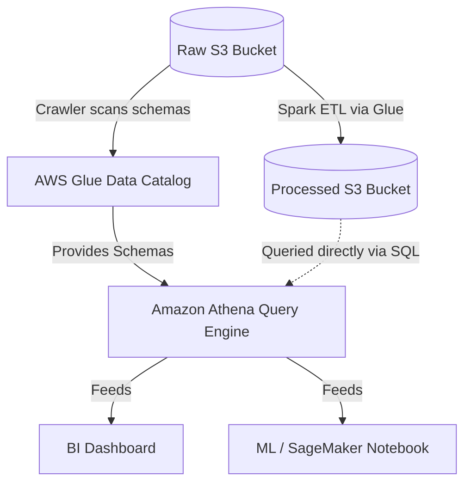

# Module 6.3: Cloud Data Lakes

Welcome to **Cloud Data Lakes**. In modern enterprise data platforms, you will not build physical storage clusters. You will rely on cloud-native serverless object storage and managed services provided by AWS, Azure, or GCP. In this module, you will learn the services that make up cloud data lakes and how to orchestrate them.

---

## 1. Detailed Theory

### Managed Storage Layers
The core foundation of any cloud data lake is serverless object storage:
- **AWS (Amazon S3)**: Extremely durable, highly scalable key-value object store. Integrates natively with IAM.
- **Azure (ADLS Gen2 - Azure Data Lake Storage)**: Built on Azure Blob Storage. Introduces a **Hierarchical Namespace (HNS)** which allows for high-performance directory operations (renames/deletes), mimicking a local file system.
- **GCP (Google Cloud Storage - GCS)**: Serverless object storage with high consistent performance and fast metadata listing.

### The Cloud Catalog & Query Layer
Storing files in S3 or GCS is only useful if you can query them. Cloud platforms provide serverless query engines that read files directly using SQL:
- **AWS Glue Data Catalog**: A managed metadata registry (schema store). A **Glue Crawler** scans S3 files, identifies schemas, and creates table references.
- **Amazon Athena**: A serverless query service that allows you to run standard SQL queries directly against files in S3. It uses Presto under the hood and reads from the Glue Data Catalog schemas.
- **GCP BigQuery Omni**: Allows BigQuery to execute SQL queries directly against data stored in AWS S3 or Azure ADLS Gen2 without moving files.

---

## 2. Architecture Diagram: AWS Serverless Data Lake Architecture



---

## 3. Production Use Cases

1. **AWS Enterprise Data Lake**: Raw customer logs are uploaded to S3. An AWS Glue job runs a PySpark script to clean the data and saves it back to S3 in Parquet format. A Glue Crawler catalogs the tables, allowing data scientists to query the data instantly via Amazon Athena using SQL.
2. **Multi-Cloud Data Access (GCP BigQuery Omni)**: Running analytics on AWS S3 files using GCP BigQuery queries without paying expensive egress fees to move the raw data to Google Cloud.

---

## 4. Real Company Examples

- **Netflix**: Houses petabytes of transactional and viewing logs in Amazon S3, using Athena and EMR clusters to run ad-hoc analytics queries and train recommendations systems.

---

## 5. Coding Examples

### Querying AWS S3 Data Lakes via Boto3 and Athena (Python)

This script shows how an application queries a serverless AWS Data Lake programmatically.

```python
import boto3
import time

# 1. Configure Athena client
athena_client = boto3.client('athena', region_name='us-east-1')

# 2. Define the SQL query against the Glue Data Catalog
query = "SELECT category, SUM(amount) FROM enterprise_catalog.gold_sales GROUP BY category;"
database = "enterprise_catalog"
output_s3_path = "s3://my-athena-query-results-bucket/"

# 3. Start query execution (asynchronous)
response = athena_client.start_query_execution(
    QueryString=query,
    QueryExecutionContext={'Database': database},
    ResultConfiguration={'OutputLocation': output_s3_path}
)
query_execution_id = response['QueryExecutionId']

# 4. Poll for query completion
while True:
    status = athena_client.get_query_execution(QueryExecutionId=query_execution_id)
    state = status['QueryExecution']['Status']['State']
    
    if state in ['SUCCEEDED', 'FAILED', 'CANCELLED']:
        print(f"Query finished with state: {state}")
        break
    time.sleep(2)

# 5. Fetch query results if succeeded
if state == 'SUCCEEDED':
    results = athena_client.get_query_results(QueryExecutionId=query_execution_id)
    for row in results['ResultSet']['Rows']:
        print([val.get('VarCharValue', 'NULL') for val in row['Data']])
```

---

## 6. Hands-on Labs

**Lab: Glue Crawler Execution**
**Objective**: Catalog S3 directories.
**Instructions**:
Write down the step-by-step instructions to create an AWS Glue Crawler in the AWS Console, point it to an S3 folder containing daily partitioned CSV logs, run the crawler, and verify that the table and schema were created in the Glue Catalog database.

---

## 7. Assignments

**Assignment: ADLS Gen2 Hierarchical Namespace**
Write a short technical analysis explaining how Azure ADLS Gen2's **Hierarchical Namespace (HNS)** improves Spark's performance during file `rename` and `delete` operations compared to standard flat storage services (like standard AWS S3) which must copy and delete objects key-by-key.

---

## 8. Interview Questions

1. **How does Amazon Athena work?**
   *Answer Hint: Athena is a serverless query service based on Presto. It queries files directly in S3. It uses metadata from the AWS Glue Data Catalog to map database schemas (column names, types) over the raw S3 files at query execution time.*
2. **What is the difference between S3 Standard and S3 Glacier?**
   *Answer Hint: S3 Standard is high-performance storage designed for active, frequent data access. S3 Glacier is extremely cheap cold storage designed for archiving inactive records (retrievals can take minutes or hours), allowing you to reduce storage costs for historical logs.*

---

## 9. Best Practices (FDE Standards)

- **Do Not Query Raw S3 via Athena in Production**: Raw files (JSON/CSV) are slow to parse and scan. Always clean and save data in partitioned Parquet format in the Processed Zone before exposing it to Athena queries to minimize query costs.
- **Use Partition Projection in Athena**: Configure partition projection on high-frequency tables in the Glue Catalog to bypass slow Glue partition metadata queries, speeding up Athena query start times.

---

## 10. Common Mistakes

- **Failing to manage query results buckets**: Letting Amazon Athena store query output files in S3 indefinitely without lifecycle rules, creating millions of redundant files and increasing storage costs.
- **Hardcoding S3 keys in scripts**: Hardcoding S3 Access Keys in python scripts instead of using IAM Roles (Instance Profiles) to access cloud data lakes securely.
