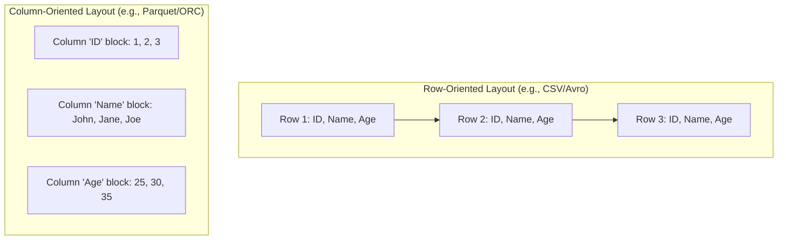

# Module 6.4: Data Lake File Formats

Welcome to **Data Lake File Formats**. Storing files on S3/GCS is easy, but the file format you choose determines the storage costs, network transit overhead, and query speeds of your data platform. In this module, you will learn the differences between Row-oriented and Column-oriented file formats and how query engines optimize reads.

---

## 1. Detailed Theory

### File Format Types
Data Lakes support any format:
- **CSV / TSV**: Raw text format. Simple, but verbose, untyped, and slow to query.
- **JSON**: Text format supporting semi-structured hierarchies. Easy to read, but highly verbose due to repeated keys.
- **Avro**: Row-oriented binary serialization format. Fast to write; stores schemas in the file headers. Ideal for real-time streaming queues (Kafka).
- **Parquet**: Column-oriented binary format. The industry standard for Big Data analytics. Highly compressible.
- **ORC (Optimized Row Columnar)**: Similar to Parquet. Developed for Hadoop/Hive workloads.

### Columnar Storage Mechanics
In row-oriented files (like CSV), values for a single row are stored contiguously on disk. In column-oriented files (like Parquet), values for a single column are stored contiguously.
- If you have a table with 100 columns and run `SELECT age FROM users`, a row-oriented format forces the engine to scan the entire file (all 100 columns).
- A column-oriented format allows the engine to seek directly to the `age` column byte address and scan only that data, skipping 99% of the file read operations.

### Optimization Concepts
- **Compression**: Parquet blocks are compressed using algorithms like Snappy, Gzip, or Zstd, drastically reducing S3 storage bills.
- **Predicate Pushdown**: Parquet files store metadata (min/max values) for groups of rows within each file. If you query `WHERE age > 60`, the query engine checks the min/max metadata first. If a file block's max age is 45, the engine skips reading the entire file block (File Skipping).

---

## 2. Architecture Diagram: Row-Oriented vs. Column-Oriented Storage Layout



---

## 3. Production Use Cases

1. **Optimized Analytics Storage**: Converting terabytes of raw API output logs (JSON format) in the Raw zone into Snappy-compressed Parquet files in the Processed zone. This reduces storage footprint by up to 80% and increases downstream query performance by 10x.
2. **Serverless BI Dashboard Support**: Providing direct data queries for Looker/Tableau dashboards from S3 using Athena. By storing files in partitioned Parquet, Athena scans only the required columns and partitions, reducing query costs from dollars to cents.

---

## 4. Real Company Examples

- **Netflix**: Standardizes all analytical tables on Apache Parquet and Iceberg, allowing their query engines to skip billions of irrelevant rows when compiling daily streaming analytics summaries.

---

## 5. Coding Examples

### PySpark JSON to Optimized Parquet Conversion Script

```python
from pyspark.sql import SparkSession

spark = SparkSession.builder.appName("FileFormatOptimization").getOrCreate()

# 1. Read verbose raw JSON files from S3 Raw Zone
raw_json_df = spark.read.json("s3://enterprise-datalake/raw/stripe_events/*.json")

# 2. Write conformed dataset to Processed Zone in Snappy-compressed Parquet format
raw_json_df.write \
    .format("parquet") \
    .option("compression", "snappy") \
    .mode("overwrite") \
    .save("s3://enterprise-datalake/processed/stripe_events/")

# 3. Querying only a subset of columns (Spark only reads the specific bytes on S3)
parquet_df = spark.read.parquet("s3://enterprise-datalake/processed/stripe_events/")
filtered_df = parquet_df.select("event_id", "amount").filter("amount > 100.0")

filtered_df.write.parquet("s3://enterprise-datalake/curated/large_transactions/")
```

---

## 6. Hands-on Labs

**Lab: Parquet Metadata Inspection**
**Objective**: Read file metadata.
**Instructions**:
Write a short Python script using the `pyarrow` library to print the schema, row group count, and columnar metadata (including min/max statistics) of a local Parquet file.

---

## 7. Assignments

**Assignment: File Skipping Logic**
You have a Parquet dataset partitioned by `year` and `month`. Within each Parquet file, data is split into row groups containing column statistics.
Write a paragraph explaining how a query containing `WHERE year = 2023 AND month = 10 AND customer_age > 80` utilizes:
1. Directory-level partition pruning.
2. Row group metadata skipping (Predicate Pushdown).

---

## 8. Interview Questions

1. **Why does Parquet query faster than CSV?**
   *Answer Hint: Parquet is columnar, allowing query engines to read only the columns requested in the query. It is also binary (faster parsing than text) and contains embedded metadata (like min/max statistics for row groups), enabling engines to skip reading entire chunks of data.*
2. **When would you choose Avro over Parquet?**
   *Answer Hint: Choose Avro for write-heavy streaming architectures (like Kafka topics or CDC landing zones) because row-oriented formats append new records fast without reorganizing columns. Choose Parquet for read-heavy analytics and querying where column scanning is required.*

---

## 9. Best Practices (FDE Standards)

- **Use Columnar Formats for Queries**: Always convert raw JSON/CSV data into Parquet or ORC before exposing it to analytical tools or serverless query engines.
- **Enforce Snappy or Zstd Compression**: Always write Parquet files with compression enabled (default in modern Spark is Snappy) to minimize S3/GCS storage costs.

---

## 10. Common Mistakes

- **Writing JSON to Curated Zones**: Leaving raw JSON files as the final queryable tables for BI dashboards, resulting in slow load times and high query costs.
- **CSV Data Schema Drift**: Relying on CSV file formats where values can break column ordering or types easily due to missing quotation mark formats.
