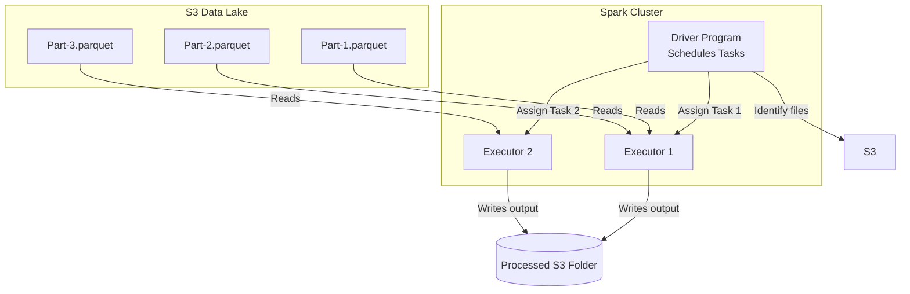

# Module 6.5: Data Lake Processing

Welcome to **Data Lake Processing**. Storing data in object storage is only half the battle. To extract value, you must process terabytes of raw logs, join disparate datasets, and calculate metrics. Because Data Lakes decouple storage from compute, you use distributed engines—primarily **Apache Spark** and **PySpark**—to perform scalable transformations.

---

## 1. Detailed Theory

### Distributed Processing on Data Lakes
Data Lakes store files across distributed object store partitions.
- **Master-Worker Compute**: When running a Spark job on a Data Lake, the Driver queries the storage catalog (Glue) to identify file locations, splits the list of files into tasks, and assigns tasks to Executors.
- **Data Parallelism**: Different executors read different Parquet files from S3/GCS in parallel, run transformations, and write conformed outputs back to storage.

### Batch Processing Pipelines
Batch processing operates on bounded datasets at set intervals.
- The pipeline reads raw directories (e.g., `/raw/year=2023/month=10/day=15/`), aggregates features, and writes to processed partitions.
- Spark SQL allows analysts to perform these processing steps using pure SQL queries compiled into optimized RDD operations.

---

## 2. Architecture Diagram: Distributed Processing Data Flow



---

## 3. Production Use Cases

1. **Customer Analytics Platform**: A weekly batch job reads 500GB of customer interactions stored in S3, runs aggregations using PySpark to calculate customer lifetime values, and saves conformed analytical datasets to the Curated Zone.
2. **Retail Analytics Platform**: Aggregating sales data from thousands of stores daily to calculate regional revenue matrices.

---

## 4. Real Company Examples

- **Airbnb**: Scales their data lake processing by running thousands of Daily PySpark batch jobs on EKS/Kubernetes clusters to clean listing, search, and reservation metrics.

---

## 5. Coding Examples

### PySpark Batch Transformation Pipeline

```python
from pyspark.sql import SparkSession
import pyspark.sql.functions as F

spark = SparkSession.builder.appName("DataLakeProcessing").getOrCreate()

# 1. Read processed sales dataset from S3
sales_df = spark.read.parquet("s3://enterprise-datalake/processed/sales/")
stores_df = spark.read.parquet("s3://enterprise-datalake/processed/stores/")

# 2. Perform Distributed Join and Aggregation
joined_df = sales_df.join(
    F.broadcast(stores_df), 
    on="store_id", 
    how="inner"
)

# Calculate total revenue and transaction counts by store and region
regional_aggs = joined_df.groupBy("region", "store_name") \
                         .agg(
                             F.sum("amount").alias("total_revenue"),
                             F.count("transaction_id").alias("transaction_count")
                         )

# 3. Write results to Curated Zone (Gold Layer)
regional_aggs.write \
    .format("parquet") \
    .mode("overwrite") \
    .save("s3://enterprise-datalake/curated/regional_sales_reports/")
```

---

## 6. Hands-on Labs

**Lab: Spark Session Configuration**
**Objective**: Build a Session initiator.
**Instructions**:
Write the Python code to initialize a `SparkSession` configured to run on a local Kubernetes cluster, setting the executor core count to `2` and executor memory to `4g`.

---

## 7. Assignments

**Assignment: Shuffling in Data Lakes**
Explain the performance implications of **Wide Transformations** (shuffles) during data lake processing. How does shuffling affect the network bandwidth and temporary disk storage of executor nodes when processing 1TB datasets?

---

## 8. Interview Questions

1. **How does Apache Spark process data stored in a cloud data lake?**
   *Answer Hint: Spark Driver queries the data catalog or S3 API to get the list of file blocks. It divides the list into tasks (partitions) and sends them to executors. Executors read their assigned files directly from S3/GCS in parallel, process the records in memory, and write results back to object storage.*
2. **What is the difference between batch and distributed processing?**
   *Answer Hint: Batch processing is a computing model that processes a bounded volume of data at scheduled intervals. Distributed processing is the underlying execution mechanism that runs tasks in parallel across multiple physical servers (cluster) to speed up execution.*

---

## 9. Best Practices (FDE Standards)

- **Filter Early (Predicate Pushdown)**: Always apply filters (`.filter()`) immediately after reading files to allow Spark to use partition pruning and row group statistics to minimize S3 data scans.
- **Decouple compute lifecycle**: Spin down processing clusters when batch jobs finish to prevent paying for idle CPU/RAM resources.

---

## 10. Common Mistakes

- **Reading Full Directories without Filters**: Running `spark.read.load("s3://bucket/raw/")` on a bucket containing 5 years of logs just to calculate yesterday's metrics, causing S3 rate limits and long execution times.
- **Driver collect memory crashes**: Calling `.collect()` on a massive data lake DataFrame, overloading the Driver JVM memory.
