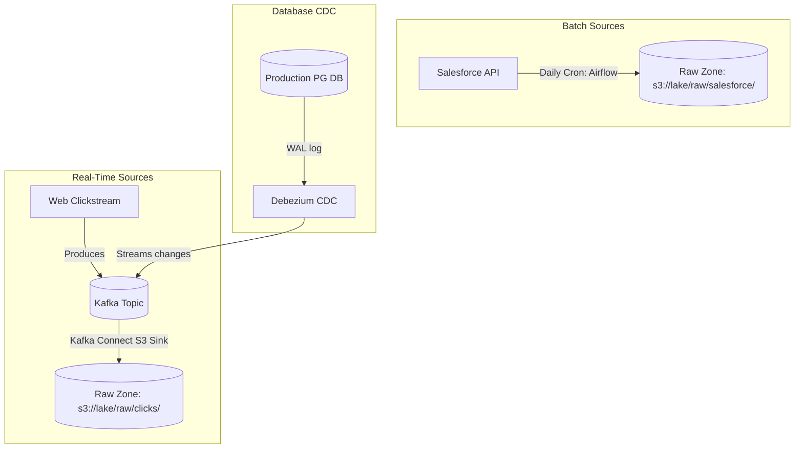

# Module 6.6: Data Lake Ingestion

Welcome to **Data Lake Ingestion**. Getting data into the lake reliably, securely, and in the correct format is the first step of any pipeline. In this module, you will learn the different pipelines used to land data in the Raw Zone: batch scheduled runs, real-time streaming, and Change Data Capture (CDC) logs.

---

## 1. Detailed Theory

### Batch Pipelines
Batch ingestion runs on scheduled intervals (e.g., hourly, daily) to move bounded data blocks:
- **Airflow**: Acts as the orchestrator, triggering tasks that extract data from SaaS APIs, FTP servers, or databases and save them directly to S3.
- **Spark Jobs**: Run scheduled jobs to perform bulk reads from legacy databases and write them as raw JSON/Parquet dumps.

### Streaming Pipelines
Streaming ingestion processes unbounded events continuously as they occur:
- **Apache Kafka**: The central messaging queue.
- **Kafka Connect**: Connectors (like the S3 Sink Connector) pull messages from Kafka topics and write them in parallel to GCS/S3 directories.
- **AWS Kinesis Firehose**: A managed AWS service that consumes streams and automatically bundles them into S3 files based on time (e.g., every 60 seconds) or size (e.g., every 5MB) thresholds.

### CDC Pipelines
- **Debezium**: Integrates with relational database transaction logs, streaming every row change in real-time to a Kafka topic. Kafka Connect sinks then write these change events to the Data Lake Raw Zone, preserving database historical updates.

---

## 2. Architecture Diagram: Ingestion Pathways to Raw Zone



---

## 3. Production Use Cases

1. **Real-Time Data Lake Ingestion**: Clickstream events from a mobile application stream into Kafka. A Kafka Connect S3 Sink connector runs on Kubernetes, consuming the events and writing them to partitioned S3 paths every 5 minutes.
2. **SaaS API Batch Ingestion**: An Airflow DAG triggers a hourly python script to extract support ticket logs from the Zendesk API and write them as raw JSON files to the Data Lake landing area.

---

## 4. Real Company Examples

- **Uber**: Uses Kafka Connect and custom CDC ingest engines to capture every update to their main driver-passenger databases, streaming changes to a centralized Hudi-based lakehouse.

---

## 5. Coding Examples

### Configuring an AWS Kinesis Firehose Ingestion to S3 (Terraform IaC Concept)

Production pipelines are defined as infrastructure as code. This configuration creates a serverless streaming ingestion pipeline from a Kinesis Stream to S3.

```hcl
# Terraform configuration for Kinesis Firehose S3 Ingestion
resource "aws_kinesis_firehose_delivery_stream" "s3_ingest_stream" {
  name        = "clickstream-ingest-to-s3"
  destination = "extended_s3"

  extended_s3_configuration {
    role_arn   = aws_iam_role.firehose_role.arn
    bucket_arn = aws_s3_bucket.raw_datalake_bucket.arn
    prefix     = "raw/clicks/year=!{timestamp:YYYY}/month=!{timestamp:MM}/day=!{timestamp:dd}/"
    error_output_prefix = "errors/clicks/year=!{timestamp:YYYY}/month=!{timestamp:MM}/day=!{timestamp:dd}/!{firehose:error-output-type}/"

    # Ingestion Buffer thresholds
    buffer_size = 5 # MBs
    buffer_interval = 300 # Seconds (5 minutes)

    compression_format = "GZIP"
  }
}
```

---

## 6. Hands-on Labs

**Lab: REST API Connector Setup**
**Objective**: Deploy a connector via curl.
**Instructions**:
Write the `curl` command to register a new Kafka Connect S3 Sink connector by POSTing a JSON configuration payload to a Kafka Connect cluster running locally on port 8083. (Hint: Endpoint is `/connectors`).

---

## 7. Assignments

**Assignment: Small File Problem Mitigation**
A streaming ingestion pipeline writes a new file to the Raw Zone on S3 every 2 seconds. Over a day, this creates 43,200 tiny files.
Write a paragraph explaining the impact of the "Small File Problem" on downstream Spark read performance, and propose a batch compaction strategy to mitigate this issue.

---

## 8. Interview Questions

1. **What is the difference between batch and streaming ingestion?**
   *Answer Hint: Batch ingestion transfers bounded blocks of data at scheduled intervals (e.g., daily dumps). Streaming ingestion moves unbounded events continuously in real-time (e.g., Kafka Connect S3 sink).*
2. **Why do we compress streaming ingestion logs (e.g., GZIP/Snappy) at the landing stage?**
   *Answer Hint: Compression significantly reduces the network transit cost, decreases bucket storage costs, and reduces the number of bytes read by downstream query engines like Athena.*

---

## 9. Best Practices (FDE Standards)

- **Use Idempotent Sinks**: Ensure your ingestion sinks support idempotency (like Delta Lake MERGE or unique file paths based on offsets) to prevent duplicate records if ingestion tasks retry.
- **Isolate Landing Folders**: Never mix schemas in the same raw directory. Store different sources in distinct, isolated prefix paths (e.g., `s3://lake/raw/source_a/`, `s3://lake/raw/source_b/`).

---

## 10. Common Mistakes

- **Typos in partition prefixes**: Setting partition strings in Firehose config that contain typos (e.g., `yera=` instead of `year=`), breaking partition pruning calculations.
- **Ignoring rate limits on source APIs**: Writing scheduled Airflow batch extract jobs that do not respect source REST API rate limits, resulting in job failures due to HTTP 429 errors.
