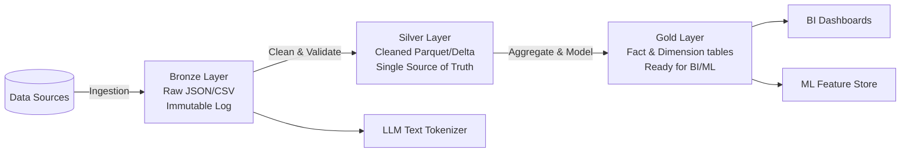

# Module 6.8: Medallion Architecture

Welcome to **Medallion Architecture**. The Medallion Architecture is a data design pattern that logically organizes data inside a Lakehouse into three progressive layers: **Bronze**, **Silver**, and **Gold**. This structure ensures that data quality is enforced incrementally, providing clean, validated, and optimized tables for business intelligence and machine learning pipelines.

---

## 1. Detailed Theory

### The Three Layers
1. **Bronze Layer (Raw Data)**:
   - The landing zone for all raw ingested data.
   - Storage is immutable; files are saved exactly as they arrived from source systems (e.g., raw JSON web logs, database CDC streams).
   - History is retained indefinitely, enabling complete reprocessing if downstream logic changes.
2. **Silver Layer (Cleaned & Conformed Data)**:
   - Data is cleaned, filtered, conformed, and structured.
   - Operations include: parsing JSON strings into structured columns, standardizing date formats, renaming columns to follow enterprise standards, and running deduplication routines.
   - Represents the "Single Source of Truth" for corporate data.
3. **Gold Layer (Curated Business Data)**:
   - Data is structured into aggregates and business-level metrics.
   - Typically modeled as Star Schemas (Fact and Dimension tables).
   - Optimized for fast read queries, powering dashboards, financial reports, and ML feature aggregations.

---

## 2. Architecture Diagram: Medallion Progression Pipeline



---

## 3. Production Use Cases

1. **Enterprise Analytics Platform**: Landing e-commerce orders as raw JSON in the Bronze layer. A Spark pipeline cleans the rows, enforces types, and writes conformed accounts to the Silver layer. Downstream, a dbt script runs aggregations to calculate daily store sales and updates the Gold layer tables.
2. **LLM RAG Feed**: Processing raw document PDFs (Bronze), extracting clean text segments (Silver), and formatting them as tokenized chunk embeddings in Pinecone (Gold).

---

## 4. Real Company Examples

- **Databricks**: Promotes the Medallion Architecture as the default design pattern for all data platform architectures deployed on their Delta Lakehouse platform.

---

## 5. Coding Examples

### Implementing the Medallion Pipeline in PySpark

```python
from pyspark.sql import SparkSession
import pyspark.sql.functions as F

spark = SparkSession.builder.appName("MedallionPipeline").getOrCreate()

# ----------------------------------------------------
# 1. BRONZE -> SILVER: Clean and Conform
# ----------------------------------------------------
bronze_df = spark.read.format("delta").load("s3://lake/bronze/transactions/")

# Clean: Cast types, drop nulls, and standardise dates
silver_df = bronze_df \
    .filter(F.col("transaction_id").isNotNull()) \
    .withColumn("amount", F.col("amount").cast("double")) \
    .withColumn("timestamp", F.to_timestamp(F.col("raw_time"))) \
    .dropDuplicates(["transaction_id"])

# Save to Silver Layer
silver_df.write.format("delta").mode("overwrite").save("s3://lake/silver/transactions/")

# ----------------------------------------------------
# 2. SILVER -> GOLD: Aggregate and Model
# ----------------------------------------------------
silver_transactions = spark.read.format("delta").load("s3://lake/silver/transactions/")

# Aggregate: Calculate total spend per user
gold_user_spend = silver_transactions \
    .groupBy("user_id") \
    .agg(
        F.sum("amount").alias("total_spend"),
        F.count("transaction_id").alias("transaction_count")
    )

# Save to Gold Layer
gold_user_spend.write.format("delta").mode("overwrite").save("s3://lake/gold/user_spend_metrics/")
```

---

## 6. Hands-on Labs

**Lab: Pipeline Failure Troubleshooting**
**Objective**: Identify data pipeline boundaries.
**Instructions**:
A column type change in a third-party source database causes your Silver layer write to crash.
Describe why having an **immutable Bronze layer** prevents you from losing data and explain the steps to recover and reprocess the dataset after correcting the Silver transformation code.

---

## 7. Assignments

**Assignment: Medallion Architecture Schema Evolution**
Design the schema evolution rules for each layer of the Medallion Architecture.
Explain why:
1. Bronze should have no schema validation.
2. Silver should enforce strict schema checks.
3. Gold should be optimized for read compatibility (Schema Evolution enabled).

---

## 8. Interview Questions

1. **What is the Medallion Architecture?**
   *Answer Hint: A data organization pattern that structures a Lakehouse into three layers: Bronze (raw, immutable), Silver (cleaned, conformed, single source of truth), and Gold (aggregated, business-level metrics ready for BI).*
2. **Why keep Bronze data if it is dirty and hard to query?**
   *Answer Hint: Bronze data serves as the historical source of truth. If a bug is discovered in your Silver transformation logic 3 months later, or if you need to calculate a new business metric, you can rerun the pipeline from the raw Bronze files to reconstruct the history.*

---

## 9. Best Practices (FDE Standards)

- **Bronze is Immutable**: Never perform delete or update operations on Bronze data (except for regulatory compliance like GDPR).
- **Silver is the Source of Truth**: All enterprise applications, dashboards, and ML models should read from the Silver layer if they require raw, atomic transactional records.

---

## 10. Common Mistakes

- **Skipping the Silver Layer**: Joining raw Bronze tables directly to generate Gold aggregates, resulting in dirty data polluting business dashboards.
- **Over-aggregating Silver**: Aggregating data too early in the Silver layer, making it impossible for downstream data scientists to access fine-grained atomic records.
