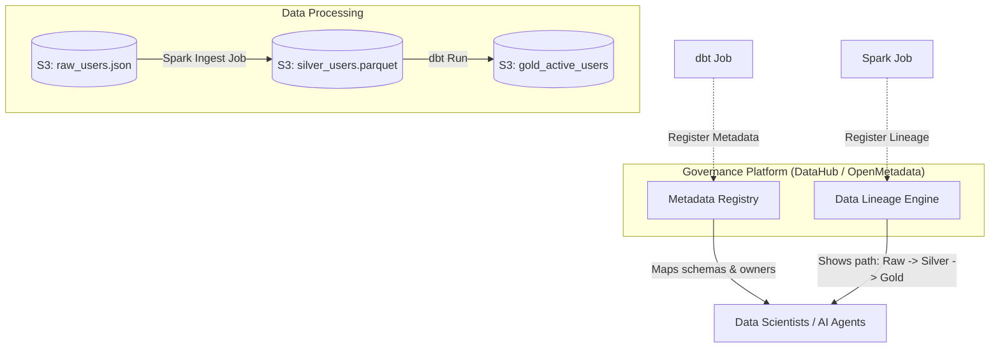

# Module 6.9: Data Governance

Welcome to **Data Governance**. In massive enterprise systems, managing data quality, understanding data origin (Lineage), cataloging schemas, and enforcing ownership is critical. Without proper governance, a Data Lake quickly degenerates into an unorganized, secure-less "Data Swamp." In this module, you will learn the pillars of governance and how to deploy cataloging tools.

---

## 1. Detailed Theory

### Core Governance Pillars
1. **Data Catalog**: A centralized metadata search engine. It registers what tables exist, what columns they contain, who owns the dataset, and what classification tags apply (e.g., PII).
2. **Metadata Management**: Storing and versioning schemas across systems.
3. **Data Lineage**: Tracking the complete lifecycle of a data point from its source system, through all Spark/Airflow transformations, to the final dashboard metric. Essential for debugging and compliance.
4. **Data Quality Frameworks**: Automated verification checks ensuring data conforms to business rules.
5. **Data Classification**: Categorizing data based on sensitivity (e.g., Public, Internal, Confidential, PII).

### Enterprise Governance Tools
- **Apache Atlas**: An open-source framework designed to provide data governance and metadata capabilities for Hadoop and cloud environments, capturing lineage automatically.
- **DataHub / OpenMetadata**: Modern, user-friendly data catalogs featuring automated ingestion from S3, dbt, Spark, and Snowflake, offering graphical representations of data lineage.

---

## 2. Architecture Diagram: Metadata Cataloging and Lineage Flow



---

## 3. Production Use Cases

1. **Enterprise Governance Platform**: Deploying a central DataHub instance. Airflow and Spark jobs are configured to report metadata and lineage to DataHub automatically at the end of each run, allowing data scientists to search for features and trace column origins visually.
2. **PII Isolation Audit**: Auditing the lineage of an LLM training dataset. You trace the lineage chart back to the Bronze layer to verify that no PII-tagged columns (e.g., `phone_number`) were included in the files fed to the tokenizer.

---

## 4. Real Company Examples

- **LinkedIn**: Created and open-sourced **DataHub** to manage their massive internal data catalogs, helping thousands of employees discover datasets and understand data lineage.
- **Airbnb**: Developed **Amundsen** (another popular catalog tool) to serve as a search engine for their data assets, helping team members find tables and columns.

---

## 5. Coding Examples

### Logging Data Lineage and Metadata to DataHub (Python)

This script shows how an ingestion task programmatically registers metadata and lineage in a DataHub catalog.

```python
from datahub.emitter.mcp import MetadataChangeProposalWrapper
from datahub.emitter.rest_emitter import DatahubRestEmitter
from datahub.metadata.schema_classes import DatasetPropertiesClass

# 1. Initialize DataHub REST Emitter
emitter = DatahubRestEmitter("http://localhost:8080")

# 2. Define Dataset Properties (Metadata)
properties = DatasetPropertiesClass(
    description="Silver conformed table containing customer profile records.",
    customProperties={
        "owner": "fde_data_team",
        "pii_content": "masked",
        "update_frequency": "hourly"
    }
)

# 3. Build Metadata Change Proposal (MCP)
mcp = MetadataChangeProposalWrapper(
    entityType="dataset",
    changeType="UPSERT",
    entityUrn="urn:li:dataset:(urn:li:dataPlatform:s3,enterprise-datalake.processed.users,PROD)",
    aspectName="datasetProperties",
    aspect=properties
)

# 4. Emit Metadata to Catalog
try:
    emitter.emit_mcp(mcp)
    print("Successfully registered metadata in DataHub!")
except Exception as e:
    print(f"Failed to emit metadata: {e}")
```

---

## 6. Hands-on Labs

**Lab: Tracing Lineage**
**Objective**: Build a conceptual lineage chart.
**Instructions**:
Write down the step-by-step data lineage path for a metric called `monthly_churn_rate` displayed on a Tableau dashboard. Trace it back from:
1. Tableau dashboard.
2. Gold aggregated table.
3. Silver customer profiles.
4. Bronze relational DB dump.

---

## 7. Assignments

**Assignment: Governance Tool Evaluation**
Write a comparison analysis evaluating **Apache Atlas** and **DataHub**. Which tool is better suited for a modern cloud-native Lakehouse platform running on Kubernetes, Spark, and dbt, and why?

---

## 8. Interview Questions

1. **What is Data Lineage and why is it important?**
   *Answer Hint: Data Lineage is the visual tracking of data's lifecycle from its origin systems, through all intermediate transformation steps, to its final destination. It is critical for debugging data errors, auditing compliance (e.g., verifying no PII was leaked), and managing schema changes.*
2. **What is the difference between a Data Catalog and a Data Dictionary?**
   *Answer Hint: A Data Dictionary is a static definition of column names and types for a specific database. A Data Catalog is an enterprise-wide metadata platform that indexes all data assets across multiple systems, providing search capability, ownership tracking, lineage charts, and quality metrics.*

---

## 9. Best Practices (FDE Standards)

- **Automate Metadata Collection**: Do not rely on developers manually updating catalogs. Configure your CI/CD pipelines and processing engines (Spark/dbt) to report schemas and lineage automatically.
- **Tag PII on Ingestion**: Tag any columns containing sensitive information (PII) at the Silver layer boundary to ensure downstream compliance policies are enforced automatically.

---

## 10. Common Mistakes

- **Letting Metadata Stale**: Creating static documentation pages for schemas on Confluence that are never updated when database columns change, creating confusion for the data team.
- **Ignoring Data Ownership**: Registering tables in the catalog without assigning an owner, making it impossible to resolve pipeline failures or schema changes.
