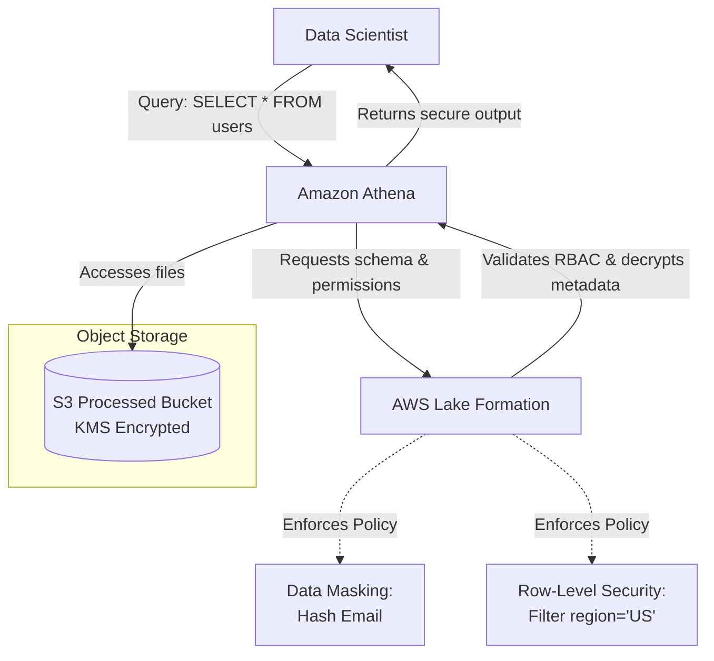

# Module 6.10: Security

Welcome to **Data Lake Security**. Storing enterprise data in a centralized cloud bucket creates high security risks. As an FDE, you must secure this data against unauthorized access, encrypt it in transit and at rest, and implement Row-Level Security (RLS) and Data Masking to protect PII.

---

## 1. Detailed Theory

### Identity & Access Management (IAM)
- **IAM Policies**: Define who can read/write to specific S3/GCS buckets.
- **RBAC (Role-Based Access Control)**: Assigning permissions based on organizational roles (e.g., Data Scientists can query Silver, Business Analysts can query Gold, Admin can access Raw).

### Encryption
- **Encryption at Rest**: Encrypting files written to disk. Done using managed keys (e.g., AWS KMS - Key Management Service).
- **Encryption in Transit**: Enforcing TLS (HTTPS) for all API calls to object storage.

### Fine-Grained Security Controls
- **Data Masking**: Dynamically replacing sensitive data (like SSNs or emails) with hashes or wildcard strings when accessed by unauthorized users.
- **Row-Level Security (RLS)**: Enforcing policies at the database/catalog level to restrict rows returned (e.g., a regional manager in Europe can only query rows where `region = 'EU'`).

---

## 2. Architecture Diagram: Secure Data Lake Access Pattern



---

## 3. Production Use Cases

1. **Secure Enterprise Data Lake**: A bank hosts transaction files on S3. They configure AWS Lake Formation to enforce RBAC: the Risk team has full access to columns, while the Marketing team receives records where the `account_number` column is masked with `XXXX-XXXX-XXXX` and transaction records are filtered to show only their assigned market regions.

---

## 4. Real Company Examples

- **Capital One**: Relies on strict KMS key rotation policies and AWS Lake Formation authorization rules to protect credit card records stored in S3.

---

## 5. Coding Examples

### Configuring Row-Level Security Policy in SQL (AWS Lake Formation)

This SQL rule is applied inside AWS Lake Formation or Spark catalog to enforce row-level filtering on a table.

```sql
-- RLS Policy: Restrict data access based on user region
CREATE ROW FILTER region_filter ON gold_sales
USING (
    -- The session variable 'user_region' must match the row's region column
    region = current_setting('app.user_region')
);
```

---

## 6. Hands-on Labs

**Lab: KMS Bucket Policy**
**Objective**: Build a bucket policy.
**Instructions**:
Write an S3 bucket policy (JSON) that denies any upload (`PutObject`) to a bucket if the request does not specify server-side encryption with AWS KMS (`aws:SecureTransport` and `s3:x-amz-server-side-encryption` keys).

---

## 7. Assignments

**Assignment: RBAC vs. ACLs**
Write a short memo comparing **Role-Based Access Control (RBAC)** and traditional **Object ACLs** in a multi-tenant Data Lake. Which method is easier to manage when scaling to thousands of tables and user groups?

---

## 8. Interview Questions

1. **What is the purpose of AWS Lake Formation?**
   *Answer Hint: AWS Lake Formation is a managed service that sits on top of the Glue Data Catalog. It provides centralized, fine-grained access control (table, column, and row-level permissions) for data stored in S3, making it easier to secure Data Lakes.*
2. **What is the difference between client-side and server-side encryption?**
   *Answer Hint: Client-side encryption encrypts the data on the client application side before sending it over the network to the cloud. Server-side encryption receives the plaintext data and encrypts it at the storage host boundary (e.g., S3 using KMS keys).*

---

## 9. Best Practices (FDE Standards)

- **Use KMS with Key Rotation**: Never use standard S3-managed keys (`SSE-S3`) for sensitive data. Always configure customer-managed keys (`SSE-KMS`) with automated yearly key rotation.
- **Enforce TLS 1.2+**: Configure S3 bucket policies to explicitly deny connections that use insecure HTTP protocols or old TLS versions.

---

## 10. Common Mistakes

- **Leaving Buckets Public**: Accidentally configuring S3 bucket permissions to allow `AllUsers` read access, exposing sensitive corporate data to the public internet.
- **Storing Decryption Keys in Code**: Writing AWS access keys and decryption tokens inside PySpark scripts. Use IAM roles and Secrets Manager instead.
