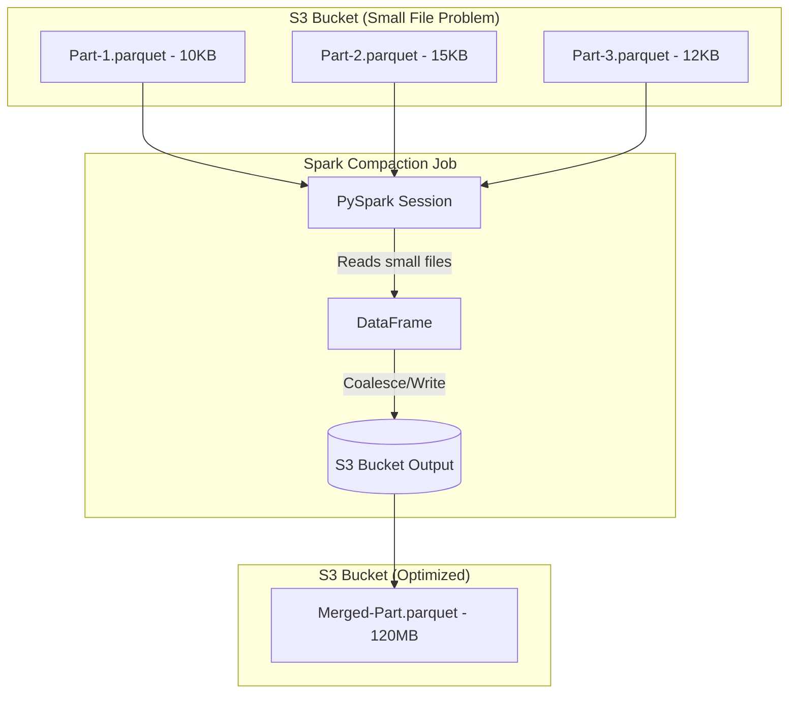

# Module 6.11: Production Data Lakes

Welcome to **Production Data Lakes**. Moving from basic bucket storage to an enterprise-scale data platform requires designing for scalability, query optimization, disaster recovery, and cluster metrics monitoring.

---

## 1. Detailed Theory

### Scalability and File Layout
To keep query times sub-second on massive data lakes, you must optimize file layout:
- **Partitioning**: Grouping files in folders by partition keys.
- **Bucketing**: Pre-shuffling data into a set number of buckets (files) based on a hash of a column, preventing network shuffles during joins.
- **File Compaction**: Consistently running background tasks to merge thousands of small 10KB streaming files into optimal ~500MB Parquet files (Mitigating the Small File Problem).

### Reliability & Disaster Recovery
- **Replication**: Configuring cross-region object replication (e.g., S3 Cross-Region Replication) to sync files in real-time to a backup region.
- **Metadata Backups**: Backing up the central Glue Data Catalog schemas periodically.

### Observability
- **Prometheus & Grafana**: Exporting metrics (e.g., S3 bytes scanned, partition counts, Athena execution times) to track query performance and costs in real-time.

---

## 2. Architecture Diagram: File Compaction Process



---

## 3. Production Use Cases

1. **Multi-Tenant Data Lake Platform**: A shared cloud data lake hosts data for 50 corporate clients. The files are partitioned by `tenant_id` and `date`. A daily Spark job compacts the files, registers schemas, and updates metadata indexes to ensure fast query times for dashboard users.

---

## 4. Real Company Examples

- **Netflix**: Monitors their S3 Data Lake query patterns using custom dashboards, detecting when users run queries that scan excessive amounts of raw data and alerting them to partition their filters.

---

## 5. Coding Examples

### PySpark Batch File Compaction Script

```python
from pyspark.sql import SparkSession

spark = SparkSession.builder.appName("DataLakeCompaction").getOrCreate()

# 1. Read daily partition containing thousands of small streaming files
daily_path = "s3://enterprise-datalake/processed/clicks/year=2023/month=10/day=15/"
df = spark.read.parquet(daily_path)

# 2. Coalesce partitions to merge small files into a target size (e.g., 2 files)
# Write output to a temporary directory
temp_path = "s3://enterprise-datalake/processed/clicks_temp/year=2023/month=10/day=15/"
df.coalesce(2).write.parquet(temp_path)

# 3. Swap temp path to production (requires S3 metadata updates/renames)
# In production, this can be automated using file system renames/swaps
print("Compaction complete. Temp files written.")
```

---

## 6. Hands-on Labs

**Lab: Bucketing vs Partitioning**
**Objective**: Differentiate performance techniques.
**Instructions**:
Write a short explanation of when to choose **Bucketing** over **Partitioning** for a column containing a high-cardinality identifier (like `user_id` with 10 million unique values). (Hint: Think about file count constraints).

---

## 7. Assignments

**Assignment: Disaster Recovery Strategy**
Write a design proposal for a cross-region disaster recovery strategy for an S3-based Data Lake. Detail how you would replicate the raw files, sync the Glue Data Catalog metadata schemas, and switch consumers to the backup region if the primary region experiences a complete cloud outage.

---

## 8. Interview Questions

1. **What is the "Small File Problem" in Data Lakes?**
   *Answer Hint: Streaming ingestion systems write data frequently, creating thousands of tiny files (1KB - 100KB) in S3. When query engines read the directory, the overhead of opening and closing thousands of connections to S3 degrades query performance. Solve it by running background compaction jobs to merge files.*
2. **How does Bucketing optimize Join operations in Spark?**
   *Answer Hint: Bucketing pre-shuffles and groups data into a set number of buckets based on the join key. When Spark joins two bucketed tables on that key, it knows matching records are in the same bucket numbers, allowing it to run local joins without shuffling data across the network.*

---

## 9. Best Practices (FDE Standards)

- **Compact Streaming Files Regularly**: Run background batch compaction jobs daily to keep file sizes in the Processed Zone around 128MB - 512MB.
- **Monitor bytes scanned**: Configure billing alerts on Amazon Athena and BigQuery to detect and block unoptimized queries that scan terabytes of data.

---

## 10. Common Mistakes

- **Over-partitioning**: Partitioning a table by `customer_id` when there are 1 million customers, creating 1 million folders in S3 and crashing the metadata catalog.
- **Ignoring Directory Renames in S3**: Assuming S3 directory renames are fast. S3 is a flat namespace; renaming a folder requires copying and deleting every file key-by-key, causing performance lag on large directories.
