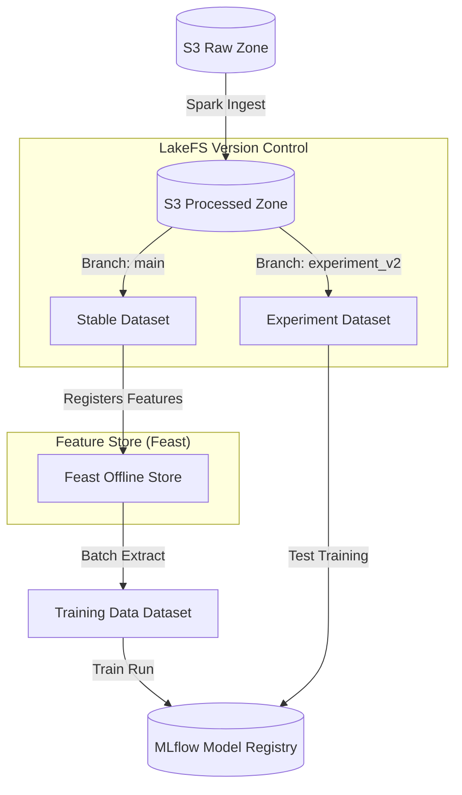

# Module 6.12: Data Lakes for AI/ML

Welcome to **Data Lakes for AI/ML**. Building machine learning models requires more than standard SQL. Data scientists need structured training datasets, versioned feature stores, experiment tracking, and complete data lineage audits to prevent training-serving skew. In this module, you will learn how to connect your Data Lake with ML tools like **MLflow**, **Feast**, and **LakeFS**.

---

## 1. Detailed Theory

### Feature Store Integration
A Feature Store coordinates machine learning feature layouts:
- **Feast**: An open-source feature store. It uses your Data Lake (Parquet/Delta) as the Offline Store to generate historical training datasets and syncs the latest feature values to an Online Store (Redis) for low-latency live predictions.

### Data Versioning and git-like operations
- **LakeFS**: An open-source tool that brings Git-like version control to object storage data lakes. It allows you to branch, commit, merge, and rollback datasets (e.g., `lakefs://my-bucket/main` vs. `lakefs://my-bucket/dev-experiment`). This allows data scientists to lock training datasets to a specific commit version, guaranteeing reproducibility.

---

## 2. Architecture Diagram: MLOps Data Lake Lifecycle



---

## 3. Production Use Cases

1. **Enterprise MLOps Data Platform**: A data science team wants to test a new recommendation model. They create a Git-like branch of the S3 Silver layer using LakeFS (`lakefs branch experiment_v2`), run data transformations, train the model, and log metrics in MLflow. If the model fails evaluation, they simply delete the branch without affecting the stable production S3 datasets.

---

## 4. Real Company Examples

- **Stitch Fix**: Integrates feature store frameworks on top of their cloud data lakes to coordinate how hundreds of client recommendation models fetch user sizing and preference features.

---

## 5. Coding Examples

### Generating Training Datasets with Feast and MLflow

```python
from feast import FeatureStore
import mlflow
import pandas as pd

# 1. Initialize Feast Feature Store (reads configurations from feature_store.yaml)
store = FeatureStore(repo_path=".")

# 2. Define entities and timestamps to extract historical features
entity_df = pd.DataFrame(
    {
        "customer_id": ["user_1", "user_2", "user_3"],
        "event_timestamp": [
            "2023-10-15 10:00:00",
            "2023-10-15 11:00:00",
            "2023-10-15 12:00:00"
        ]
    }
)
entity_df["event_timestamp"] = pd.to_datetime(entity_df["event_timestamp"])

# 3. Pull historical features from the Data Lake (Feast Offline Store)
# This executes point-in-time correct joins to prevent data leakage.
training_data = store.get_historical_features(
    entity_df=entity_df,
    features=[
        "customer_features:total_spend_30d",
        "customer_features:transaction_count_30d"
    ]
).to_df()

# 4. Train Model and track with MLflow
mlflow.set_experiment("Customer Churn Prediction")
with mlflow.start_run() as run:
    mlflow.log_param("dataset_version", "v1.2")
    mlflow.log_metric("row_count", len(training_data))
    
    # Simulating training process
    accuracy = 0.92
    mlflow.log_metric("accuracy", accuracy)
    
    print(f"Model logged with run ID: {run.info.run_id}")
```

---

## 6. Hands-on Labs

**Lab: Dataset Versioning**
**Objective**: Build a LakeFS data branch.
**Instructions**:
Write the CLI commands using `lakectl` (LakeFS CLI) to:
1. Create a new branch named `ml-retrain` from the `main` branch of a repository `my-datalake`.
2. Upload a new training file `features.parquet` to the branch.
3. Commit the changes with a message "Uploaded training set".

---

## 7. Assignments

**Assignment: Point-in-Time Joins**
Explain the importance of **Point-in-Time Correct Joins** (AS-OF Joins) in Machine Learning data engineering. How does a Feature Store like Feast utilize event timestamps to prevent **Data Leakage** during training data generation?

---

## 8. Interview Questions

1. **What is LakeFS and what problem does it solve in a Data Lake?**
   *Answer Hint: LakeFS is a version control system for object storage. It brings Git-like capabilities (branching, committing, merging, reverting) to S3/GCS. This allows data scientists to create isolated workspace branches of petabyte-scale datasets and lock training runs to specific commit versions for reproducibility.*
2. **What is the difference between an Online and Offline Feature Store?**
   *Answer Hint: The offline store resides in the Data Lake (Parquet/Delta) and is optimized for bulk historical feature extraction used to train models. The online store resides in a low-latency database (Redis/DynamoDB) and is updated in real-time to serve the latest feature values to live model APIs.*

---

## 9. Best Practices (FDE Standards)

- **Lock Training Datasets**: Always record the specific LakeFS commit ID or Delta table version in your model training parameters to ensure historical runs can be replicated.
- **Enforce Data Lineage**: Capture which feature columns were derived from which source raw fields to facilitate regulatory audits.

---

## 10. Common Mistakes

- **Data Leakage in Joins**: Joining historical transaction values to user profiles without timestamp constraints, allowing the model to train on "future" data.
- **Ignoring Online/Offline Syncs**: Writing features to the offline store but forgetting to trigger the sync/materialization task to update the online store, resulting in stale predictions.
