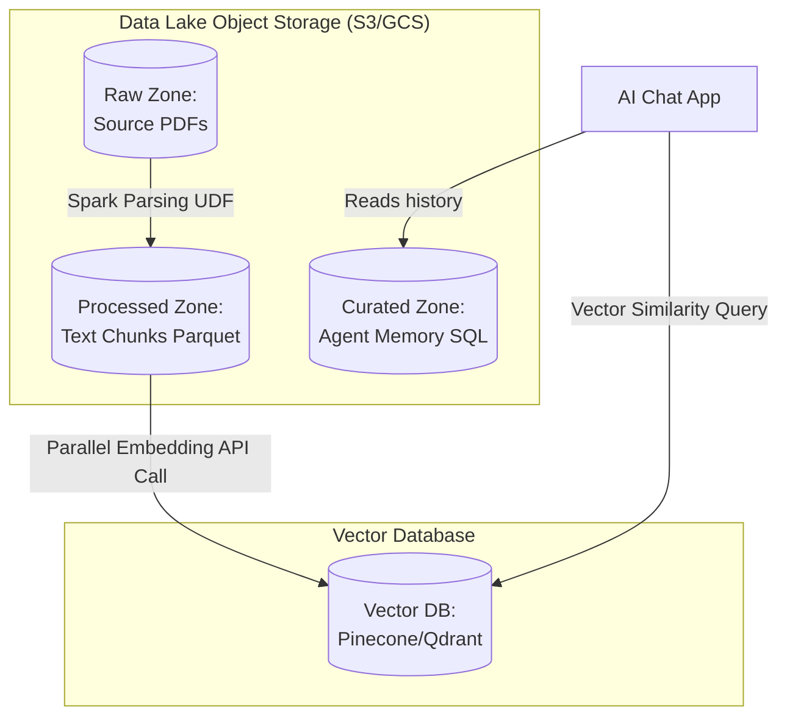

# Module 6.13: Data Lakes for LLMOps

Welcome to **Data Lakes for LLMOps**. While standard data engineering manages tables, LLMOps manages massive corpuses of unstructured text, PDFs, audio transcripts, chunk configurations, high-dimensional vector embeddings, and agent conversation logs. In this module, you will learn how to design storage patterns for Generative AI pipelines and structure document metadata.

---

## 1. Detailed Theory

### Unstructured Data Storage in Data Lakes
Generative AI pipelines begin with files stored in cheap object storage (Raw Zone):
- **Document Storage**: Storing raw corporate PDFs, HTML pages, and transcripts.
- **Chunk Storage**: Saving parsed text segments alongside their parent file IDs.

### Metadata Storage Patterns
To prevent LLM hallucination and enforce security access controls during RAG retrieval, you must model metadata at every stage:
1. **Document Metadata**: Author, creation date, source URL, version, and security tags (RBAC).
2. **Chunk Metadata**: Page numbers, character boundaries, chunk index, and overlapping context pointers.
3. **Embedding Metadata**: The mathematical vector ID linked back to the text chunk database identifier.
4. **Agent Memory Data**: Conversational logs and state variables (short-term and long-term memory).

---

## 2. Architecture Diagram: LLMOps Data Lake Ingestion & Sync



---

## 3. Production Use Cases

1. **Enterprise RAG Platform**: Ingesting thousands of multi-page technical manuals in S3. A Spark job extracts the PDF text, splits it into conformed chunks, generates embeddings using the OpenAI API, and upserts them to Qdrant. The metadata fields (`doc_id`, `page_number`, `sec_group`) are attached to both the Parquet tables and the Qdrant vectors to enable role-based document access.

---

## 4. Real Company Examples

- **Scale AI**: Manages unstructured datasets (text, image arrays, sensor logs) in cloud data lakes, using metadata indexing to link human annotations and model evaluations back to source files.

---

## 5. Coding Examples

### PySpark Document Chunking and Metadata Extraction Pipeline

```python
from pyspark.sql import SparkSession
import pyspark.sql.functions as F
from pyspark.sql.types import ArrayType, StructType, StructField, StringType, IntegerType

spark = SparkSession.builder.appName("LLMOpsIngestionPipeline").getOrCreate()

# 1. Read binary files (PDFs) from raw data lake directory
raw_docs = spark.read.format("binaryFile").load("s3://enterprise-datalake/raw/manuals/*.pdf")

# 2. Extract raw text from binary (using fitz/PyMuPDF inside UDF)
def parse_pdf(content):
    import fitz
    doc = fitz.open(stream=content, filetype="pdf")
    pages_text = []
    for i, page in enumerate(doc):
        pages_text.append((i + 1, page.get_text()))
    return pages_text # Returns list of tuple: (page_number, text)

# Define return schema for PySpark UDF
page_schema = ArrayType(StructType([
    StructField("page_num", IntegerType(), False),
    StructField("text", StringType(), False)
]))

parse_pdf_udf = F.udf(parse_pdf, page_schema)
parsed_df = raw_docs.withColumn("pages", parse_pdf_udf(F.col("content")))

# 3. Explode pages array into rows
exploded_df = parsed_df.select(
    F.col("path").alias("source_doc"),
    F.explode(F.col("pages")).alias("page_data")
).select(
    "source_doc",
    F.col("page_data.page_num").alias("page_number"),
    F.col("page_data.text").alias("page_text")
)

# 4. Write processed text chunks with metadata to Processed Zone (Silver Layer)
exploded_df.write \
    .format("parquet") \
    .mode("overwrite") \
    .save("s3://enterprise-datalake/processed/manual_chunks/")
```

---

## 6. Hands-on Labs

**Lab: Metadata Schema Design**
**Objective**: Model vector search payloads.
**Instructions**:
Write the JSON structure for a vector metadata payload containing:
- Parent document S3 path.
- Chunk text segment.
- Department ownership.
- Data classification tag (e.g., PII status).

---

## 7. Assignments

**Assignment: RAG Index Synchronization**
A client updates a PDF file in their S3 Raw Zone.
Write a paragraph explaining how you would design an event-driven synchronization pipeline using S3 event notifications, Kafka, and Spark to identify which chunks changed, update the embeddings in the Vector DB, and remove outdated vectors.

---

## 8. Interview Questions

1. **Why do we store the raw text chunks in a Parquet Data Lake if the vectors are already in Pinecone?**
   *Answer Hint: Pinecone/Vector DBs are expensive, memory-based indexes designed for similarity search, not heavy data storage. Storing raw text in a Parquet data lake allows us to maintain a low-cost backup, run historical NLP analysis, and audit schemas without paying for vector memory.*
2. **What is chunk overlap and why is it modeled in metadata?**
   *Answer Hint: Chunk overlap is the duplicate text shared between adjacent chunks (e.g., 50 characters). It prevents loss of semantic context when splitting documents at arbitrary character counts, ensuring the LLM receives complete sentences during retrieval.*

---

## 9. Best Practices (FDE Standards)

- **Always Store UUIDs**: Assign a unique UUID to every document and chunk, and map these identifiers across both the Parquet database and the Vector database to ensure sync consistency.
- **Implement Pre-Filtering**: Include tenant IDs and security permissions in vector metadata to allow the retrieval engine to execute metadata pre-filtering, preventing unauthorized access.

---

## 10. Common Mistakes

- **Storing Large Documents in Vector Metadata**: Uploading full 10MB text files inside the payload field of a Vector Database, exhausting index memory and slowing down search query times.
- **Ignoring Model Dimension Changes**: Upgrading the embedding model version (e.g., from a 384-dimension local model to a 1536-dimension API model) without recreating the vector collection, causing insert failures.
