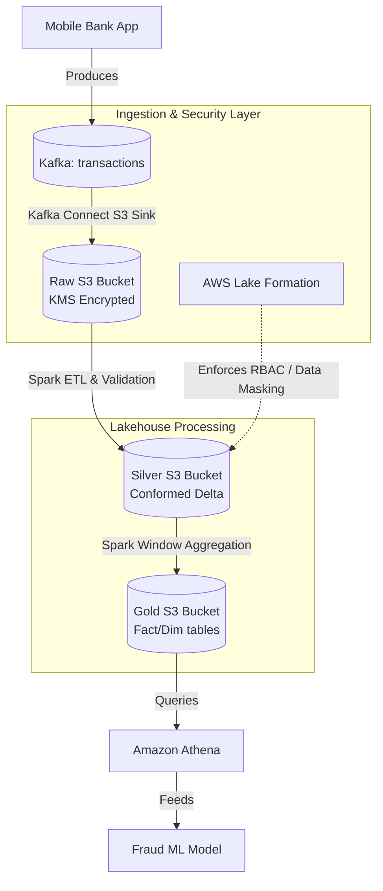

# Module 6.14: Enterprise Architectures

Welcome to the final module of the Data Lakes curriculum: **Enterprise Architectures**. As a Forward Deployed Engineer, you will design the storage layout, security access policies, and data processing stages for massive corporate data lakes serving different industries. In this module, you will learn how to design architectures for Customer 360, Banking, Insurance, and Retail platforms.

---

## 1. Detailed Theory

### Customer 360 Platform
A unified data lake architecture that aggregates all customer contact points (Stripe billing, Segment clickstream, Zendesk tickets) to build a canonical view of each customer.
- **Identity Resolution**: Matching records from different systems using deterministic or probabilistic rules to generate a single `global_customer_id` mapping.

### Banking Platform (Transactions & Fraud)
- Relies on strict security (KMS keys, AWS Lake Formation), ACID transactions (Delta Lake), and real-time streaming ingestion (Kafka) to ingest financial transactions securely, evaluate them for fraud in milliseconds, and land audit logs in S3.

### Insurance Platform (Claims & Underwriting)
- Aggregating historical claims and policy details in the Data Lake to calculate underwriting risk features for ML models.

### Retail Platform (Inventory & Forecasting)
- Ingesting sales data from online checkout and physical stores into a central lakehouse to calculate inventory levels and forecast demand.

---

## 2. Architecture Diagram: Enterprise Banking Data Lake Architecture



---

## 3. Production Use Cases

1. **Banking Transaction Auditing**: Financial records are streamed to a Delta Lake. You configure AWS Lake Formation to enforce RBAC, ensuring that auditors can access the full transaction logs, while customer support agents only see anonymized fields (data masking) and are restricted from viewing SSN columns.
2. **Retail Demand Forecasting**: A global supermarket chain schedules daily Spark jobs to aggregate sales records across 1,000 stores. The resulting features (e.g., store stock trends) are saved in S3 to train ML replenishment models.

---

## 4. Real Company Examples

- **Capital One**: Builds their entire data catalog and security model around S3 and AWS Lake Formation to isolate financial domains while enabling machine learning.
- **Walmart**: Orchestrates heavy retail demand forecasting and logistics pipelines by hosting massive Spark jobs on cloud data lakes.

---

## 5. Coding Examples

### Customer 360 Ingestion and Identity Resolution (PySpark)

```python
from pyspark.sql import SparkSession
import pyspark.sql.functions as F

spark = SparkSession.builder.appName("Customer360Identity").getOrCreate()

# 1. Load CRM and Billing records from S3
crm_df = spark.read.parquet("s3://enterprise-datalake/processed/crm_users/")
billing_df = spark.read.parquet("s3://enterprise-datalake/processed/billing_users/")

# Standardize values for matching
clean_crm = crm_df.select(
    F.col("user_id").alias("crm_id"),
    F.lower(F.trim(F.col("email"))).alias("crm_email"),
    F.lower(F.trim(F.col("name"))).alias("crm_name")
)

clean_billing = billing_df.select(
    F.col("id").alias("billing_id"),
    F.lower(F.trim(F.col("email"))).alias("billing_email"),
    F.lower(F.trim(F.col("name"))).alias("billing_name")
)

# 2. Rule: Exact email join to resolve identity
resolved_identities = clean_crm.join(
    clean_billing,
    clean_crm.crm_email == clean_billing.billing_email,
    how="inner"
).select(
    "crm_id",
    "billing_id",
    F.expr("uuid()").alias("global_customer_id")
)

# 3. Write identity mapping to Curated Zone (Gold Layer)
resolved_identities.write \
    .format("delta") \
    .mode("overwrite") \
    .save("s3://enterprise-datalake/curated/customer_identity_registry/")
```

---

## 6. Hands-on Labs

**Lab: Identity Resolution Mapping**
**Objective**: Build a mapping view.
**Instructions**:
Given the `customer_identity_registry` table generated in the coding example above, write the SQL query to resolve a client's transaction billing record to their CRM account.

---

## 7. Assignments

**Assignment: Banking Compliance Design**
Design the architecture and security layout for a banking data lake.
Detail:
1. S3 bucket encryption configurations.
2. IAM roles and access control mechanisms (Lake Formation).
3. Data masking policies for customer personally identifiable information (PII).
Explain how the design meets regulatory auditing requirements (e.g., SOC2).

---

## 8. Interview Questions

1. **What is Identity Resolution in a Customer 360 platform?**
   *Answer Hint: The process of matching and linking customer records from different systems (e.g., CRM, billing, web logs) into a single, canonical profile representing a unique individual, using deterministic rules or probabilistic matching.*
2. **Why is a Lakehouse table format (like Delta or Iceberg) preferred for Customer 360 registries?**
   *Answer Hint: Customer registries require frequent updates (e.g., when a user changes their email) and historical version tracking for audits. Lakehouse formats support atomic updates/merges and version history/time travel natively on S3 storage.*

---

## 9. Best Practices (FDE Standards)

- **Standardize joining fields**: Before matching records, clean and normalize all joining columns (e.g., lowercasing email strings, trimming whitespace).
- **Run Incremental Registry Updates**: Do not recalculate the entire registry daily. Build pipelines that only process *newly modified* records and merge them into the master matching database.

---

## 10. Common Mistakes

- **Incorrect Fuzzy Joins**: Setting fuzzy matching thresholds too low (e.g., matching "John Smith" with "John Smythe" without validating address/phone data), resulting in data pollution.
- **Forgetting soft-delete updates**: Failing to update the matching registry when a customer deletes their billing account, resulting in orphaned records in downstream reporting dashboards.
