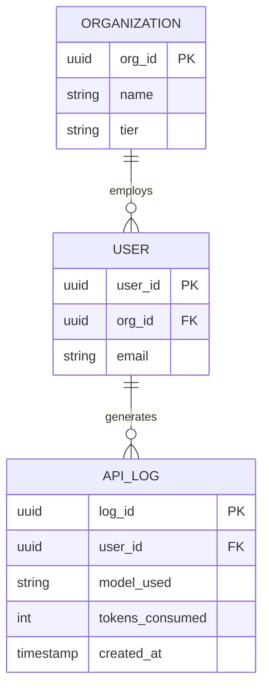

# Module 1.1: Data Modeling Fundamentals

Welcome to **Data Modeling Fundamentals**. As an AI Forward Deployed Engineer (FDE), data modeling is a critical skill. To build enterprise AI systems, whether they are predictive models or Generative AI RAG pipelines, you must first understand the data ecosystem of the client. This begins with how data is modeled, structured, and related.

---

## 1. Detailed Theory

### The Three Levels of Data Modeling
1. **Conceptual Data Model**: The highest level of abstraction. It defines *what* the system contains (Entities and Relationships) but not *how* it will be implemented. Used for business stakeholder alignment.
2. **Logical Data Model**: Adds more detail, defining attributes (columns) for each entity and the relationships between them. It is independent of the specific database system.
3. **Physical Data Model**: The actual implementation schema for a specific database (e.g., PostgreSQL, Snowflake). It includes primary keys, foreign keys, data types, indexes, and constraints.

### Key Concepts
- **Entities & Relationships**: An *entity* is an object or concept (e.g., Customer, Product, Prompt). A *relationship* defines how entities interact (e.g., Customer *places* Order).
- **ER Diagrams (Entity-Relationship Diagrams)**: Visual representations of entities and their relationships.
- **Keys**:
  - **Primary Keys (PK)**: Uniquely identifies a record in a table.
  - **Foreign Keys (FK)**: A field in one table that uniquely identifies a row of another table, establishing a link.
- **Constraints**: Rules applied to data columns (e.g., `NOT NULL`, `UNIQUE`, `CHECK`).

### Normalization vs. Denormalization
- **Normalization**: The process of organizing data to reduce redundancy and improve data integrity. It involves dividing large tables into smaller, related tables (1NF, 2NF, 3NF). 
- **Denormalization**: Intentionally adding redundancy to data to improve read performance. Common in analytical databases (OLAP) and Data Warehouses where join operations can be expensive.

---

## 2. Architecture Diagram: ER Diagram Example

How an AI startup might model their multi-tenant LLM usage.



---

## 3. Production Use Cases

1. **AI Cost Tracking**: An FDE building a dashboard to track token usage across different client departments. A properly normalized model allows rolling up costs from `User` to `Department` to `Organization`.
2. **Feature Store Design**: Designing the backend for a Machine Learning system where customer behavioral attributes are constantly updated.
3. **RAG Vector Linking**: Structuring SQL tables that hold document metadata, ensuring they correctly map (via Foreign Keys) to vectors stored in a database like Pinecone or Milvus.

---

## 4. Real Company Examples

- **Stripe**: Uses highly rigorous logical data modeling before any physical database tables are created. Their APIs (which map to these models) must remain backward-compatible for years, making the initial conceptual and logical phases critical.
- **Enterprise Client**: A Fortune 500 bank has millions of records. An FDE must understand their highly normalized transactional (OLTP) models to extract data safely without causing production slowdowns.

---

## 5. Coding Examples

### Physical Data Model Implementation (SQL DDL)

```sql
-- Normalization Example: Creating related tables
CREATE TABLE departments (
    dept_id UUID PRIMARY KEY,
    dept_name VARCHAR(100) NOT NULL UNIQUE
);

CREATE TABLE employees (
    emp_id UUID PRIMARY KEY,
    dept_id UUID REFERENCES departments(dept_id), -- Foreign Key
    name VARCHAR(255) NOT NULL,
    email VARCHAR(255) UNIQUE NOT NULL
);

-- Denormalization Example: A view or table for fast analytics
CREATE TABLE reporting_employee_directory (
    emp_id UUID PRIMARY KEY,
    name VARCHAR(255),
    email VARCHAR(255),
    dept_name VARCHAR(100) -- Redundant, but avoids a JOIN on read
);
```

---

## 6. Hands-on Labs

**Lab: Model a Support Chatbot Database**
**Objective**: Design the logical model for a customer support AI chatbot.
**Instructions**:
1. Identify the entities (e.g., `Customer`, `ChatSession`, `Message`, `AgentAction`).
2. Determine the relationships (1-to-Many, Many-to-Many).
3. Assign attributes and identify Primary and Foreign Keys for each entity.

---

## 7. Assignments

**Assignment: Normalization Exercise**
You are given a flat CSV file with the following columns: `OrderID`, `CustomerName`, `CustomerEmail`, `ProductName`, `ProductCategory`, `Price`, `Quantity`, `OrderDate`.
1. Normalize this data into 3rd Normal Form (3NF).
2. Write the SQL `CREATE TABLE` statements for your new, normalized model.

---

## 8. Interview Questions

1. **Explain the difference between a Conceptual, Logical, and Physical data model.**
   *Answer Hint: Conceptual is high-level business entities. Logical adds attributes and relationships (no DB syntax). Physical is the actual SQL DDL for a specific database engine.*
2. **When would you choose to denormalize a database?**
   *Answer Hint: When read performance is critical and data is read much more frequently than it is written (e.g., Data Warehouses, reporting dashboards), to avoid expensive JOINs.*
3. **What is an Entity-Relationship (ER) diagram?**
   *Answer Hint: A visual representation of how data entities relate to one another, detailing keys and cardinality (1:1, 1:N, M:N).*

---

## 9. Best Practices (FDE Standards)

- **Map before you code**: Never start writing `CREATE TABLE` statements without sketching an ER diagram first.
- **Standardize Naming Conventions**: Use `snake_case` for tables and columns in relational DBs. End foreign keys with `_id` (e.g., `user_id`).
- **Use Surrogate Keys**: For distributed AI applications, use UUIDs as primary keys instead of auto-incrementing integers to prevent collision across microservices.

---

## 10. Common Mistakes

- **Over-normalizing**: Normalizing data to 4NF or 5NF can result in queries requiring dozens of JOINs, crippling performance.
- **Ignoring Constraints**: Relying on the application layer to enforce data integrity instead of using database constraints (`NOT NULL`, `UNIQUE`), leading to dirty data over time.
