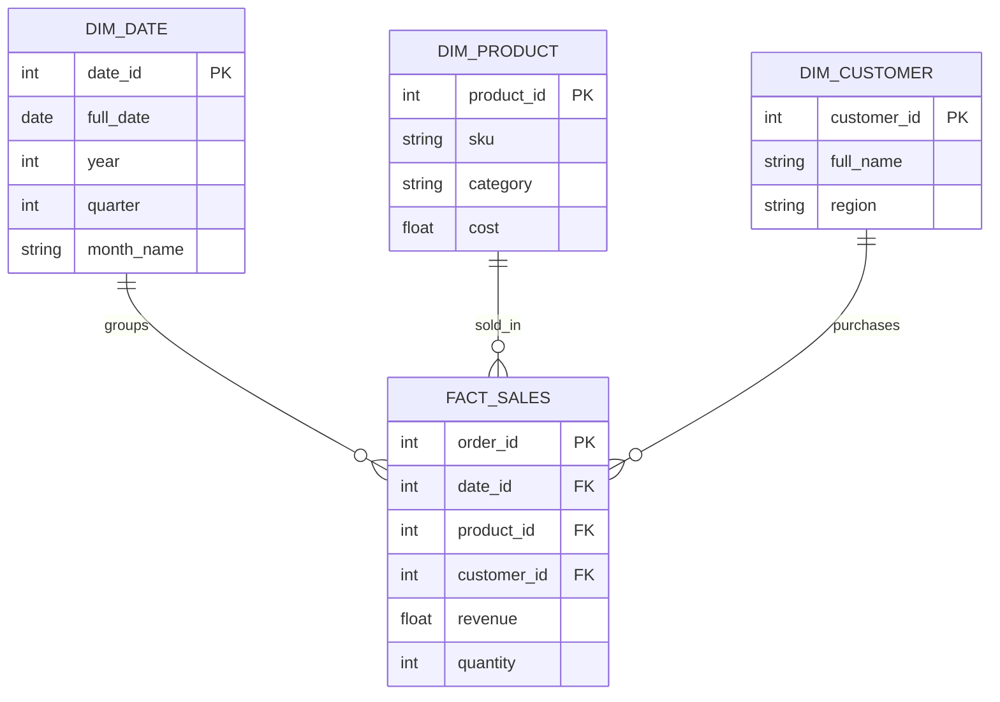

# Module 1.2: Data Warehouse Modeling

Welcome to **Data Warehouse Modeling**. Once data is extracted from transactional systems, it needs to be reorganized for analytical queries, business intelligence (BI), and large-scale AI feature extraction. The way you model a Data Warehouse is fundamentally different from a standard application database.

---

## 1. Detailed Theory

### Dimensional Modeling Concepts
- **Fact Tables**: The core of a dimensional model. They contain quantitative data (metrics, measurements, facts) and foreign keys referring to dimension tables. Examples: Sales amount, clicks, temperature readings.
- **Dimension Tables**: They contain descriptive attributes related to the facts. They answer the "who, what, where, when, why" of a transaction. Examples: Time, Geography, Product, Customer.

### Schemas
- **Star Schema**: The simplest and most common Data Warehouse schema. One central fact table is connected directly to multiple dimension tables, resembling a star. Highly optimized for fast READ queries.
- **Snowflake Schema**: A variation of the star schema where dimension tables are normalized into multiple related tables (e.g., a `City` table connected to a `State` table, connected to a `Country` table). It saves storage but makes queries more complex.

### Slowly Changing Dimensions (SCD)
How to handle dimension data that changes over time (e.g., a customer moves to a new state).
- **SCD Type 1**: Overwrite old data. No history is kept.
- **SCD Type 2**: Create a new record with active/inactive flags and date ranges. Complete history is kept.
- **SCD Type 3**: Add a new column to track the previous value (only tracks the current and previous state).

### Data Vault Modeling
An advanced modeling technique designed for enterprise-scale data integration from multiple sources. It focuses on historical tracking and auditability, consisting of **Hubs** (core business keys), **Links** (transactions/relationships), and **Satellites** (descriptive attributes).

---

## 2. Architecture Diagram: Star Schema



---

## 3. Production Use Cases

1. **AI Training Data Aggregation**: To train an AI model to predict churn, you don't want raw application logs. You query a Data Warehouse's Star Schema to easily aggregate a customer's lifetime value, recent clicks, and support tickets in one pass.
2. **Executive BI Dashboards**: Tools like Tableau or Looker sit directly on top of Star Schemas to render sub-second dashboards for C-suite executives.

---

## 4. Real Company Examples

- **Netflix**: Uses massive, complex dimensional models to track exactly what users watch, when they pause, and what they search for, joining this fact data with dimensions about the content metadata and user demographics.
- **Retail Enterprises (e.g., Walmart)**: Extensive use of Data Vault modeling to integrate supply chain data, point-of-sale data, and online e-commerce data into a single, auditable enterprise data warehouse.

---

## 5. Coding Examples

### Creating a Star Schema in SQL

```sql
-- Dimension: Product
CREATE TABLE dim_product (
    product_id INT PRIMARY KEY,
    product_name VARCHAR(255),
    category VARCHAR(100),
    brand VARCHAR(100)
);

-- Fact: Sales
CREATE TABLE fact_sales (
    transaction_id INT PRIMARY KEY,
    product_id INT REFERENCES dim_product(product_id),
    sale_date DATE,
    quantity_sold INT,
    total_amount DECIMAL(10, 2)
);

-- Analytical Query: Total sales by category
SELECT 
    p.category, 
    SUM(f.total_amount) AS total_revenue
FROM fact_sales f
JOIN dim_product p ON f.product_id = p.product_id
GROUP BY p.category;
```

---

## 6. Hands-on Labs

**Lab: Design a Snowflake Schema**
**Objective**: Convert a simple Star Schema into a Snowflake Schema.
**Instructions**:
1. Take a `dim_store` table that has columns `store_id`, `store_name`, `city`, `state`, `country`.
2. Normalize this dimension into three separate tables: `dim_store`, `dim_city`, and `dim_state_country` to create a Snowflake pattern.

---

## 7. Assignments

**Assignment: SCD Type 2 Implementation**
Write a SQL pseudocode logic or explain the steps required to update a `dim_customer` table using SCD Type 2 when a customer changes their `email_address`.
*Requirements*: Show the columns needed (e.g., `is_current`, `valid_from`, `valid_to`) and what the final two rows for that customer would look like.

---

## 8. Interview Questions

1. **What is the difference between a Fact table and a Dimension table?**
   *Answer Hint: Facts contain metrics and measurements (numbers). Dimensions contain context and descriptive attributes (text).*
2. **Why use a Star Schema instead of a highly normalized 3NF schema for analytics?**
   *Answer Hint: 3NF requires many complex JOINs which are computationally expensive for read-heavy analytical queries. Star Schemas denormalize data to minimize JOINs and speed up aggregations.*
3. **What is an SCD Type 2 and when would you use it?**
   *Answer Hint: Slowly Changing Dimension Type 2 tracks historical data by creating multiple records for a given natural key with effective date ranges. Use it when historical accuracy is required (e.g., auditing, historical reporting).*

---

## 9. Best Practices (FDE Standards)

- **Design for the Business**: Dimension tables should directly reflect the nouns the business uses (Customer, Product, Store).
- **Use Surrogate Keys for Dimensions**: Never use the source system's ID (natural key) as the Primary Key in a dimension table, especially when using SCDs. Create an auto-incrementing surrogate key.

---

## 10. Common Mistakes

- **Putting Facts in Dimension Tables**: Storing something volatile like "Lifetime Revenue" inside a Customer Dimension. Revenue is a fact and belongs in a fact table or an aggregated fact table.
- **Snowflaking too much**: Over-normalizing dimension tables until the schema looks like an OLTP system, defeating the performance benefits of a Data Warehouse.
