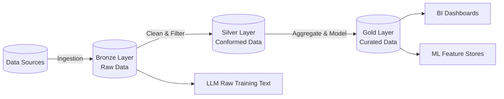

# Module 1.3: Big Data Modeling

Welcome to **Big Data Modeling**. When data grows beyond the terabyte scale and becomes unstructured or semi-structured, traditional Data Warehouses struggle. We transition to Data Lakes and Lakehouses. As an AI FDE, this is where you will often find the massive datasets required to pre-train or fine-tune foundation models.

---

## 1. Detailed Theory

### The Evolution of Big Data Storage
- **Data Lake**: A centralized repository that allows you to store all your structured and unstructured data at any scale. Data is stored as-is (schema-on-read). Typically built on cloud object storage (AWS S3, Google Cloud Storage, Azure Data Lake Storage).
- **Lakehouse Modeling**: Combines the flexibility and scalability of a Data Lake with the data management and ACID transactions of a Data Warehouse. Uses open table formats like Delta Lake, Apache Iceberg, or Apache Hudi.

### The Medallion Architecture
A data design pattern used to logically organize data in a Lakehouse.
- **Bronze Layer (Raw)**: Raw data ingested from sources. History is retained. No schema enforcement.
- **Silver Layer (Cleaned & Conformed)**: Data is filtered, cleaned, augmented, and normalized. Schema is enforced. "Enterprise view" of truth.
- **Gold Layer (Curated)**: Business-level aggregates. Modeled using Star Schemas. Ready for BI reporting and AI consumption.

### Performance Optimization Techniques
- **Partitioning**: Dividing a large dataset into smaller, manageable directories based on a column value (usually a date, like `year=2023/month=10`). This drastically reduces the amount of data scanned during queries (Partition Pruning).
- **Bucketing**: Distributing data across a fixed number of "buckets" based on a hash of a column. Useful for optimizing JOINs on large tables.
- **Schema Evolution**: The ability to safely add, remove, or modify columns in a massive dataset over time without breaking downstream pipelines or requiring a full rewrite of the data.

---

## 2. Architecture Diagram: Medallion Architecture



---

## 3. Production Use Cases

1. **LLM Pre-training Pipeline**: Taking petabytes of raw internet scrape data (Bronze), filtering out PII and low-quality text (Silver), and formatting it into perfectly tokenized parquet files (Gold) for model training.
2. **IoT Telemetry Logging**: Streaming millions of sensor readings per second into a partitioned Data Lake, where they are later aggregated for predictive maintenance models.

---

## 4. Real Company Examples

- **Databricks**: Pioneers of the Lakehouse paradigm and the Medallion Architecture. Databricks heavily promotes using Delta Lake to bring ACID compliance to cloud object storage.
- **Uber**: Uses massive Apache Hudi data lakes to handle the constant, massive influx of geospatial and ride telemetry data, allowing for fast, incremental updates to massive datasets.

---

## 5. Coding Examples

### Partitioning in PySpark

```python
# Assuming 'df' is a massive PySpark DataFrame containing web logs
# We partition by Year and Month before writing to the Data Lake

(df.write
   .format("parquet")
   .mode("overwrite")
   .partitionBy("year", "month")
   .save("s3://enterprise-data-lake/web_logs/")
)

# resulting storage structure:
# s3://enterprise-data-lake/web_logs/year=2023/month=01/part-0001.parquet
# s3://enterprise-data-lake/web_logs/year=2023/month=02/part-0001.parquet
```

### Schema Evolution (Delta Lake SQL)

```sql
-- Adding a new column to a massive Delta table without rewriting data
ALTER TABLE silver_customers 
ADD COLUMNS (loyalty_tier STRING);
```

---

## 6. Hands-on Labs

**Lab: Designing a Lakehouse Directory Structure**
**Objective**: Map out the S3/GCS paths for a new E-commerce Lakehouse.
**Instructions**:
Write out the logical directory paths for the Bronze, Silver, and Gold layers for a stream of JSON order data coming from a web application. Assume you need to partition the data by ingestion date.

---

## 7. Assignments

**Assignment: Partition Pruning Logic**
Given a Data Lake partitioned by `country` and `date`, write the `WHERE` clause of a SQL query that will optimally use Partition Pruning to find all sales in 'Canada' for the month of 'October 2023'. Explain why your query is optimized.

---

## 8. Interview Questions

1. **What is the difference between a Data Warehouse and a Data Lake?**
   *Answer Hint: Warehouses are structured, schema-on-write, and optimized for SQL. Lakes are unstructured/semi-structured, schema-on-read, and store data in native formats on cheap object storage.*
2. **Explain the Medallion Architecture (Bronze, Silver, Gold).**
   *Answer Hint: Bronze is raw data. Silver is cleaned, filtered, and typed. Gold is business-level aggregates (Star Schema) ready for BI/AI consumption.*
3. **What is Partition Pruning?**
   *Answer Hint: An optimization technique where the query engine skips scanning entire directories of data because the `WHERE` clause filters on the partition key.*

---

## 9. Best Practices (FDE Standards)

- **Avoid the "Data Swamp"**: A Data Lake without governance, metadata, or clear folder structures quickly becomes an unusable "Data Swamp." Always enforce structure at the Silver layer.
- **Right-size Partitions**: Avoid "over-partitioning" (resulting in thousands of tiny 1KB files, known as the small file problem) and "under-partitioning" (resulting in massive 100GB files). Aim for partition files around 128MB - 1GB.

---

## 10. Common Mistakes

- **Schema-on-Read Failures**: Storing raw JSON in a Data Lake, and then multiple downstream applications all write their own slightly different parsing logic, leading to inconsistent metrics.
- **Ignoring the Small File Problem**: Streaming systems writing a new Parquet file every second into a Data Lake will crash Spark clusters when they try to read millions of tiny files. Use compaction processes.
