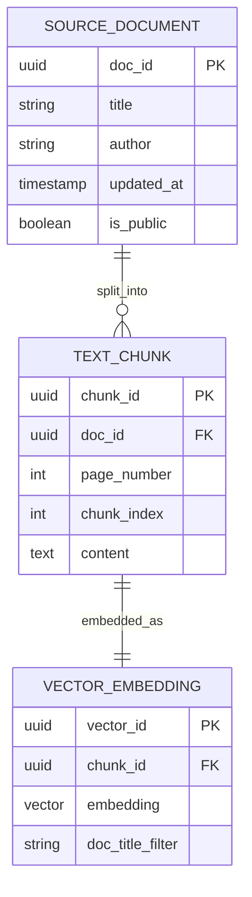

# Module 1.5: LLMOps Data Modeling

Welcome to **LLMOps Data Modeling**. As an AI FDE, this is the bleeding edge. Traditional data engineering focuses on numbers and structured text. Generative AI requires modeling high-dimensional vectors, massive chunks of unstructured text, complex conversational memory, and semantic relationships. 

---

## 1. Detailed Theory

### RAG Data Models
Retrieval-Augmented Generation (RAG) systems require two parallel data stores that must stay perfectly synchronized:
1. **The Source Store (SQL/NoSQL)**: Holds the raw document, chunk text, and strict metadata.
2. **The Vector Store**: Holds the mathematical embedding (e.g., `[0.012, -0.45, ...]`) and a subset of metadata for filtering.

### Chunk & Embedding Metadata Design
When you chunk a 100-page PDF, you don't just throw 1,000 vectors into a database. You must model the metadata.
- **Required Metadata**: `document_id`, `chunk_index`, `page_number`, `author`, `access_level` (for RBAC).
- Without this metadata modeling, your LLM will hallucinate answers from documents the user doesn't have permission to see, or mix up pages from different manuals.

### Agent Memory Schema
AI Agents (like LangChain or AutoGen agents) need memory to persist state across sessions.
- **Short-Term Memory**: The current chat window context. Usually modeled as a simple list of `role` (user/assistant) and `content` (text) objects.
- **Long-Term Memory**: Storing user preferences, past summaries, or facts across weeks. Often modeled as a Vector Database lookup or a specialized Knowledge Graph.

### Knowledge Graph Modeling
Modeling relationships as Nodes and Edges instead of Rows and Columns. 
- Example: `(Node: User_A) -[Edge: REPORTED]-> (Node: Issue_42) <-[Edge: RESOLVED_BY]- (Node: Agent_B)`.
- Highly effective for complex enterprise systems where LLMs need to understand "who knows what."

---

## 2. Architecture Diagram: Enterprise RAG Architecture


*Note: In production, `SOURCE_DOCUMENT` and `TEXT_CHUNK` live in Postgres, while `VECTOR_EMBEDDING` lives in Pinecone/Milvus.*

---

## 3. Production Use Cases

1. **Multi-Tenant SaaS Copilot**: A SaaS application embeds all user documents. The Vector DB schema MUST include an `org_id` in its metadata. Every search query is pre-filtered by `org_id` to prevent cross-tenant data leakage.
2. **Customer Service Agent Memory**: Modeling a SQL schema that saves every interaction an LLM has with a user. When the user returns 3 days later, the application fetches the last 5 `session_id` summaries to inject into the system prompt.

---

## 4. Real Company Examples

- **OpenAI (Custom GPTs)**: Behind the scenes, OpenAI heavily models file uploads, associating specific embeddings tightly to the `user_id` and the `gpt_id` to ensure isolated retrieval.
- **Palantir (AIP)**: Merges traditional Ontology (Knowledge Graph) data modeling with LLM capabilities, allowing agents to understand that a "Tank" entity is related to a "Supply Depot" entity.

---

## 5. Coding Examples

### Defining a Vector Schema in Python (e.g., Qdrant/Milvus)

```python
# Conceptual schema definition for a Vector DB collection
collection_schema = {
    "name": "enterprise_kb",
    "vector_size": 1536, # OpenAI text-embedding-ada-002 size
    "distance_metric": "Cosine",
    "payload_schema": {
        "doc_id": "uuid",
        "org_id": "uuid",           # CRITICAL for multi-tenant isolation
        "access_level": "string",
        "text_chunk": "string"
    }
}
```

---

## 6. Hands-on Labs

**Lab: Modeling Agent State**
**Objective**: Design the SQL schema for a long-running Agentic workflow.
**Instructions**:
An AI agent is tasked with writing a book over 5 days. It can pause and resume. Design a `agent_tasks` table and an `agent_scratchpad` table to store its intermediate thoughts and current state so it can be safely restarted if the server crashes.

---

## 7. Assignments

**Assignment: RBAC in RAG**
Explain, using a schema design, how you would prevent a junior employee from using an LLM to query the CEO's private performance review documents within a unified Vector Database. Which metadata fields are required?

---

## 8. Interview Questions

1. **Why do we store the raw text chunk alongside the vector embedding?**
   *Answer Hint: A vector is just math. The LLM cannot read `[0.1, 0.4]`. We must find the nearest vector, retrieve the associated raw text string attached to its metadata payload, and feed that text into the LLM.*
2. **What is the risk of not modeling Tenant IDs in your Vector Database schema?**
   *Answer Hint: Cross-tenant data leakage. Company A's queries might retrieve Company B's sensitive documents if the similarity search does not strictly filter on `org_id` before performing the KNN search.*

---

## 9. Best Practices (FDE Standards)

- **Sync, Sync, Sync**: The hardest part of RAG data modeling is keeping the SQL database and the Vector Database in sync. If a document is deleted in SQL, you MUST have an event-driven mechanism to delete the corresponding vectors.
- **Filter Before Search (Pre-filtering)**: Always model your metadata so you can filter by `user_id` or `org_id` *before* the vector distance calculation runs.

---

## 10. Common Mistakes

- **Storing massive text in the Vector DB**: Vector DBs are expensive memory-based systems. Do not store full 50-page documents in the payload. Store chunks, or better, store a pointer to the chunk in cheaper blob storage.
- **Ignoring Chunk Order**: Failing to model the `chunk_index`. Sometimes the LLM needs the chunk *before* or *after* the retrieved chunk for context. If you didn't model the index, you can't fetch them.
